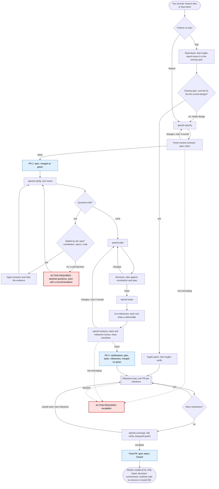
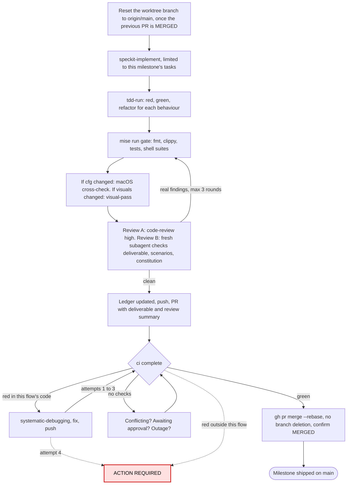

# Spec Kit autopilot

`/speckit-autopilot <feature idea>`, `/speckit-autopilot bug: <report>` or
`/speckit-autopilot resume <NNN>`.

You give it one prompt. The agent writes the spec and merges it, clarifies it with you, plans and
cuts the work into milestones, then ships each milestone to `main` as its own reviewed PR. It reviews
every artifact and every diff itself; no human does. It asks you only for decisions that are yours
(see [When you are asked](#when-you-are-asked)). When everything has merged, it tells you the
worktree can be removed.

The agent follows [SKILL.md](SKILL.md). This page is the human-facing overview.

## The flow

### One milestone

## When you are asked

Every question arrives as a `🛑 ACTION REQUIRED FROM YOU` banner and a push notification. The banner
says:
- what is needed
- why the agent cannot decide it
- what it already checked
- what it recommends
- what stays paused while it waits

Questions are batched. You are asked only when one of these applies:

1. A product or scope decision that the repo does not already settle.
2. A conflict with the constitution.
3. An irreversible or outward action beyond merging the flow's own PRs: a release, a settings or
   ruleset change, secrets, deleting data.
4. Access the agent lacks.
5. Something that will not converge: a review after 3 rounds, CI after 3 fixes, clarification after
   4 rounds, a bug that will not reproduce. This includes a flow blocked by work outside it.
6. The plan proved false in a way that changes requirements.

Everything else the agent handles itself: review findings, lint and test failures, merge conflicts,
flaky CI, visual checks, and implementation choices. Details:
[references/escalation.md](references/escalation.md).

## What the agent owns

The agent owns only the work its own flow created:
- this worktree and its branch
- the feature directory it created
- the PRs recorded in its ledger

It never merges, reviews or fixes other sessions' PRs, specs or worktrees. It never deletes the
worktree or the branch. Removing the worktree in micold IDE cleans up both.

## Resuming

Progress is kept in `specs/<NNN>-<slug>/autopilot.md`, which is committed with every PR. It holds the
phase, PRs, milestones, every decision (and who made it), declined review findings, and follow-ups.
After a crash or `/clear`, run `/speckit-autopilot resume <NNN>`.

## Files

| File | Holds |
|---|---|
| [SKILL.md](SKILL.md) | The phases, the milestone loop, ownership, the handoff, red flags |
| [references/escalation.md](references/escalation.md) | When and how the human is asked |
| [references/milestones.md](references/milestones.md) | How tasks become deliverable milestones |
| [references/review-rubrics.md](references/review-rubrics.md) | Reviewer dispatch and the rubric for each artifact and for code |
| [references/pr-and-merge.md](references/pr-and-merge.md) | Local gate, PR format, waiting for CI, merging, known failure modes |
| [templates/autopilot-ledger.md](templates/autopilot-ledger.md) | The progress ledger |
