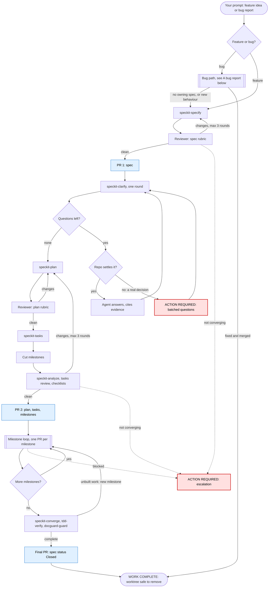
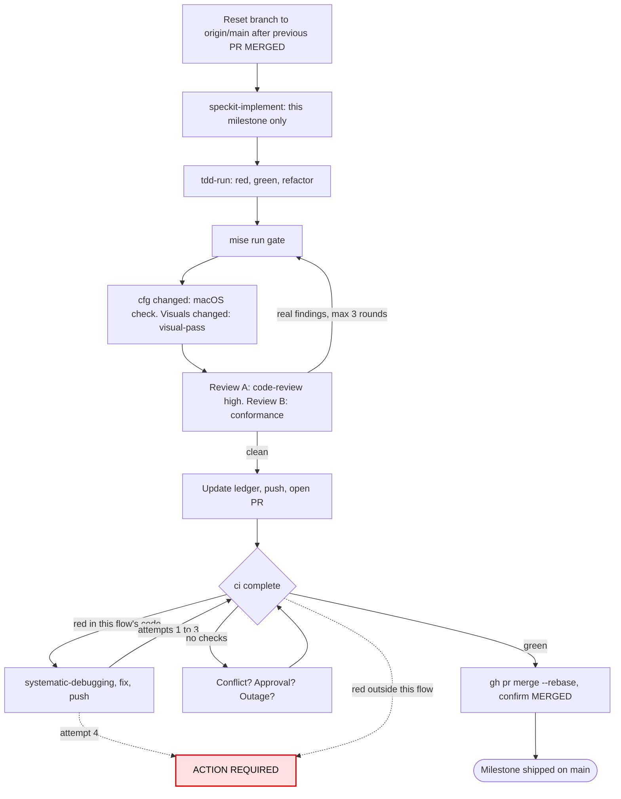
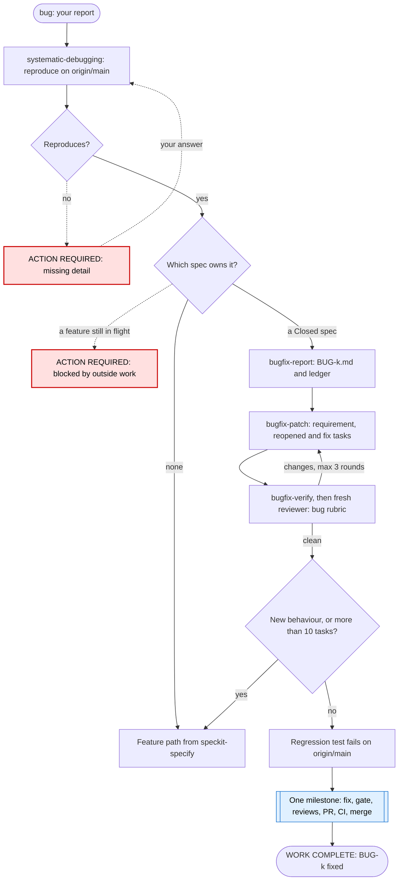

# Spec Kit autopilot

`/speckit-autopilot <feature idea>`, `/speckit-autopilot bug: <report>` or
`/speckit-autopilot resume`.

You give one prompt.

- **Feature:** the agent writes and merges the spec, clarifies it with you, plans, cuts milestones,
  then ships each milestone to `main` as its own reviewed PR.
- **Bug:** the agent reproduces it, records it against the owning spec, and ships the regression
  test and fix as one PR.

The agent reviews every artifact and diff itself. It asks you only for decisions that are yours
(see [When you are asked](#when-you-are-asked)). When all PRs have merged, it tells you the worktree
can be removed.

The session you start only orchestrates: ledger, questions, CI and merges, per [SKILL.md](SKILL.md).
The bug triage, spec, each clarify round, design, each milestone and the close each run in a fresh
subagent that reads only [unit.md](unit.md) and its file in [phases/](phases/).

## The flow

```mermaid
flowchart TD
    START(["Your prompt: feature idea or bug report"]) --> TRIAGE{"Feature or bug?"}

    TRIAGE -->|bug| BUGPATH[["Bug path, see A bug report below"]]
    BUGPATH -->|"no owning spec, or new behaviour"| SPEC
    BUGPATH -->|"fixed and merged"| DONE

    TRIAGE -->|feature| SPEC["speckit-specify"]
    SPEC --> SREV["Reviewer: spec rubric"]
    SREV -->|"changes, max 3 rounds"| SPEC
    SREV -->|clean| PR1["PR 1: spec"]

    PR1 --> CSCAN["speckit-clarify, one round"]
    CSCAN --> CQ{"Questions left?"}
    CQ -->|none| PLAN
    CQ -->|yes| CTRI{"Repo settles it?"}
    CTRI -->|yes| CAUTO["Agent answers, cites evidence"]
    CTRI -->|"no: a real decision"| H1["ACTION REQUIRED: batched questions"]
    CAUTO --> CSCAN
    H1 --> CSCAN

    PLAN["speckit-plan"] --> PREV["Reviewer: plan rubric"]
    PREV -->|changes| PLAN
    PREV -->|clean| TASKS["speckit-tasks"]
    TASKS --> MCUT["Cut milestones"]
    MCUT --> ANA["speckit-analyze, tasks review, checklists"]
    ANA -->|"changes, max 3 rounds"| PLAN
    ANA -->|clean| PR2["PR 2: plan, tasks, milestones"]

    PR2 --> MLOOP[["Milestone loop, one PR per milestone"]]
    MLOOP --> MORE{"More milestones?"}
    MORE -->|yes| MLOOP
    MORE -->|no| CLOSE["speckit-converge, tdd-verify, docguard-guard"]
    CLOSE -->|"unbuilt work: new milestone"| MLOOP
    CLOSE -->|complete| FIN["Final PR: spec status Closed"]
    FIN --> DONE(["WORK COMPLETE: worktree safe to remove"])

    ESC["ACTION REQUIRED: escalation"]
    SREV -.->|"not converging"| ESC
    ANA -.->|"not converging"| ESC
    MLOOP -.->|blocked| ESC

    classDef human fill:#ffe0e0,stroke:#c00,stroke-width:2px,color:#000
    classDef pr fill:#e0f0ff,stroke:#06c,color:#000
    class H1,ESC human
    class PR1,PR2,FIN pr
```

### One milestone

```mermaid
flowchart TD
    M0["Reset branch to origin/main after previous PR MERGED"] --> M1["speckit-implement: this milestone only"]
    M1 --> M2["tdd-run: red, green, refactor"]
    M2 --> GATE["mise run gate"]
    GATE --> EXTRA["cfg changed: macOS check. Visuals changed: visual-pass"]
    EXTRA --> REV["Review A: code-review high. Review B: conformance"]
    REV -->|"real findings, max 3 rounds"| GATE
    REV -->|clean| PR["Update ledger, push, open PR"]
    PR --> CI{"ci complete"}
    CI -->|"red in this flow's code"| FIX["systematic-debugging, fix, push"]
    FIX -->|"attempts 1 to 3"| CI
    FIX -.->|"attempt 4"| ESC["ACTION REQUIRED"]
    CI -.->|"red outside this flow"| ESC
    CI -->|"no checks"| DIAG["Conflict? Approval? Outage?"]
    DIAG --> CI
    CI -->|green| MERGE["gh pr merge --rebase, confirm MERGED"]
    MERGE --> SHIP(["Milestone shipped on main"])

    classDef human fill:#ffe0e0,stroke:#c00,stroke-width:2px,color:#000
    class ESC human
```

### A bug report

```mermaid
flowchart TD
    B0(["bug: your report"]) --> REPRO["systematic-debugging: reproduce on origin/main"]
    REPRO --> RQ{"Reproduces?"}
    RQ -.->|no| ESCR["ACTION REQUIRED: missing detail"]
    ESCR -.->|"your answer"| REPRO
    RQ -->|yes| OWN{"Which spec owns it?"}
    OWN -->|none| FEAT["Feature path from speckit-specify"]
    OWN -.->|"a feature still in flight"| ESCO["ACTION REQUIRED: blocked by outside work"]
    OWN -->|"a Closed spec"| REP["bugfix-report: BUG-k.md and ledger"]
    REP --> PATCH["bugfix-patch: requirement, reopened and fix tasks"]
    PATCH --> VER["bugfix-verify, then fresh reviewer: bug rubric"]
    VER -->|"changes, max 3 rounds"| PATCH
    VER -->|clean| SIZE{"New behaviour, or more than 10 tasks?"}
    SIZE -->|yes| FEAT
    SIZE -->|no| RED["Regression test fails on origin/main"]
    RED --> MS[["One milestone: fix, gate, reviews, PR, CI, merge"]]
    MS --> BDONE(["WORK COMPLETE: BUG-k fixed"])

    classDef human fill:#ffe0e0,stroke:#c00,stroke-width:2px,color:#000
    classDef pr fill:#e0f0ff,stroke:#06c,color:#000
    class ESCR,ESCO human
    class MS pr
```

A bug gets no spec PR, design PR or close phase. The BUG record, spec patch, regression test and fix
ship in one PR. If the fix is new behaviour, the bug becomes input to the feature flow.

## When you are asked

The agent asks you only for product decisions, constitution conflicts, irreversible actions,
missing access, things that will not converge, or a plan that proved false. Every question arrives as
a `🛑 ACTION REQUIRED FROM YOU` banner and a push notification. The agent handles everything else
itself. See [SKILL.md](SKILL.md#asking-the-human) and [references/escalation.md](references/escalation.md).

## Ownership

The agent owns only its worktree, branch, feature directory (or BUG record) and the PRs in its
ledger. It never touches other sessions' work and never deletes the worktree. Remove the worktree in
micold IDE to clean up.

## Resuming

The ledger is `specs/<NNN>-<slug>/autopilot.md`, or for a bug `bugs/BUG-<k>.autopilot.md` beside the
BUG record. It is committed with every PR. It holds the phase, PRs, milestones, every decision (and
who made it), declined review findings, and follow-ups. After a crash or `/clear`, run
`/speckit-autopilot resume` in the same worktree. It finds the unfinished ledger that records this
worktree's branch.

## Files

- [SKILL.md](SKILL.md): the orchestrator: entry, resume, dispatch, CI and merge, ownership, handoff
- [unit.md](unit.md): rules every unit follows: ledger, reviews, escalating, return format
- [phases/](phases/): one file per phase unit (bug, spec, clarify, design, milestone, close)
- [references/escalation.md](references/escalation.md): when the human is asked
- [references/milestones.md](references/milestones.md): cutting milestones
- [references/review-rubrics.md](references/review-rubrics.md): reviewer dispatch and rubrics
- [references/pr-and-merge.md](references/pr-and-merge.md): gate, PR, CI, merge
- [templates/autopilot-ledger.md](templates/autopilot-ledger.md): the ledger
