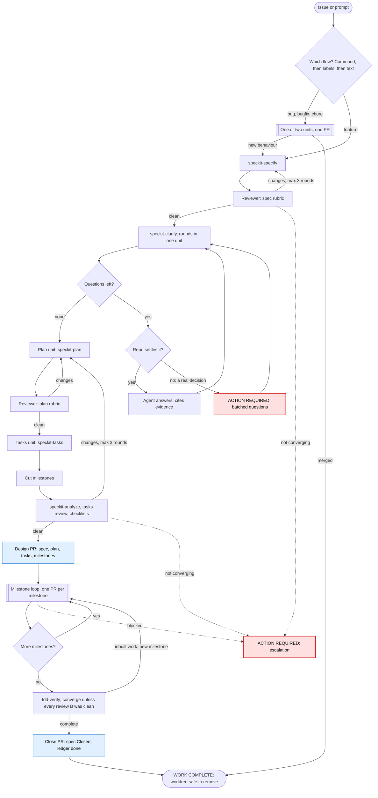
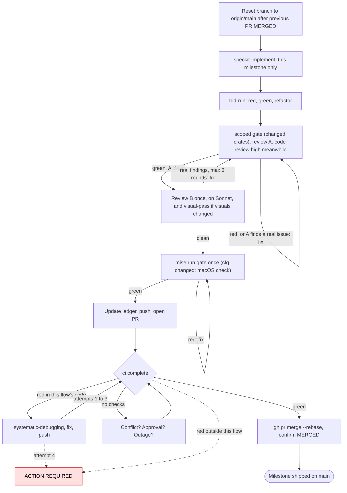
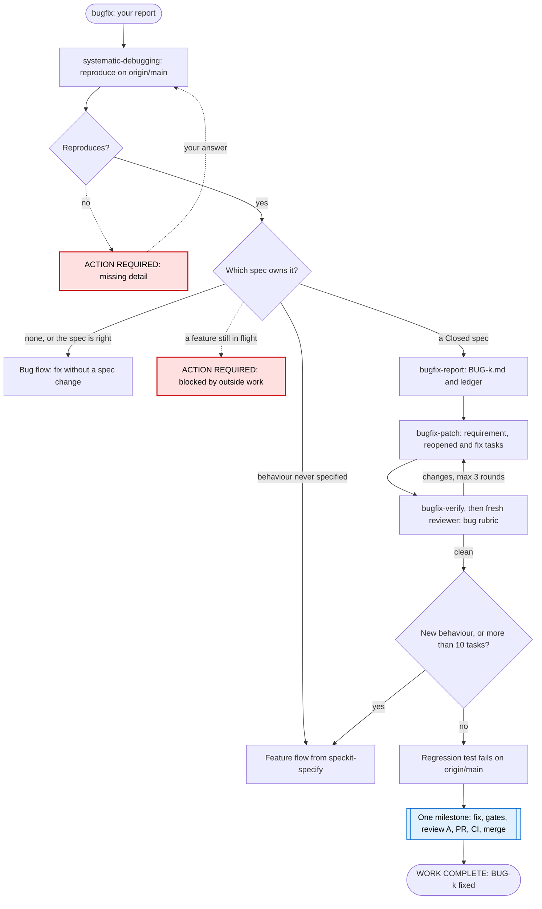

# Spec Kit autopilot

```
/speckit-autopilot #553                  flow and effort from the issue's labels
/speckit-autopilot bugfix #702           you name the flow
/speckit-autopilot chore low #587        you name the flow and the effort
/speckit-autopilot <feature idea>        no issue yet: the agent opens one
/speckit-autopilot bug: <report>
/speckit-autopilot resume
```

You give one prompt or one GitHub issue. The agent picks the lightest flow that fits, does the
work, reviews every artifact and diff itself, and merges to `main`. It asks you only for decisions
that are yours (see [When you are asked](#when-you-are-asked)). When all PRs have merged, it closes
the issue and tells you the worktree can be removed.

## Flows

| Flow | For | What runs | What it skips |
|---|---|---|---|
| **bug** | broken behaviour no spec covers, or whose spec stays as it is | one unit: reproduce, failing test, fix, review A at `medium`, full gate, one PR | spec, clarify, plan, tasks, BUG record, review B, close |
| **bugfix** | broken behaviour a spec describes wrongly or misses | BUG record and spec patch with a reviewer, then one milestone: regression test, fix, review A at `medium`, gates, one PR | spec, clarify, plan and tasks units, review B, close |
| **feature** | new behaviour | spec, clarify, plan, tasks (design PR), one reviewed PR per milestone with reviews A and B, close | nothing |
| **chore** | CI, build, tooling, tests, docs, dependency or config bumps; nothing a user sees | one unit: failing test for a code change, the change, review A at `low`, the gate that fits the diff, one PR | every Spec Kit skill, review B, visual pass, close |

Every flow keeps a GitHub issue, a failing test first for a code change, the local gate, a fresh
reviewer and green CI. A unit that finds its flow wrong stops and names the right one; the agent
switches, and asks you first when you had named the flow yourself.

## Labels

The agent reads the issue's labels to choose, and writes its choice back, so the issue always says
what the run does.

| Label | Means |
|---|---|
| `flow:bug`, `flow:bugfix`, `flow:feature`, `flow:chore` | run that flow |
| `effort:low` | the cheaper model (Sonnet) for a bug, bugfix or chore unit; with `bug` alone, the bug flow |
| `effort:high` | the session model; with `bug` alone, the bugfix flow; lets a chore pass the size cap |
| `bug` | without a `flow:*` label, broken behaviour: bug or bugfix flow |
| `enhancement` | new behaviour: feature flow |
| `documentation` | chore flow |
| `in-progress` | a run has claimed the issue; set at the start, removed when the issue is closed |

What you type in the command wins over labels, and labels win over the agent's reading of the
text. When labels and text agree, the agent does not ask. When labels conflict with each other
(two `flow:*` labels) or with the text (`bug` on new behaviour), it asks exactly one question.
An unlabelled issue is read by its text. A run started from text looks for an open issue for the
same work first, and otherwise opens its own, labelled.

The issue number is the run's ID: a feature's spec lives in `specs/<issue>-<slug>`, so two runs
never take the same number. A bugfix record is `BUG-<issue>`, and every PR title of the run ends
with `(#<issue>)`, so the PR list shows which issue each PR serves.

## How it is built

The session you start only orchestrates: it chooses the flow, keeps the issue, asks you, waits on
CI and merges, routed by [SKILL.md](SKILL.md). Each unit of work runs in a fresh subagent that
reads [rules/unit.md](rules/unit.md) and only the task files its flow lists. Every step is one
small file, at most 60 lines (checked by `scripts/tests/autopilot.test.sh`), so nobody loads
rules for steps it does not run.

## The feature flow


```mermaid
flowchart TD
    START(["Issue or prompt"]) --> TRIAGE{"Which flow? Command, then labels, then text"}

    TRIAGE -->|"bug, bugfix, chore"| LIGHT[["One or two units, one PR"]]
    LIGHT -->|"new behaviour"| SPEC
    LIGHT -->|"merged"| DONE

    TRIAGE -->|feature| SPEC["speckit-specify"]
    SPEC --> SREV["Reviewer: spec rubric"]
    SREV -->|"changes, max 3 rounds"| SPEC
    SREV -->|clean| CSCAN["speckit-clarify, rounds in one unit"]

    CSCAN --> CQ{"Questions left?"}
    CQ -->|none| PLAN
    CQ -->|yes| CTRI{"Repo settles it?"}
    CTRI -->|yes| CAUTO["Agent answers, cites evidence"]
    CTRI -->|"no: a real decision"| H1["ACTION REQUIRED: batched questions"]
    CAUTO --> CSCAN
    H1 --> CSCAN

    PLAN["Plan unit: speckit-plan"] --> PREV["Reviewer: plan rubric"]
    PREV -->|changes| PLAN
    PREV -->|clean| TASKS["Tasks unit: speckit-tasks"]
    TASKS --> MCUT["Cut milestones"]
    MCUT --> ANA["speckit-analyze, tasks review, checklists"]
    ANA -->|"changes, max 3 rounds"| PLAN
    ANA -->|clean| PR2["Design PR: spec, plan, tasks, milestones"]

    PR2 --> MLOOP[["Milestone loop, one PR per milestone"]]
    MLOOP --> MORE{"More milestones?"}
    MORE -->|yes| MLOOP
    MORE -->|no| CLOSE["tdd-verify; converge unless every review B was clean"]
    CLOSE -->|"unbuilt work: new milestone"| MLOOP
    CLOSE -->|complete| FIN["Close PR: spec Closed, ledger done"]
    FIN --> DONE(["WORK COMPLETE: worktree safe to remove"])

    ESC["ACTION REQUIRED: escalation"]
    SREV -.->|"not converging"| ESC
    ANA -.->|"not converging"| ESC
    MLOOP -.->|blocked| ESC

    classDef human fill:#ffe0e0,stroke:#c00,stroke-width:2px,color:#000
    classDef pr fill:#e0f0ff,stroke:#06c,color:#000
    class H1,ESC human
    class PR2,FIN pr
```

### One milestone


```mermaid
flowchart TD
    M0["Reset branch to origin/main after previous PR MERGED"] --> M1["speckit-implement: this milestone only"]
    M1 --> M2["tdd-run: red, green, refactor"]
    M2 --> GATE["scoped gate (changed crates), review A: code-review high meanwhile"]
    GATE -->|"red, or A finds a real issue: fix"| GATE
    GATE -->|"green, A clean"| REV["Review B once, on Sonnet, and visual-pass if visuals changed"]
    REV -->|"real findings, max 3 rounds: fix"| GATE
    REV -->|clean| FULL["mise run gate once (cfg changed: macOS check)"]
    FULL -->|"red: fix"| FULL
    FULL -->|green| PR["Update ledger, push, open PR"]
    PR --> CI{"ci complete"}
    CI -->|"red in this flow's code"| FIX["systematic-debugging, fix, push"]
    FIX -->|"attempts 1 to 3"| CI
    FIX -.->|"attempt 4"| ESC["ACTION REQUIRED"]
    CI -.->|"red outside this flow"| ESC
    CI -->|"no checks"| DIAG["Conflict? Approval? Outage?"]
    DIAG --> CI
    CI -->|green| MERGE["gh pr merge --rebase, confirm MERGED"]
    MERGE --> SHIP(["Milestone shipped on main"])

    classDef human fill:#ffe0e0,stroke:#c00,stroke-width:2px,color:#000
    class ESC human
```

### The bugfix flow


```mermaid
flowchart TD
    B0(["bugfix: your report"]) --> REPRO["systematic-debugging: reproduce on origin/main"]
    REPRO --> RQ{"Reproduces?"}
    RQ -.->|no| ESCR["ACTION REQUIRED: missing detail"]
    ESCR -.->|"your answer"| REPRO
    RQ -->|yes| OWN{"Which spec owns it?"}
    OWN -->|"none, or the spec is right"| LIGHT["Bug flow: fix without a spec change"]
    OWN -->|"behaviour never specified"| FEAT["Feature flow from speckit-specify"]
    OWN -.->|"a feature still in flight"| ESCO["ACTION REQUIRED: blocked by outside work"]
    OWN -->|"a Closed spec"| REP["bugfix-report: BUG-k.md and ledger"]
    REP --> PATCH["bugfix-patch: requirement, reopened and fix tasks"]
    PATCH --> VER["bugfix-verify, then fresh reviewer: bug rubric"]
    VER -->|"changes, max 3 rounds"| PATCH
    VER -->|clean| SIZE{"New behaviour, or more than 10 tasks?"}
    SIZE -->|yes| FEAT
    SIZE -->|no| RED["Regression test fails on origin/main"]
    RED --> MS[["One milestone: fix, gates, review A, PR, CI, merge"]]
    MS --> BDONE(["WORK COMPLETE: BUG-k fixed"])

    classDef human fill:#ffe0e0,stroke:#c00,stroke-width:2px,color:#000
    classDef pr fill:#e0f0ff,stroke:#06c,color:#000
    class ESCR,ESCO human
    class MS pr
```

A bugfix gets no design PR or close unit. The BUG record, spec patch, regression test and fix
ship in one PR. If the fix is new behaviour, the bug becomes input to the feature flow.

## When you are asked

The agent asks you only for product decisions, constitution conflicts, irreversible actions,
missing access, things that will not converge, or a plan that proved false. Every question arrives as
a `🛑 ACTION REQUIRED FROM YOU` banner and a push notification. The agent handles everything else
itself. See [rules/escalation.md](rules/escalation.md) and [tasks/ask.md](tasks/ask.md).

## Ownership

The agent owns only its worktree, branch, feature directory (or BUG record) and the PRs in its
ledger. It never touches other sessions' work and never deletes the worktree. Remove the worktree in
micold IDE to clean up.

## Resuming

The ledger is `specs/<issue>-<slug>/autopilot.md` for a feature, `bugs/BUG-<issue>.autopilot.md` beside
the BUG record for a bugfix, and `specs/quick/<date>-<issue>-<slug>.autopilot.md` (not committed)
for a bug or chore. It holds the flow, the unit at work, PRs, milestones, every decision (and who
made it), declined review findings, and follow-ups. After a crash or `/clear`, run
`/speckit-autopilot resume` in the same worktree. It finds the unfinished ledger that records this
worktree's branch.

## Files

- [SKILL.md](SKILL.md): the router: which file to read when
- [flows/](flows/): choosing the flow and effort, one file per flow with the task files each unit
  reads, and switching
- [tasks/](tasks/): one file per step, for a unit (spec, clarify, plan, tasks, implement, verify,
  gate, pr, close, bug, bugfix, chore, review) or the orchestrator (issue, dispatch, merge, ci,
  ask, handoff, resume)
- [rules/](rules/): rules shared by several tasks, each written once: unit, context, waiting,
  delegating, ownership, escalation
- [rubrics/](rubrics/): one file per review rubric
- `phases/`, `references/`, `unit.md`: pointers for runs that started before the split
- [templates/autopilot-ledger.md](templates/autopilot-ledger.md): the ledger
- `scripts/autopilot/`: `resume.sh`, `branch-start.sh`, `wait-merge.sh`, `handoff-check.sh` run the fixed sequences, one call each; `review-snapshot.sh` records what a review round saw, so the next round reviews only the fix diff; `brief.py` prints just the part of a spec artifact a step needs; `context.py` tells a unit when its context passed 150k, so it hands over to a fresh one; `checkpoint.sh` is a unit's one probe at each checkpoint; `scoped-gate.sh` checks the changed crates between review rounds; `gate-hook.sh` is the PreToolUse hook that blocks another flow's PRs, `--delete-branch`, `--admin` and pushing code no green gate saw; `tests/` holds pressure scenarios that check the rules still hold after a skill change; `read-hook.sh` is the PreToolUse hook that blocks a whole `Read` of a long file or of the ledger; `hold.sh` waits for a gate, a subagent or a unit and comes back before the prompt cache expires; `context-hook.py` is the PostToolUse hook that tells a unit when its context passed 150k, and when it makes one read-only call after another; `measure-skill.sh` estimates the tokens each role loads; `issue.sh` opens or claims the run's GitHub issue, writes its flow and effort labels, and closes it at the handoff
