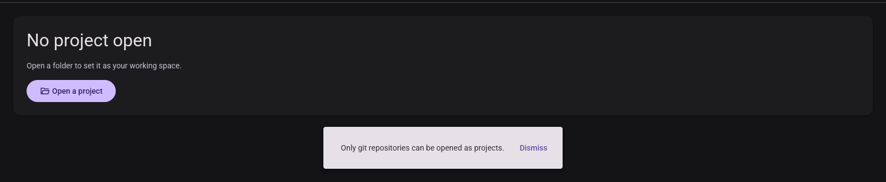

# 002 T047 — the manual walkthrough (quickstart steps 1–12), run for the first time

**Date**: 2026-08-21
**Run by**: an agent, not a person at a display — Xvfb `:83` at 1600×1400, Mesa lavapipe (software
Vulkan), driven with `xdotool`, captured with `import`. Per the repo's `visual-pass` skill.
**Build**: this branch's own `micold-ai-ide` + `micold-daemon`, built in one invocation and copied
out of the shared target directory **inside** the build lock (`~/vp83/bin`, 2026-08-20 21:03). The
newest commit touching `crates/` is `d28a0c6` (2026-08-19), so the pinned pair is this branch.
**Isolation**: `XDG_RUNTIME_DIR=/tmp/vp83`, a scratch `XDG_DATA_HOME`/`XDG_CONFIG_HOME` that had
never held a catalog. Everything started here was stopped by PID afterwards.
**Platform**: Linux only. The quickstart asks for steps 1–12 "on each platform"; macOS and Windows
are not reachable from here, and CI runs no GUI walkthrough on any platform.

## Fixture

Under a **real** (non-symlinked) path, because a symlinked project path misclassifies every
worktree — see [BUG-002](../bugs/BUG-002.md):

- `/home/jaro/.aaa-vp83d/w2-git` — a git repository
- `/home/jaro/.aaa-vp83d/w2-git-b` — a second git repository (steps 10–12 need two projects)
- `/home/jaro/.aaa-vp83d/w2-plain` — a plain folder containing `sub-a` and `sub-b`

## Result

| # | Claim | Result |
|---|-------|--------|
| 1 | Empty state invites opening a project | **PASS** — "No project open / Open a folder to set it as your working space." + a filled **Open a project** button; the top bar carries the neutral **Select project** affordance (C1 / FR-016) |
| 2 | In-app folder browser; folders only | **PASS** |
| 3 | git folder badged, non-git folder not | **PASS** — `w2-git`, `w2-git-b`, `myrepo`, `repo-b` all carry `git`; `w2-plain` does not. `w3-selector-git-badges.png` (C3 / FR-006, SC-006) |
| 4 | Enter/leave folders; reaches the root | **PASS** — into `w2-plain`, then **Up** five times to `/` (bin, boot, cdrom, dev, etc); one further **Up** is a no-op, no crash |
| 5 | Choose the **non-git** folder → project created | **stale step, behaviour correct** — see below |
| 6 | Choose the **git** folder → new project active, replaces previous | **PASS** — heading `Active project: w2-git`, chip `w2-git`, row marked active; opening `w2-git-b` afterwards moved heading, chip and marker to it and left `w2-git` listed (C4 / FR-013, FR-014) |
| 7 | Choose the **same** git folder again → no duplicate | **PASS** — one entry, still active; the catalog on disk still holds exactly one record for it (FR-012) |
| 8 | Rename to `My Project` | **PASS** — updated in the Known-projects row, and (at step 11) in the heading and the top-bar chip; `display_name` in `projects.json` follows; **no folder on disk renamed** (FR-017, FR-018, FR-019) |
| 9 | Reject `""` and `"   "` | **PASS** — two distinct messages in the error colour, dialog stays open, previous name kept. `w9-rename-validation.png` (FR-020) |
| 10 | Quit and relaunch → both projects, stored names, last-active indicated | **PASS** — `My Project` and `w2-git-b` both back, `w2-git-b` restored as active with its marker (FR-008, FR-010, FR-019) |
| 11 | Reopen a known project from the list | **PASS** for the step as written — `My Project` became active with no browsing (FR-011). **But the activation is not persisted** — [BUG-003](../bugs/BUG-003.md) |
| 12 | Rename a project's folder on disk, relaunch → unavailable, reopen blocked, no crash | **PARTIAL** — the row is marked unavailable and its action is a disabled **Unavailable**; pressing it does nothing and nothing crashes. The app nevertheless *opens into* that project — [BUG-004](../bugs/BUG-004.md) |

### Persistence spot check — **PASS**

The store matches [storage-schema.md](../contracts/storage-schema.md) exactly, and nothing else:

```json
{
  "schema_version": 1,
  "last_active": "/home/jaro/.aaa-vp83d/w2-git-b",
  "projects": [
    { "path": "/home/jaro/.aaa-vp83d/w2-git",   "display_name": "My Project", "is_git_repo": true },
    { "path": "/home/jaro/.aaa-vp83d/w2-git-b", "display_name": "w2-git-b",   "is_git_repo": true }
  ]
}
```

`display_name` carries the rename (FR-019); `ls` of the fixture directory afterwards still shows
`w2-git`, `w2-git-b`, `w2-plain` under their original names (FR-018). The refused non-git folder
appears nowhere in the catalog.

### Corruption resilience spot check — **PASS, and better than asked**

With the app closed, `echo 'not json' > projects.json`, then relaunch: the app comes up on the
empty state, no crash (SC-009). It also **does not overwrite the damaged file** — it is moved aside
to `projects.json.bak`, and both per-project state files under `projects/` survive untouched, which
is FR-012a's isolation clause holding on the same event.

## Step 5 — a stale step, and a defect it turns out to have closed

The step asks for a **non-git** folder to become a project. It cannot, and should not: FR-003 was
amended on 2026-07-20 to the opposite rule (git repositories only, per feature 005 FR-001a) because
every session maps to a git worktree. The quickstart line, US1 acceptance scenario 3, and SC-002
still describe the pre-amendment behaviour; they are stale text, not a failing app.

What the run *does* settle is the defect the same alignment note recorded and left open — *"the
refusal message is written to a state field whose only render site is the add-worktree modal, so a
non-git folder is refused silently"*. It is no longer silent:



The picker closes and a dismissible notification reads **"Only git repositories can be opened as
projects."**. The fix is visible in the source, with the ordering spelled out —
`crates/micold-client/src/shell/workspace.rs:98` closes the selector *before* the git gate,
"because notifications render inside `base`, which every modal wraps behind its scrim". Nothing to
carry forward; the spec's alignment note can be closed.

## What was not covered

- **macOS and Windows** (FR-024, SC-010). Not reachable from here.
- **FR-012b's visible surfacing of a persistence failure.** Provoking a real write fault (a
  read-only data dir, a full disk) was not attempted; the corruption check above covers the read
  side only.
- **SC-001's "without reading documentation".** A judgement about a first-time human, which an
  agent driving the same widgets cannot make. Every mechanical part of that flow passed.
