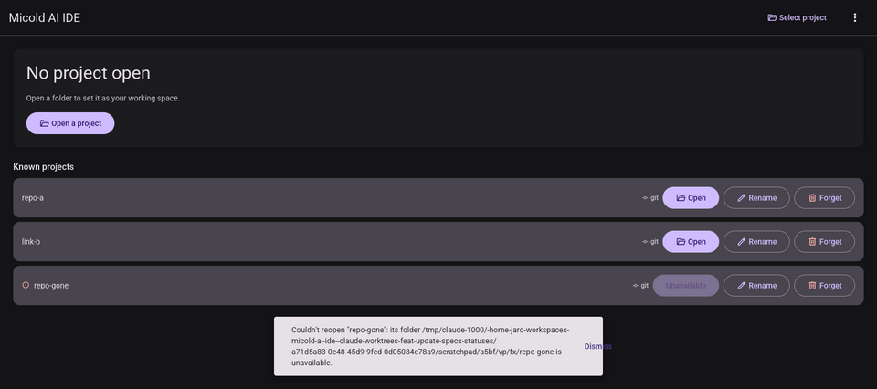
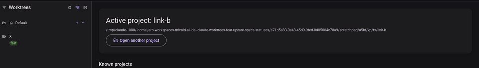

# 002 BUG-002, BUG-003, BUG-004 — visual pass

**Date**: 2026-09-13
**Run by**: an agent, not a person at a display. It used Xvfb `:93` at 1600×1400 with Mesa lavapipe (software Vulkan), drove the app with `xdotool` and captured with `import`, following the repo's `visual-pass` skill.
**Build**: this branch's own `micold-ai-ide` and `micold-daemon`, built in one locked invocation and copied out of the shared target directory inside the lock at 18:06. The newest commit touching `crates/` is from 17:58. `strings` finds `ProjectActivate` in both binaries. The daemon log shows `client attached to daemon` for both launches.
**Isolation**: `XDG_RUNTIME_DIR=/tmp/vp93` with scratch XDG data, config, state and cache homes. Everything started here was stopped by PID afterwards.

## Fixture

The client has no command line, so the catalog was seeded directly. `projects.json` holds three projects:

- `repo-a`, a git repository.
- `link-b`, a **symlink** to the git repository `real-b`. It is stored under the symlink's spelling, which is how a catalog written before this fix stores it.
- `repo-gone`, a path that does not exist.

`last_active` is `repo-gone`.

`real-b` carries the worktree `.claude/worktrees/feat-x` on branch `feat/x`. It was made with `git worktree add`, so feature 029 would hide it as an assistant's worktree. `micold-demo-provenance` recorded it as the application's, the same step `site/capture/demo-project.sh` takes.

## BUG-004 — a last-active project whose folder is gone is not opened — **PASS**

The launch lands on "No project open". `repo-gone` stays in Known projects, marked Unavailable, and is not active. The error notification reads: `Couldn't reopen "repo-gone": its folder … is unavailable.`

An earlier capture, taken about 40 s after launch, showed no notification. That is expected: error notifications expire after 10 s (`micold_core::notify::Level::duration`). The frame above was taken 7 s after launch.

**Finding, not fixed here:** the snackbar's "Dismiss" label spills past the container's right edge. This happens when the message is long enough to reach `anatomy::snackbar::MAX_WIDTH`, and a message carrying a full path does. The defect is in feature 018's shared `Snackbar` component (`ui/material/snackbar.rs`: a `Fill` text beside the button inside a `Shrink` container capped by `max_width`). It affects any long notification, not only this one, so it is out of scope for this bug.

## BUG-003 — reopening a known project records it as last active — **PASS**

Reopening `link-b` from the switcher (first run) and from the Known projects list (second run) changed `projects.json` from `"last_active": ".../repo-gone"` to `"last_active": ".../link-b"`. The daemon wrote it: it is the catalog's single writer.

## BUG-002 — a project opened through a symlink lists its worktrees as valid — **PASS**

With `link-b` active, the sidebar lists `feat-x` under its display name "X". The label is in the normal `on_surface` colour and carries the `feat` tag derived from branch `feat/x`. A Missing or Invalid worktree is drawn error-tinted with a status tag instead (`ui/sidebar.rs`, FR-011). Neither appears.

The first run showed "No worktrees yet" for `link-b`. That was the fixture lacking a provenance record (feature 029 hides unrecorded worktrees under `.claude/worktrees/`), not this bug. The run above records it.

## Not exercised

- **The unfixed build, side by side.** No pre-fix binary was pinned for comparison. The failing half is carried by the Red commits' tests, which failed before the fix.
- **The no-local-git route** (a daemon on another machine). There is no second machine here.
- **macOS and Windows.** Resolving Windows' verbatim `\\?\` prefix is covered by unit tests only.
