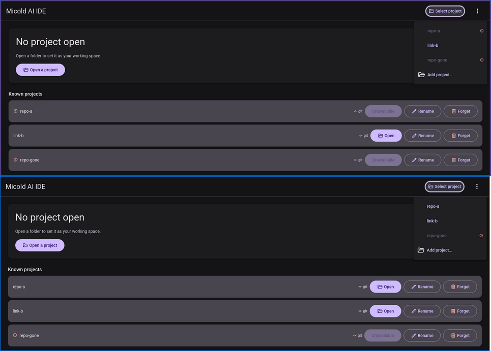
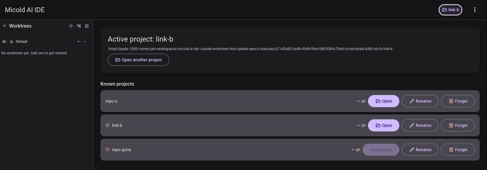

# 008 BUG-002, BUG-003 — visual pass

**Date**: 2026-09-13
**Run by**: an agent, not a person at a display. It used Xvfb `:93` at 1600×1400 with Mesa lavapipe (software Vulkan), drove the app with `xdotool` and captured with `import`, following the repo's `visual-pass` skill.
**Build**: this branch's own `micold-ai-ide` and `micold-daemon`, built in one locked invocation and copied out of the shared target directory inside the lock. The daemon log shows `client attached to daemon`.
**Isolation**: `XDG_RUNTIME_DIR=/tmp/vp93` with scratch XDG homes. Everything started here was stopped by PID afterwards.

## Fixture

The same seeded catalog as [002's pass](../../002-project-workspace-management/evidence/bugs-002-003-004-visual-pass.md): `repo-a`, `link-b` (a symlink to a git repository) and `repo-gone` (missing). No project is active after launch.

## BUG-003 — opening the switcher rescans availability — **PASS**

Steps:

1. Launch the app with every folder but `repo-gone` present.
2. Rename `repo-a`'s folder away on disk.
3. Press the switcher trigger **once**.

The panel opens with `repo-a` already badged unavailable, and the Known projects list below agrees (top, red border). There was no refused pick, no second press and no restart.

Next, the folder was moved back, the panel closed, and the trigger pressed once more. `repo-a` is available again in both places (bottom, blue border).

## BUG-002 — picking a project closes the switcher — **PASS**

Picking `link-b` in the open panel switched to it and closed the panel in the same step. The trigger now reads `link-b`, and the sidebar and "Active project: link-b" show beneath it with no panel covering them.

## Not exercised

- **A refused pick leaving the panel open.** The pass did not pick an unavailable row. `a_refused_pick_leaves_the_switcher_open` covers it.
- **The open and close animation.** A screenshot cannot settle a 150 ms transition. Only the resting states before and after are shown.
