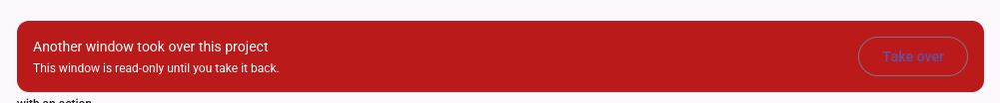

# Bug Report: the connection banner's action label is drawn in `primary` on an `error` container — purple on red at a 1.00:1 contrast ratio, so "Take over" is very nearly invisible

**Type**: Spec gap (§1.3 enumerates the surfaces `primary` may be drawn on and `error` is not among
them; §7.3 states the outlined button's label is `primary` without qualifying it by host surface —
nothing forbids composing the two), surfacing as an implementation the contract permits.

**Severity**: High — the label is the only statement of what the button does, and it is the button
that ends a read-only state the user cannot otherwise leave. Two more banners carry the same
affordance (`Restart service`, twice). No data is at risk; the control is simply unreadable.

**Feature**: `018-material3-visual-system` (§1.3 the contrast obligation table, §7.3 buttons,
FR-004/FR-005). The banner's behaviour belongs to
[`010-daemon-session-persistence`](../../010-daemon-session-persistence/spec.md) US5 (FR-024,
FR-027); the component to [`017-material-component-architecture`](../../017-material-component-architecture/spec.md);
the colours that make it unreadable are this feature's.

**Reported**: 2026-08-21

**Status**: Fixed

**Patched**: 2026-08-21 — `spec.md` gained FR-004a, FR-027b, SC-008g and US4 acceptance scenario 15;
`contracts/design-tokens.md` §1.3's `primary` row gained the accent-fill prohibition and the table's
closing note the border rule, and §7.3 gained a **Host surface** paragraph and table beside the
destructive-action line; `plan.md` gained the "every component knows its own colours, and nothing
knows what it is standing on" risk row; `tasks.md` gained Phase 21 (T151–T159). The border question
this report left open is settled: an outlined component on an accent fill takes the fill's paired
`on_*` role at the border's own opacity, not `outline`. Nothing is reopened — T080, T000a/T000b and
T036 are complete as written.

**Fixed**: 2026-08-21 — Phase 21 (T151–T159) complete.

`style::Host` is the seam: a container's fill paired with the foreground a component drawn on it
takes, plus whether that fill is an **accent** — only an accent imposes, so a neutral host leaves
§7.3's table exactly as it was. `style::notification_host` is the one decision the banner's fill and
its action both read, so a level added to `NoticeLevel` cannot arrive with a readable banner and an
unreadable button. `Button::on_host` carries it into the component, and `Variant::content` — already
the single place a variant's content colour is decided — resolves it once for the label, the leading
glyph, the border, the state layer and the ripple.

The measured result on the `error` fill: the label goes from **1.00:1** to 6.46:1 in the light scheme
and from 1.01:1 to 6.46:1 in the dark, and the border from 1.44:1 / 1.86:1 to the same figure, past
a 3:1 threshold it was never near. Confirmed at a display in both schemes, at rest and under hover
and press ([evidence](../evidence/BUG-009-action-on-the-error-banner.png)).

The class, not the instance. All three actioned banners — `Take over` and both `Restart service` —
are one `ConnectionBanner`, so one fix reaches them. The **snackbar** was a second instance and is
fixed too: its `Dismiss` label was already `inverse_primary`, tinted onto the label at the call site,
which reached the glyphs and left the hover and press layers and the ripple in `primary` over the
inverted fill. Tags and chips are tonal rather than accent-filled and host no interactive child.

`composition_contrast.rs` is the gate, in-crate rather than in `tests/` because the style layer is
`pub(crate)` and reading the composition means calling the functions the view calls. It walks
`ColorScheme × NoticeLevel::ALL × Variant::ALL × {active, hovered, pressed}`, resolves the background
as the host's fill with the button's own state layer composited over it, and accumulates every
violation rather than stopping at the first.

The "adjacent risk" this report noted is now measured, and it is real: on the neutral `Info` host the
label falls to 4.40–4.49:1 under the state layers and the dark scheme's `outline` border sits at
2.96:1 before any layer at all. That is a different cause with a different fix, and it is filed as
[BUG-010](BUG-010.md) rather than folded in here.

## Description

When another window takes over the project, the client shows the full-width red takeover banner with
a trailing `Take over` button. The button's outline and label are drawn in `primary` — the baseline
purple — on the banner's `error` red. The label is legible only as a slightly different shade of the
surface it sits on.



Two other banners hit the same pairing, both with `Restart service`:
`ConnectionStatus::VersionMismatch` and `ConnectionStatus::BuildMismatch`
(`crates/micold-client/src/ui/mod.rs:93-130`). All four banner states default to
`NoticeLevel::Error`, so every banner that carries an action carries an unreadable one. The showcase
renders the same thing (`showcase/sections/surfaces.rs:189-198`, "with an action").

## Evidence

The pairing is two independent, individually-correct decisions meeting inside one widget.

`crates/micold-client/src/ui/material/connection_banner.rs:73-85` — the container takes the error
surface, and the action is the shared outlined button:

```rust
line = line.push(super::Button::outlined(label, b.roles).on_press(on_press));
...
container(line)
    .padding(spacing::MD)
    .style(style::notification(b.roles, b.level))
```

`style.rs:424-437` — `notification(Error)` fills with `error` and sets the *container's* text colour
to `on_error`:

```rust
NoticeLevel::Error => (r.error, r.on_error),
```

That `text_color` reaches the banner's title and detail, which is why the prose is readable. It does
not reach the button, which sets its own:

`style.rs:464-478` — the outlined variant, per §7.3, in `primary`, unconditionally:

```rust
let prim = color(r.primary);
...
(prim, color(r.outline))
```

### The numbers

Roles resolve to (`crates/micold-core/src/tokens/mod.rs:181-256`, `palette.rs`):

| | light | dark |
|---|---|---|
| `error` (the banner fill) | `#BA1A1A` (tone 40) | `#FFB4AB` (tone 80) |
| `primary` (the label) | `#6750A4` (tone 40) | `#CFBCFF` (tone 80) |
| `outline` (the border) | `#7A757F` | neutral-variant tone 60 |

| pair | ratio | AA (4.5:1) |
|---|---|---|
| `primary` on `error`, light | **1.00:1** | fails |
| `primary` on `error`, dark | **1.01:1** | fails |
| `outline` on `error`, light | 1.42:1 | fails the non-text 3:1 threshold too |
| `on_error` on `error` (the prose) | 6.46:1 | passes |

Both schemes land at 1:1 for the same structural reason, and it is the reason the tonal system was
adopted: a role reads its ramp at the tone its *scheme* assigns, so in the light scheme `primary`
and `error` are both tone 40 and in the dark scheme both tone 80. **Two roles at the same tone have
the same luminance by construction.** The system that guarantees `on_error` is readable on `error`
guarantees, just as reliably, that `primary` on `error` is not — this is not a near miss that a
better red would fix.

### Why no gate saw it

- `crates/micold-core/tests/tokens_contrast.rs:124-136` is the FR-004 gate, and it is exhaustive
  over the pairs it is *given*. Line 130 pushes `primary/<bg>` for the neutral surfaces only —
  the same list §1.3 enumerates — and line 136 does the same for `error`. `primary` × `error` is not
  in the product, because no artifact says that combination exists.
- `ui/material/style_snapshot.rs:83-87` pins `container.notification[error]`'s background and text
  colour. Both are correct. The snapshot records styles one at a time; a button's colour inside a
  container's fill is not a property of either style.
- `anatomy_size.rs` and the 019 frame probes measure geometry. This costs no pixels.
- The showcase displays the exact failing composition and has been through visual passes. It reads
  as a design choice unless you know `primary` is not supposed to be there.

## Artifact Traceability

### spec.md / contracts (018-material3-visual-system)

- **FR-004** — "Every foreground role that carries text or icons MUST meet WCAG AA contrast
  (≥ 4.5:1) against every background role **it is specified to render on**". The clause does its
  job: `primary` is not specified to render on `error`, so the requirement is satisfied and the
  screen is still wrong. The gap is that nothing forbids the un-enumerated pairing, and composition
  creates them without anyone declaring one.
- **FR-005** — "The AA contrast test MUST cover every role pair **introduced by this feature**".
  Same shape. The pair was introduced by a *call site*, not by the token set.
- **§1.3, `contracts/design-tokens.md:109`** — the obligation table's `primary` row reads
  "`surface`, `surface_container_low`, `surface_container` (text/outlined buttons and links draw
  `primary` on a surface)". The parenthetical is the assumption in plain sight: an outlined button
  is presumed to stand on a *neutral* surface. Nothing states it, so nothing checks it.
- **§7.3, `contracts/design-tokens.md:541-563`** — the button table gives Outlined an unconditional
  `primary` label and a `1dp outline` border. Its one host-sensitive rule is the last line,
  "Destructive actions substitute `error` / `on_error` for `primary` / `on_primary`" — which is
  about the action's *meaning*, not the surface underneath. There is no row for a button on an
  accent-filled container.
- **FR-003 / §3** — outlines may appear as "the border of an outlined component variant". The border
  is permitted; that it is drawn in a role with 1.42:1 against its host is not considered.
- **Gap identified**: the contract has no rule for a component placed on a container that is not a
  neutral surface. Material's own answer for this case exists — a banner or snackbar on a filled
  container takes its action's colour from the container's paired `on_*` role (or, for the inverse
  surfaces, `inverse_primary`) — and none of it is written down here.

### tasks.md (018)

- **T080** (`tasks.md:527`) is the direct antecedent: *"Rebuild the connection banner's action …
  on the shared `Button` with the outlined variant, rather than a raw `button` styled with
  `style::outlined(...)`"*. It is correct and complete as written — the action ripples, and there is
  one definition of an outlined button. It is worth recording that the task **did not introduce the
  defect**: the hand-rolled version it replaced called `style::outlined` and was purple-on-red too.
  What it did was make the colour arrive from the shared library, which is where the rule that is
  missing would have to live.
- **T000a/T000b** (`tasks.md:80-84`) built the contrast gate over §1.3's table. Faithful to the
  table; the table is the gap.
- **T036** (`tasks.md:252`) applied state layers to the outlined style — the hover and pressed fills
  are `primary` at low alpha, so they are invisible on red as well.
- **False completions**: none. Every task above is done as specified.
- **Missing tasks**: a rule in §1.3/§7.3 for components on non-neutral containers; the gate
  extension that enforces it; the banner's own fix.

### 010-daemon-session-persistence/spec.md

- **FR-024** — on confirmed takeover the displaced client goes read-only. The `Take over` button is
  the only way back, and this feature's US5 is where it was specified.
- **FR-027** — while disconnected the client "MUST clearly indicate that displayed content may be
  stale". The indication is clear; the way out of it is not. Nothing in 010 states the action must
  be legible, which is correct — that is 018's obligation.
- **No reopening.** 010's behaviour is intact: the button works, is focusable and hit-testable.

### 017-material-component-architecture/spec.md

- The `Button` variants and their chainable builders are 017's; the colours are 018's. 017's
  single-definition rule is what makes the fix cheap — one place to change — and also what makes the
  question real: a variant that hard-codes `primary` cannot serve a call site that needs a different
  foreground, so the fix has to be expressed as something the *component* takes, not as a second
  outlined button at the call site (which FR-021/FR-027 forbid, and which T080 has already removed
  once).

## Root Cause Analysis

**Every component knows its own colours; nothing knows what it is standing on.**

The banner sets `text_color` on its container, which is iced's inherited-text mechanism, and the
title and detail take it. A `Button` is not inheriting text — it sets `text_color` in its own
`button::Style`, from the role §7.3 assigns it. So the banner's statement "on this surface,
foregrounds are `on_error`" is true of exactly the children that do not have an opinion, and the one
child that does have an opinion is the one whose opinion is wrong here.

The contract encodes the same blind spot one level up. §1.3 lists, for each foreground role, the
backgrounds it appears on — a table that can only be written by enumerating the compositions someone
thought of. Every entry in it is a *token-level* pairing (`on_error` with `error`). The pairing that
broke is *component-level*: it exists because a `Button` was pushed into a `row` inside a styled
`container`, three files away from anything that names a colour. FR-005's "every role pair
introduced by this feature" is scoped to the token set for the same reason — the feature that
introduces a pair by composition is not the feature that defines the roles.

This is 018's recurring lesson again, in colour rather than geometry: **the gates read one component
at a time.** BUG-003 recorded it about panels, BUG-008 about a menu and its row. Here it is a button
and the surface beneath it — and, unlike those two, the tonal system makes the failure exact rather
than approximate: same tone, same luminance, 1.00:1.

## Recommended Fix

Sketch, not a decision — `/speckit.bugfix.patch` settles the requirement wording first.

1. **State the rule in §1.3 and §7.3.** A component placed on an accent-filled container draws its
   foreground from that container's paired `on_*` role, not from `primary`. Give §7.3 a host-surface
   qualification beside the existing destructive-action line, and give §1.3's `primary` row the
   converse: `primary` MUST NOT be drawn on any accent fill. Decide explicitly what the outlined
   border becomes — `on_error` at the outline's opacity is the Material answer — since `outline` at
   1.42:1 fails the non-text 3:1 threshold §1.3 already imposes.
2. **Carry it in the component, per 017.** The variant needs to take the foreground it should use
   (an `on_color` on the builder, or a banner-scoped variant), so the single definition of "outlined
   button" still holds and the state layers and ripple follow the same colour.
3. **Extend the FR-004 gate to the composition, not just the token set.** The pair to assert is "the
   role a component's label resolves to, against the role of the container it is rendered in" — the
   inventory of banner/snackbar/tag hosts is small and known. Without this the rule in step 1 is
   prose, and this bug's shape recurs at the next filled container.
4. **Sweep the other call sites**: the two `Restart service` banners, and any tag or filled chip that
   hosts an interactive child.
5. Confirm in the running application via the `visual-pass` route, in **both** schemes — the dark
   scheme fails identically and a light-only screenshot would not show it — and record the result in
   `../evidence/`.

## Adjacent risk, not this bug

`style::notification(Info)` pairs `surface_variant` with `on_surface`, and an outlined button on
`surface_variant` is inside §1.3's neutral enumeration, so the Info banner's action is readable. It
is readable by luck of which surfaces were enumerated, not because anything checks it — the same
missing rule covers it.

## Next Steps

1. `/speckit.bugfix.patch` — amend 018's spec/contract, add the tasks. ✅ 2026-08-21
2. `/speckit.bugfix.verify` — confirm consistency across spec, plan and tasks. ✅ 2026-08-21
3. `/speckit.implement` — test first (Recommended Fix step 3), then the fix. ✅ 2026-08-21
