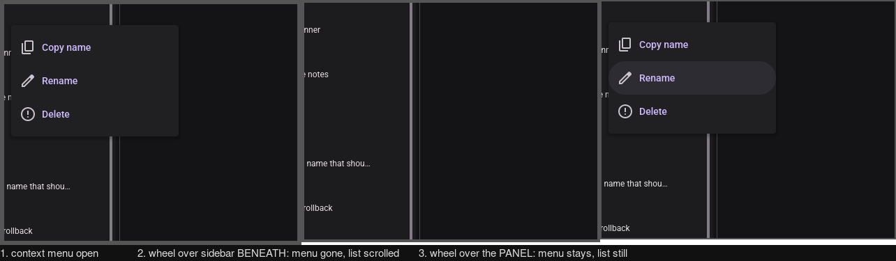

# Quickstart: Validating the Feature-Module MVU Architecture

**Feature**: 021 | **Date**: 2026-08-07 | **Plan**: [plan.md](./plan.md)

How to prove this feature works. Because it changes no user-visible behavior, validation is mostly
**measurement** and **the existing suite staying green** — not new manual scenarios.

## Prerequisites

```bash
mise trust                 # once per fresh worktree
mise run test              # baseline: whole workspace must be green before starting
```

Do not alternate between `mise run <task>` and bare `cargo` in one session — they use different
toolchain patch releases over the same `target/`, and switching rebuilds every dependency.

## Per-step validation (SC-009)

Every one of the 20 migration steps (research.md §6) must leave the application buildable, runnable
and green. Run after **each** step, and commit only on green:

```bash
mise run test              # whole workspace, matches CI
mise run test-core         # faster inner loop for core-only changes
mise run run               # the app must still launch and work
```

SC-009 is verified from git history, not just the endpoint: each step is its own commit, so
`git log` is the evidence. A step that needs a later step to compile is a planning error, not an
acceptable intermediate.

## Success criteria — how each is checked

| SC | Check | Command / method |
|---|---|---|
| **SC-001** | New floating surface touches one module + ≤1 registration line; zero central match edits | Permanent guard `surface_registration_cost.rs` (not a one-time count) |
| **SC-002** | New feature touches one module + ≤1 registration line, zero edits to other features | Permanent guard `feature_registration_cost.rs` |
| **SC-002a** | Both guards remain in the suite after this feature ships | Present in `crates/micold-client/tests/` |
| **SC-003** | Neither file among the largest; neither holds >1 feature. 500 lines indicative, **not a gate** | `find crates -name '*.rs' -exec wc -l {} + \| sort -rn \| head -10` |
| **SC-004** | Every feature module has a test using only its own types | Per-module test presence; see below |
| **SC-004a** | Per-feature nesting verdict recorded with evidence | research.md §5 — **already satisfied** |
| **SC-004b** | Tiers 1, 2 and shell split green with zero Tier 3 merged | Green CI at step 16, before step 17 |
| **SC-005** | Every capability has a fake; behavior tested through it with zero real I/O | `mise run test` with the per-capability tests |
| **SC-006** | Whole pre-existing suite passes, zero assertions modified, all three platforms | CI on Linux + macOS + Windows |
| **SC-007** | Zero direct cross-feature reducer writes; adding one fails a named guard | `feature_write_isolation.rs` |
| **SC-008** | Pre-change state loads and behaves identically | Manual procedure below |
| **SC-009** | Every step green in its own commit | `git log` + CI per commit |
| **SC-010** | "Where does feature X live?" answered by one module | Review against research.md §1 |

### SC-003 measurement

```bash
find crates -name '*.rs' -type f -exec wc -l {} + | sort -rn | head -10
```

Baseline at plan time: `main.rs` 3,567 and `app.rs` 2,434 are #1 and #2. Success means neither
appears near the top, and the next-largest files (`server.rs` 1,483, `terminal_pane.rs` 1,348,
`state.rs` 1,317) are the new leaders.

**Settled 2026-08-07**: FR-005 governs. A file containing exactly one feature and no longer among
the largest satisfies SC-003 **at any length**. The 500-line figure is a progress signal. Splitting
a coherent single-feature module to cross a numeric threshold is explicitly forbidden — it would
make the codebase worse while scoring the criterion green.

### SC-004 — per-feature isolation test

For each of the nine feature modules, a test that constructs **only** that feature's types:

```bash
mise run test -- features::
```

The test must not name any unrelated feature's types. This is the falsifiable form of "reason about
one feature in isolation" (spec User Story 2).

### FR-027 — no assertion modified

The single most important check in the feature. The existing suite is the behavior specification.

```bash
# No existing test file may have an assertion changed. Additions are fine;
# relocations are fine (research.md §3). Rewrites and deletions are not.
git diff main...HEAD -- crates/*/tests/ | grep -E '^-.*assert'
```

**Any output from that command is a defect** unless it is a pure relocation with the identical
assertion re-added elsewhere in the same diff.

## Manual procedures

Two things cannot be automated. Both fall under Principle I's GUI/process-spawn wiring exception —
thin glue with no decision logic of its own — and are recorded here as that exception requires.

### M1 — Persisted state loads identically (SC-008, FR-026)

1. Check out this feature's **merge base**, `e02f971`, and `mise run run`. Not "the commit before
   021 started" — 021 is long-lived and merges to main incrementally, so `44b9fd1`, which this step
   named until T083, carries four other features' work (016, 022, 025, 026) and attributes it here.
   The result below measures both: **0 pixels** from the merge base, **3,755 pixels** from
   `44b9fd1`, all of the latter a type-scale change this feature did not make.
2. Open a project, create a worktree, start two sessions, set a non-default theme and scrollback.
   Quit.
3. Back up the state directory.
4. Check out the post-change branch and `mise run run`.
5. **Expect**: the same project, worktrees, sessions, theme and scrollback, with no migration
   prompt, no warning, and no rewrite of the state files. **Not filters** — `sidebar_filters` is
   in-memory view state that no build has ever persisted, so a filter surviving a restart would be
   a new feature, not this one holding. This step expected them until T083.
6. Quit, and diff the state directory against the backup. **Expect**: no structural change.

#### Result — 2026-08-20, T072

Run **not on a real display**: Xvfb `:78` at 1600×1400 with Mesa lavapipe, driven by `xdotool`,
captured with `import`, state isolated via `XDG_DATA_HOME` and a short `XDG_RUNTIME_DIR`
(`/tmp/m1rt`, so the daemon socket fits in `sun_path`). Fixture: a throwaway git repo with two
worktrees. The developer's own app and daemon were left alone; each build ran with its **own**
daemon, pinned by `MICOLD_DAEMON_BIN`.

Step 1 deviates: the fixture project was seeded into `projects.json` rather than opened through the
folder browser. Everything after that — the third worktree, both sessions, the theme and the
scrollback — was performed in the pre-change GUI, which rewrote both files itself, so the state
under test is pre-change-written.

| # | Claim | Result |
|---|---|---|
| 5 | Same project, worktrees, sessions | **Pass** — same project active, same four worktrees in the same order with the same type tags, both sessions present with the same ids, `worktree_dir`, `mode` and `schema_version` |
| 5 | Same theme and scrollback | **Pass** — `theme: dark`, `scrollback_lines: 4321`, both non-default and both honoured |
| 5 | Same filters | **Not applicable — the application has never persisted them.** `sidebar_filters` is in-memory view state in both builds; nothing writes it to either file. The expectation is wrong about the application, not about the change |
| 5 | No migration prompt, no warning | **Pass** — no banner, no dialog |
| 6 | No structural change to the state directory | **Pass** — `projects.json` and `settings.json` **byte-identical**; `projects/<id>.json` differs in one field, `archived: false → true` on both sessions |

**The one differing field is not a difference between the builds.** Stopping the pre-change daemon
ends the AI CLI processes, and the daemon's restart reconciliation (FR-020c) marks the sessions
archived from the provider's own marker — the field's own doc calls it "not authoritative". Fed the
identical backup, the **pre-change build produces the identical file** (`c4e58c09…` from both), so
this is the daemon doing its documented job, not the restructuring.

**What M1's baseline cannot answer, and this is the finding worth keeping.** Step 1 names
`44b9fd1`, which was "before feature 021 started" when quickstart.md was written. Four other
features have shipped since (016, 022, 025, 026), so a `44b9fd1`-vs-HEAD comparison is *those plus*
021. Rendered against identical state at identical geometry, the sidebar differs by **3,755
pixels** — a global type-scale change — and none of it is attributable to this feature. Built at
021's own merge base (`e02f971`) and compared the same way, the difference is **0 pixels**:

- `evidence/m1-sidebar-base-vs-head.png` — merge base (red) vs HEAD (blue): pixel-identical
- `evidence/m1-sidebar-44b9fd1-vs-head.png` — `44b9fd1` (red) vs HEAD (blue): the other features

A long-lived feature that merges to main incrementally cannot use "the commit before it started" as
a control, and M1 should say so rather than let the next reader attribute four features' work to
this one.

**Done at T083.** Step 1 now names the merge base and step 5 no longer expects filters. The
procedure above and the result here agree; before T083 they contradicted each other, and a reader
following the steps would have failed a passing feature twice over.

### M2 — Overlay behavior is unchanged (FR-011, FR-012, FR-013)

The exit-animation snapshot is the riskiest obligation in the feature (research.md §9). The
automated suite covers it, but these are the behaviors most likely to shift in a way a test misses.

1. Open the About dialog; press Escape. **Expect**: it animates out, not disappears.
2. Open it again *while it is animating out*. **Expect**: it reverses smoothly; no flicker, no
   duplicate.
3. Open the sidebar filter panel, set two filters, close the panel. **Expect**: filters still
   applied (FR-013).
4. Open the project switcher, then right-click a project to open its context menu (both open at
   once). Press Escape. **Expect**: the context menu closes, the switcher stays (FR-012, D1).
5. With a popover open, open a modal. **Expect**: the popover closes (FR-012, D2).
6. Scroll the area beneath an open popover. **Expect**: it dismisses.

Run M2 after step 11 — the point where `Overlay` and `ClosingOverlay` are deleted.

#### Result — 2026-08-10, after T037 (feature 021, T040)

Run against `feat/021-tier2-quickstart` (`cacd9ab`), **not on a real display**: Xvfb `:77` at
1600×1400 with Mesa lavapipe (software Vulkan), driven by `xdotool`, captured with `import`. State
was isolated via `XDG_DATA_HOME` and `XDG_RUNTIME_DIR` pointed at a scratch directory, against a
throwaway two-project fixture with 21 worktrees under `.claude/worktrees/`; the developer's own
running app and session daemon were left alone.

| # | Behaviour | Result |
|---|---|---|
| 1 | About animates out on Escape | **Not verified** — see below |
| 2 | Reopening mid-exit reverses; no flicker, no duplicate | **Partial** — end state clean, reversal unverified |
| 3 | Filters survive closing the filter panel (FR-013) | **Pass** |
| 4 | Escape takes the context menu, switcher stays (FR-012, D1) | **Pass** |
| 5 | Opening a modal closes the popover (FR-012, D2) | **Pass** |
| 6 | Scrolling beneath a popover dismisses it | **Blocked** — see finding |

**1 and 2 — the animation itself is out of reach here, and is not being claimed.** The dialog does
close on Escape and reopens correctly. But the exit is a designed 200 ms (`modal.rs` `EXIT` =
`duration::SHORT_4`), and a capture loop sampling the dialog region every ~60 ms across 40 frames
recorded *no* intermediate frame: the region's mean jumps from 9971.78 (open) to 5225.67 (closed)
between consecutive samples. Either the transition is not being played under a software rasteriser
with no presentation timing, or it completes far faster than its token says. A screenshot pipeline
cannot distinguish those, so neither step is marked passed. What *is* established for step 2 is the
failure mode that would outlive a bad transition: reopening immediately after Escape yields a single
dialog whose captured region is byte-identical to a clean open — no duplicate, no ghost behind the
scrim, no stuck overlay.

**6 — blocked, and the reason is a finding rather than an environment artefact.** With a popover
open the sidebar does not scroll *at all*: three wheel notches over the list changed **0 pixels**,
where the same gesture at the same coordinates scrolls normally with no popover open. The trigger
therefore never fires, so the dismissal cannot be observed. This is **not** a Tier 2 regression —
`Message::SidebarScrolled` calls `dismiss_on_scroll_beneath()` correctly — and points at the overlay
primitive (feature 017) capturing wheel events before they reach the content beneath.

**A related observation, worth its own follow-up.** `Message::ScrolledBeneathOverlay` is declared and
handled in the reducer but **emitted by nothing** in `src/`; the live producer is
`Message::SidebarScrolled(offset)`, whose arm calls the same method. The only thing that drives
`ScrolledBeneathOverlay` is `tests/overlay_dismissal_delta.rs` — so feature 017's "non-modal surfaces
gained scroll dismissal" is asserted exclusively through an entry point the running application never
uses. The behaviours are equivalent *provided the live message is ever sent*, which is exactly what
step 6 could not confirm. Both belong to feature 017's overlay primitive and are out of scope for
this feature; recorded here rather than fixed.

#### Result — step 6 re-run, 2026-08-25, at T080

Step 6 was recorded **Blocked** above, with the block attributed to feature 017's overlay primitive
capturing wheel events. **That attribution was wrong.** Re-run against `HEAD` of `work-021`, again
**not on a real display**: Xvfb `:91` at 1600×1400 with Mesa lavapipe (software Vulkan),
`WGPU_BACKEND=vulkan`, driven by `xdotool`, captured with `import`, compared with
`compare -metric AE`. Client and daemon were built in one invocation and pinned to `~/vp91/bin/`;
the pair was confirmed to handshake (`client attached to daemon`) before anything was measured.
State was isolated to a scratch `XDG_DATA_HOME` with `XDG_RUNTIME_DIR=/tmp/vp91`, against a
throwaway one-project fixture with 20 worktrees. The developer's own app and daemon were untouched.

**Step 6 passes. FR-012's scroll dismissal survives in the built application.** Two different
lightweight surfaces were exercised — the header's ⋮ overflow menu (`Layer::Popover`,
`Anchor::TopEnd`, which does not overlap the sidebar) and a worktree row's right-click context menu
(`Layer::ContextMenu`, `Anchor::Point`, which does) — and both dismissed when the sidebar was
scrolled beneath them.

| Gesture | Sidebar region | Surface region |
|---|---|---|
| Three wheel notches over the sidebar, **no** surface open | 46,257 px changed | — |
| Same gesture, ⋮ overflow menu open | **46,257 px** — identical | 65,277 px (96.6%), menu gone |
| Same gesture, context menu open | scrolled | 41,623 px (80.0%), menu gone |
| Three wheel notches **over the open panel itself** | **0 px** | 10,961 px — hover highlight only, menu stays |

The last row is what T040 measured. Pointing the wheel at the panel scrolls nothing beneath it and
dismisses nothing, which is the correct behaviour for a surface that is itself the pointer's target;
pointing it at the content *beneath* the surface produces a scroll byte-identical to the
no-surface baseline **and** takes the surface with it. That last row is also the only way this build produces
"0 pixels", and it is reachable by aiming a wheel at a coordinate an open surface now covers —
exactly the hazard the `visual-pass` skill warns about under "An open overlay changes what a
coordinate means". T040 did not record where it pointed, so this is the likeliest reading of its
number rather than a certainty; what *is* certain is that the behaviour it inferred from that number
does not exist in this build.



Two history checks rule out "it was broken then and was fixed since", since that would leave the
defect real and merely relocated. Neither half of the wiring has changed since `cacd9ab`, the commit
T040 ran against: `git log cacd9ab..HEAD -- crates/micold-client/src/ui/cdk/overlay.rs` yields one
commit, `bd67826`, whose diff to that file adds nothing but the `Anchor::BottomStart` variant; and
`.on_scroll_offset(Message::SidebarScrolled)` was already present in `src/ui/sidebar.rs` at
`cacd9ab` (line 154 there, line 173 now). The static reading agrees: `mouse_area` captures
`WheelScrolled` only when `on_scroll` is set, which the overlay primitive never sets; `opaque`
captures presses only; and `modal.rs:143` is the sole `.scrim(...)` call site, so no non-modal
surface gets an opaque backdrop at all. There was never a wheel-capturing path to fix.

**Not covered.** Whether the *dismissal* animates out over its 200 ms, as opposed to disappearing —
that is steps 1 and 2's unanswered question, still unanswered, and T082's subject. This step
establishes only that the surface is gone and the content moved.

The related observation above — `Message::ScrolledBeneathOverlay` having no producer in `src/` — is
unaffected by this result, and T081 resolved it the way this result points: the variant is deleted
and `tests/overlay_dismissal_delta.rs` now asks through `SidebarScrolled`, the message the worktree
list it describes actually sends.

## Documentation deliverable (Principle VII)

This change is not user-facing, so the user-guide obligation is met by architectural documentation:

- `docs/development/architecture.md` — the tier structure, where a feature lives, how to add a
  floating surface, how to add a capability, and the read/write asymmetry with its rationale.

Verified by the existing docs check in CI (currently passing in 6s).

## Definition of done

- [ ] All 20 steps merged, each green in its own commit (SC-009)
- [ ] SC-001 through SC-010 checked by the methods above
- [ ] `git diff main...HEAD -- crates/*/tests/` shows no modified assertion (FR-027)
- [ ] M1 and M2 performed and recorded
- [ ] Three new guard tests present and failing when their invariant is violated
- [ ] `docs/development/architecture.md` written and CI-verified
- [ ] Green on Linux, macOS and Windows (SC-006)
