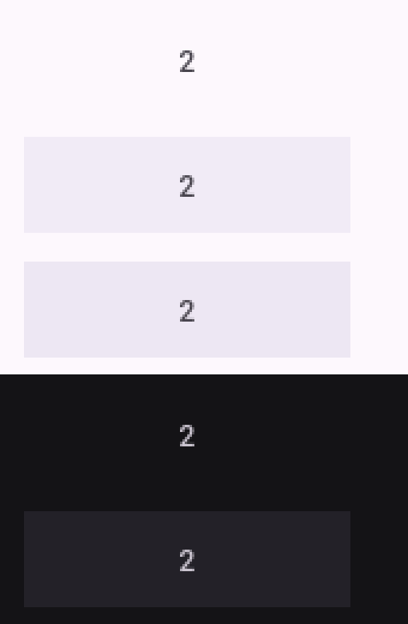
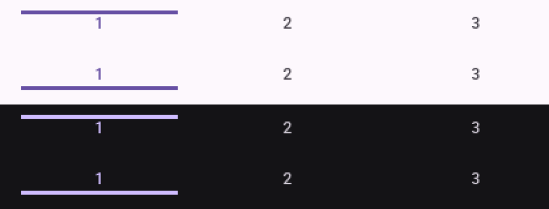
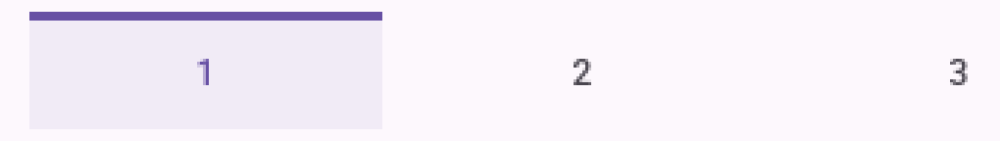
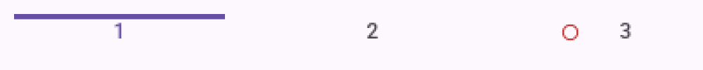
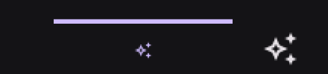
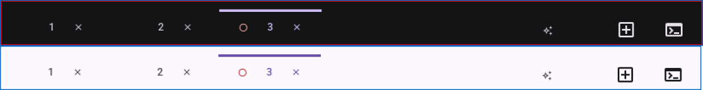
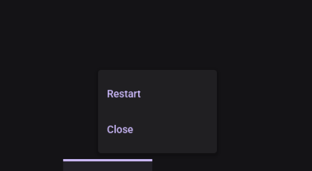

# Visual pass — The AI Session as a Tab

Records of `quickstart.md`'s manual GUI checks, run headlessly with the repo's `visual-pass` skill.

---

## 2026-08-20 — T013, §9, the gallery's tab and its two orientations

**Ran on**: Xvfb `:77` (1600×1400) + lavapipe (Mesa's software Vulkan rasteriser), **not a physical
display**. `micold-showcase`, `debug`, built from `feat/026-ai-session-tab` and copied out of
`target-shared/` to `~/vp/bin/` before launching — the shared target directory holds whatever branch
built last, and launching from it is how a pass reports on someone else's code. Verified the pin by
`strings ~/vp/bin/micold-showcase | grep -c "indicator on the bottom edge"` → 1, a string this
branch adds. Isolated `XDG_DATA_HOME` and a private `XDG_RUNTIME_DIR=/tmp/vp77`; only processes whose
`XDG_RUNTIME_DIR` read `/tmp/vp77` were ever stopped. The showcase needs no daemon, so the
client/daemon version-pairing hazard did not apply.

**Why this task exists.** Both of its claims are invisible to every gate in `tests/`. A state layer
is **drawn, not laid out** — it occupies the same box whether it is a rectangle, a pill or nothing at
all — and an indicator orientation is only meaningful *beside the other one*, which no single
assertion can arrange. `cargo test -p micold-client` was green over both before this pass, and green
over the defect below.

### Passed — the highlight is a tab's, not a button's (FR-015, SC-010)

Rest, hover and press on one tab, cropped at **identical geometry** (`170×52+178+396`) and stacked;
light scheme first, then dark. Measured off the full frames rather than judged by eye:

| scheme | state | width at the topmost row | width at the bottommost row | height at the leading edge column | height at the trailing edge column |
|---|---|---|---|---|---|
| light | hover | 136 | 136 | 40 | 40 |
| light | press | 136 | 136 | 40 | 40 |
| dark | hover | 136 | 136 | 40 | 40 |

136 × 40 is `material::tab::WIDTH` × `density::BUTTON_BASE` — the tab exactly. The four figures are
what distinguish a rectangle from a pill without trusting the eye: **a rounded shape is narrower at
its topmost and bottommost rows and shorter at its leading and trailing columns**, and `shape::FULL`
on a 40dp control is a 20dp radius, which would take 40dp off the top row. Nothing is taken off.
Square in both schemes, on hover and on press.

**At rest a tab draws nothing at all** — no background, no outline, no pill (feature 012 FR-004b).
The first and fourth frames above are the ground colour with a glyph on it; the tint appears only
under the pointer. Measured: light ground `(253, 248, 253)` → hover `(237, 231, 243)`; dark ground
`(20, 19, 22)` → hover `(35, 33, 40)`.

### Passed — both indicator orientations, side by side (FR-014, SC-011)

Four crops at identical geometry: top-edge then bottom-edge in light, then the same pair in dark.
The two read as one component with the bar on opposite edges rather than as two different controls —
same tabs, same accent, same pitch, only the rule's side differs. This is what the requirement asked
for: the application inverts Material's default placement deliberately (feature 012 FR-004b), and an
inversion that is never shown next to the thing it inverts reads as a mistake to the next person.

### Found and fixed — the indicator did not reach the tab's edges

**Reported by the user, not by this pass**, and worth recording as such: the selection bar stopped
short of both edges, and the tab should not have had padding. One cause. A tab was a `Button` with
`spacing::SM` on each side, and the indicator fills the *content column* — which padding is exactly
what makes narrower than the tab. It measured **120dp inside a 136dp tab**, floating clear at both
ends, and it read as a rule *near* a tab rather than as the tab being selected.

The padding is gone. The bar and its tab are now the same box — `512.5..632.5` in the fixture, and
**28..147 (120dp)** measured off the composited frame with the label's ink centred on it at 87.5.
Dropping the inset also drops the `2 × spacing::SM` term from `WIDTH`'s derivation, which is the
point rather than a consequence: FR-004c says a tab's width is the sum of what it holds, so a tab
that holds no padding must not reserve any, and keeping 136 would have put a chosen number back.

`gates/tab_children_fit.rs::the_active_indicator_spans_its_whole_tab` now holds it. Geometry rather
than a value, because the value was never wrong — `Divider::horizontal` has always filled what it
was given, and what was wrong was what it was given. That is the same shape as this gate's other
assertion one axis over: a figure intact in the source, competed away by the box around it.

**And then the same defect on the other axis**, reported again after the width was fixed. The tab's
column was content-sized — a 3dp rule over a ~21dp row — inside a button with a fixed 40dp height,
so the button centred that 24dp block and left the rule floating clear of the edge it marks.
Measured off the reported screenshot: an 80px state layer at 2× with **21px of tab still under the
bar**, ~10dp.

`Length::Fill` on **both** axes now. Composited and measured: the tab spans `y 1333..1372` (40px)
and `x 28..147` (120px); the rule spans `y 1333..1335` and `x 28..147`. **A 0px gap above it**, and
the same width. The gate grew the matching assertion — flush with *an* edge, top or bottom, without
pinning which, since that is `IndicatorEdge`'s business and a gate that named one would fail on the
orientation the gallery poses beside it.

Both halves were invisible to every gate for the same reason: each node was exactly where its own
layout said it was, and no assertion compared the rule's box to the tab's.

### Found and fixed — the stopped mark pulled its label 20dp off the midline

The first capture of the Tab entry showed the `stopped` instance's label sitting visibly left of
where its neighbours' sat. Measured rather than eyeballed — glyph-ink column centres across the row,
at full resolution:

| | marked | unmarked | stopped |
|---|---|---|---|
| before | 94.5 | 255.5 | **396.5** |
| after | 94.5 | 255.5 | **415.5** |

The cells are on a 161dp pitch, so the third label belongs at 94.5 + 2×161 = **416.5**. It was 20dp
short. The cause: `ActivityBadge` reserves the sidebar tag's ~11dp, not a touch target's 48, so a tab
whose process had stopped built a content row 37dp narrower than its neighbours' and the centring
column pulled it toward the leading edge by half of that.

**Every gate was green over it, and correctly so.** `tab_children_fit` asks its question of tabs in
the *application*, where no tab carries a mark until T049; and its midline assertion compares the
**content row's** centre against the tab's, which a row with unequal ends still satisfies. Each node
was exactly where its own layout said it was.

Fixed in the component: `material::tab::leading_slot` now boxes whatever it is given to
`SLOT_WIDTH`, so a slot measures the slot and never its content. A caller cannot hand a tab something
the wrong size, because the size is not the caller's to give. Pinned by
`a_slot_is_the_slots_width_whatever_is_in_it`.

### Observed, not fixed — the two slots are not equal in the application

Measuring the above turned up an older asymmetry that is **feature 012's, not this feature's**. The
leading spacer is `SLOT_WIDTH` = 48dp, and its documentation says it balances "the control it faces
at that control's laid-out footprint". The close control a terminal tab actually puts there is a
*compact* `IconButton` (`.circular().padding(XS)`), which the layout fixture records at **20dp**. So
the ends are 48 against 20 and a tab's label sits about 14dp right of its own midline today.

Not corrected here, deliberately: boxing the trailing slot to 48 moves the committed layout fixture,
and feature 026's promotion is required to move no geometry (the byte-identical fixture is the
proof). It is recorded on `leading_slot`'s own documentation, and **T022** — which requires the AI
tab's leading and trailing slots to be equal — is where it has to be confronted rather than carried
forward.

### Also confirmed while set up

- **`BadgeEmphasis::Stopped` is separable from its neighbours.** Posed beside `Attention`, which is
  also in the error role: `Stopped` is the spent *ring*, `Attention` the filled dot. They differ by
  shape as well as by tint, which is the colour-blind argument the other two are drawn apart by. The
  ring is legible against both grounds — red on near-white and red on near-black.
- **`Scrollable`'s two axes** are posed side by side and the horizontal one carries the same themed
  4px bar turned through ninety degrees, not a second scrollbar that arrived with the second axis.

### Not covered

- **The AI tab itself, the strip in the application, the edge fade and the stopped mark in a real
  session.** None exists yet — this pass is Phase 2's, against the gallery. §4, §5, §6 and §8 are
  T053, T045, T036 and T054.
- **Mid-flight animation.** The ripple's own expanding circle was not caught at a chosen frame; what
  is recorded is the settled press fill. A screenshot pipeline cannot reliably sample a 150ms
  transition, and lavapipe's frame pacing says nothing about a real GPU's.

---

## 2026-08-20 — the application: §1–§8, consolidated (T030, T036, T045, T053, T054, T055, T057)

**Consolidated deliberately, and it is a scope decision rather than a shortcut.** The task list asks
for a pass per story — §1–§3 and §7 at T030, §6 at T036, §5 at T045, §4 at T053, §8 at T054 — each
against that story's build. Five passes need five setups of the same thing: a matched client and
daemon, a private display, a throwaway git project, and a session with instances in it. They were
run as **one** session against the finished build, which is what T054 asks for anyway; what is lost
is the early warning a per-story pass gives, and by the time this ran all three stories were already
implemented, so there was no early left to be warned in.

**Ran on**: Xvfb `:77` (1600×1400) + lavapipe (Mesa's software Vulkan rasteriser), **not a physical
display**. `micold-ai-ide` and `micold-daemon`, `debug`, built in **one** locked invocation from
`feat/026-ai-session-tab` and copied together to `~/vp/bin/` — the shared target directory holds
whatever branch built last, and `--bin` filters the whole invocation, which is how a pass once
pinned a daemon a version behind. The pair connecting was confirmed from the client's own log
(`attach: connected`), which is the check that catches every cause at once. Private
`XDG_RUNTIME_DIR=/tmp/vp77` and `XDG_DATA_HOME`, with a throwaway git project at `/tmp/vpproj`; the
user's own app, daemon and project catalog were untouched, and only processes whose
`XDG_RUNTIME_DIR` read `/tmp/vp77` were ever stopped.

### Passed — the strip exists in a session with no instances at all (FR-003, SC-003)

The state feature 012 deliberately drew nothing in, and where FR-003's whole visible change lands
for the user who never opens a second terminal. A single tab — the AI conversation's — marked, at
the bar's trailing end before the mode toggle. **Judged rather than merely observed**, as T030 asks:
it reads as a strip of one rather than as a stray control, because the indicator above it is the
same rule the multi-tab strip draws and it sits in the same place relative to the toggle.

Measured: the indicator spans `x 1416..1535` — **120px, `material::tab::WIDTH` exactly**.

### Passed — membership, order and the single mark (FR-001, FR-002, FR-004, FR-005, SC-001, SC-006)

Three open instances plus the AI conversation, in a session switched to Regular Terminal mode.

- **One tab per instance, then the AI tab last.** Opening instances appends to the scrolling region
  and the AI tab holds the bar's trailing end throughout — it never moved.
- **Exactly one tab is marked** in every state observed, and it is the one the pane displays. In AI
  CLI mode that was the AI tab; after the toggle it was the instance's, and the AI tab went muted.
- **No close control on the AI tab**, while every instance tab has one. The trailing slot is
  reserved rather than reclaimed, so all four tabs measure the same.
- **The AI tab sits outside the scrolling region** (FR-002b), between it and the "+".

### Passed — the stopped mark, in both schemes (FR-012, FR-012a, FR-012c, SC-007)

`exit` in the displayed instance. Its tab gained a **red ring in the leading slot** while keeping
the accent indicator — a tab that is marked *and* not running, saying both, which is the state
FR-012a exists for and the one a tone-only cue would have failed.

The two crops above are dark and light at **identical geometry**, so the comparison is one image.
The ring is legible against both grounds and is neither the accent the indicator wears nor the muted
tint the inactive tabs wear. The label stayed on its tab's midline with the ring beside it — the
`leading_slot` fix holding in the application, not only in the gallery.

### Passed — the menus, including the silence (FR-006a, FR-006b, SC-005)

- A secondary press on the **stopped instance tab** opened Restart + Close, rising above the bar.
- A secondary press on the **running AI tab produced nothing at all** — no panel, no empty panel.
  What the frame shows is the tab's hover state layer and no menu. This is the check worth the setup:
  FR-006b is a requirement about an absence, and an absence is exactly what a green suite cannot
  distinguish from a control that failed to open.
- That state layer is visibly a **rectangle spanning the tab**, which is FR-015 confirmed in the
  application rather than only in the gallery (T057).

### Not covered

- **Overflow in the application.** Six instances at 1600×1400 do not overflow the bar the way six do
  at the fixture's 1280dp, so the edge fade and the scroll were not exercised here. They are covered
  by `gates/bar_controls_hold_their_size.rs` and `containment.rs`'s attribution proof, which read the
  1280dp covered state, and by `EdgeFade`'s four posed states in the gallery — but the composited
  fade over a real scrolling strip is **unverified**, and §6's first expectation with it.
- **Mid-flight animation**, for the reason the pass above gives.
