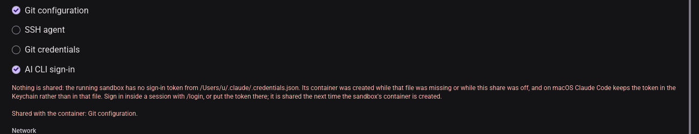

# BUG-008 — an unshared sign-in named under its share (T227)

**Date**: 2026-09-28. **Where**: Xvfb + lavapipe (software Vulkan), not a real display. Dark scheme
only; the light scheme was not captured.

**How the state was produced.** A real sandbox was not started: the container name `micold-sandbox`
is fixed, and the one on this machine was not this pass's to adopt or replace. A throw-away probe
(never committed) made the settings-open handler take the running sandbox's report from an
environment variable, `/Users/u/.claude/.credentials.json`. Everything from the draft onwards is
the committed code. How the report gets into the draft is covered by U49 and U51, not by this pass.
The client ran with host placement and a private data home.

| # | State | Check | Result |
|---|---|---|---|
| 1 | shares Git configuration and AI CLI sign-in, report present | caution directly under *AI CLI sign-in*, names the path, wraps without clipping | pass |
| 2 | same | summary reads "Shared with the container: Git configuration." — no sign-in, no "replace its token" | pass |
| 3 | shares only AI CLI sign-in, report present | caution under the share; no "Shared with the container" line at all; rail badge still shown | pass |
| 4 | shares only AI CLI sign-in, no report (control) | no caution; summary lists AI CLI sign-in with the "replace its token" sentence | pass |

**Found on the way.** The notice opened "Nothing is shared:", which read as false next to a Git
configuration share. It now opens "The sign-in is not shared:". The capture above predates that
one-phrase change.
