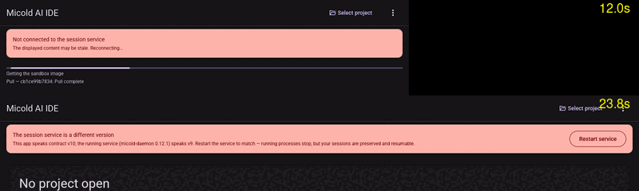
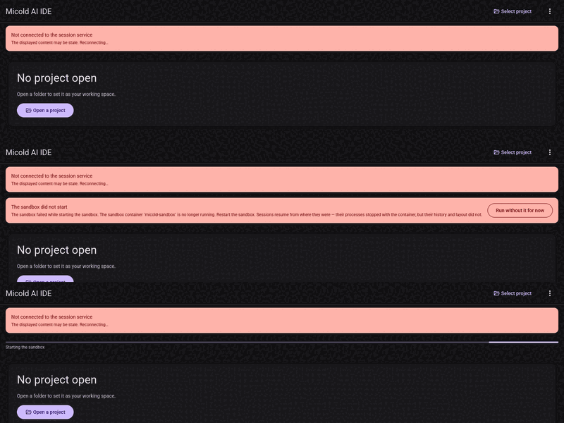
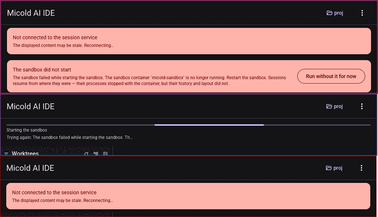
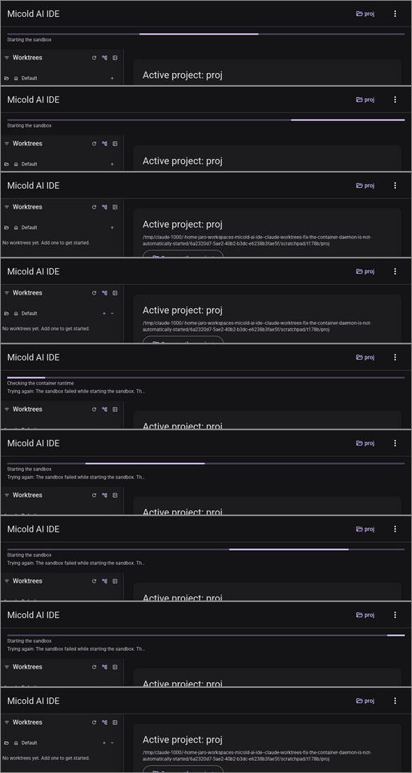

# Performance evidence: SC-003 and SC-004

**Date**: 2026-08-26 · **Runtime**: Docker 29.5.1, x86_64 Linux 7.0.0-30-generic
**Image**: `micold-daemon:dev` (`sha256:92adcb99e7e1…`, built from this working tree by `mise run image`)

---

## SC-003 — a sandboxed session start is no more than 2s slower

> *"With the sandbox already prepared, a session starts and shows its first prompt within the same
> order of time as an unsandboxed session — no more than 2 seconds slower."*

### The run

```
$ cargo test -p micold-daemon --release --features sandbox-real-runtime \
      sandbox_real_ -- --nocapture --test-threads=1
```

```
test sandbox_real_session_start_is_within_two_seconds_of_the_host_placement ...
host placement first screen: "$"
container placement first screen: "$"
host placement: median 2ms, min 2ms, max 3ms, all [2, 2, 3, 3, 2, 2, 3]
container placement: median 2ms, min 2ms, max 3ms, all [2, 2, 2, 2, 3, 2, 2]
SC-003 delta: 0ms (host median 2ms, container median 2ms)
test result: ok. 1 passed; 0 failed; 0 ignored; 0 measured; 0 filtered out; finished in 6.76s
```

**Result: 0ms.** The budget is 2000ms.

### What is measured

`crates/micold-daemon/tests/sandbox_real_session_start.rs`, behind `sandbox-real-runtime`. One test,
both arms, because the two numbers are only meaningful against each other — split in two, one arm
could report while the other silently failed to run.

Each round sends `SessionStart` + `SetViewedSession` and stops the clock at the first grid frame
**for that session** carrying a non-whitespace cell. Seven timed rounds per placement, each on a
fresh session (a session starts once), preceded by one untimed warm-up.

Deliberately outside the clock: image acquisition, container creation, and the handshake. The claim
is scoped to "with the sandbox already prepared"; folding those in would report a number true of a
first launch and of nothing else. They are SC-004's subject, below.

### Three ways this measurement was wrong before it was right

Worth recording, because each one *passed* while measuring nothing:

1. **The container arm never ran a shell at all.** The image sets `XDG_DATA_HOME=/var/lib`, so the
   daemon reads `/var/lib/micold-ai-ide/projects.json` — the state directory, one level *below* the
   data home. Mounting the seeded data home there put the catalogue at
   `…/micold-ai-ide/micold-ai-ide/projects.json`. The daemon logged `catalog adopted
   load_status=Missing` and `session start failed … err=no such session in the catalog`, sent
   nothing on the wire, and the test hung for 17 minutes: its deadline was checked between reads,
   and the read never returned. The timeout now wraps the read, so a daemon that answers nothing
   fails in 30 seconds and says where to look.

2. **Stopping at the first `full` frame measured the round trip, not the session.** The daemon
   answers `SetViewedSession` with a full snapshot immediately — of a screen the shell has not
   written to. That reported a 1ms median on both placements, which is not a shell starting. Hence
   the non-whitespace condition, and hence the test *prints the screen that stopped the clock*: the
   `"$"` above is what makes these numbers checkable rather than merely green.

3. **The two arms ran different shells.** `Supervisor::spawn_shell` takes the daemon's own `SHELL`,
   so the host arm got the developer's login shell *with their startup files* and the container arm
   got the image default. The run before the fix read `host placement first screen: "Command 'usage'
   not found, did you mean: …"` at a median of 850ms against `dash` at 2ms — a 848ms "sandbox
   advantage" that was entirely Ubuntu's `command-not-found` handler. Both arms now pin
   `SHELL=/bin/sh`, which exists on both sides and reads no startup file.

A fourth asymmetry was smaller but the same shape: the host daemon is spawned and connected to in
one breath, while the container daemon has been up since `wait_for_accept` first reached it, so the
host's first session paid for a cold process (one 706ms round among 2ms rounds). Both arms now open
an untimed warm-up session before the clock is started.

### What this does not establish

- **One machine, one runtime.** Docker on Linux with identity uid/gid mapping. The macOS and Windows
  placements route through a VM and a path-rewriting mount; neither is measured here.
- **`/bin/sh`, not the real workload.** Pinning the shell is what makes the arms comparable, but a
  session that starts `claude` does far more work than `dash`, and its own startup cost would
  dominate both columns. What is bounded here is the *placement's* contribution, which is the
  claim.
- **A warm page cache.** The image had been pulled and run before every timed round.

---

## SC-004 — first enable under five minutes, with continuous progress

> *"First-time enablement, including preparing the sandbox on a working network connection,
> completes within 5 minutes and shows continuous progress throughout, so the user never has to
> guess whether the application has stopped responding."*

### The run

```
$ cargo test -p micold-core --features sandbox-real-runtime \
      sandbox_real_first_enable -- --nocapture --test-threads=1
```

```
test sandbox_real_first_enable_is_under_five_minutes_and_never_goes_quiet ...
SC-004 enable: total 851ms — acquire 419ms, create 258ms, start 123ms, answer 50ms (archive 67.7 MiB)
SC-004 progress: 1 reports during acquisition, stages ["Importing"]
SC-004 longest silence during acquisition: 396ms
test result: ok. 1 passed; 0 failed; 0 ignored; 0 measured; 0 filtered out; finished in 1.86s
```

**Result: 851ms.** The budget is 300,000ms.

### What is measured

`crates/micold-core/tests/sandbox_real_enable.rs`, behind `sandbox-real-runtime`. The clock covers
the application's whole enable sequence — `acquire_image`, `create`, `start`, and then waiting until
the daemon *inside* the container writes `listening (sandboxed)` into the state directory the host
shares with it. "Enabled" is the daemon answering, not the container existing.

The cold state is built by tagging the image under a throwaway reference, `docker save`-ing it, and
deleting the tag — so a developer's own `micold-daemon:dev` is never disturbed.

### Which acquisition route this is, and why the other two are not measurable here

`ImageSourceKind` has three arms, and only one of them can be driven from this repository today:

| Route | Measured? | Why |
|---|---|---|
| `Registry` | **No** | Nothing is published, so there is no reference to pull. This gap is why SC-004a exists. |
| `LocalBuild` | Not through the app | `acquire_image` deliberately refuses it — staging a cross-compiled Linux binary beside a Containerfile is a build-system job. Timed separately below. |
| `ImportedFile` | **Yes** | SC-004a's documented no-network procedure, and the one streaming acquisition runnable here. |

### Where this evidence is weaker than the number suggests

Say this plainly, because 851ms against a five-minute budget invites the wrong conclusion:

- **The total is real; the continuity is barely exercised.** Acquisition emitted **one** progress
  report over 419ms. That is `docker load` being nearly instant because every layer is already in
  the local store — the honest reading is not "progress is continuous" but "there was nothing long
  enough to report on". A cold *machine*, or a registry pull over a real network, moves data this
  run did not.
- **The claim's own long case is the unmeasurable one.** The per-line reporting that would carry a
  four-minute pull is `run_streaming` feeding `pull_progress`, and it is covered against a fake
  runtime in `crates/micold-core/tests/sandbox_runtime.rs`
  (`assert!(reports.len() >= 2, "SC-004 gives this five minutes; silence for that long reads as a
  hang")`). Mechanism tested, duration not.
- **67.7 MiB is the transfer size.** Stated so the total can be scaled by a reader on a slower link
  rather than taken as machine-independent.

The `MAX_SILENCE` bound the test asserts (10s between reports) therefore passes on a route that
could not plausibly have violated it. It is a regression guard, not proof of the claim.

---

## SC-004b — source change to running sandboxed, without a registry

> *"…without publishing an image and without any registry interaction, and the loop is no more
> onerous than the existing build-and-run loop plus a single image build."*

Measured directly, since it is a developer loop rather than an application path:

```
$ cargo clean -p micold-daemon --release --target x86_64-unknown-linux-gnu
Removed 194 files, 37.5MiB total
$ time mise run image
   Compiling micold-daemon v0.8.0
    Finished `release` profile [optimized] target(s) in 9.09s
Built micold-daemon:dev -- select it in Settings > Daemon > Image.
SECONDS_TOTAL=9
```

**9 seconds** from a cleaned daemon crate to a rebuilt image; **10 seconds** when nothing has
changed at all. That is one release compile of one crate plus a layer-cached `docker build` — the
"plus a single image build" the criterion allows, and no registry is involved at any point.

Not measured: a genuinely cold machine, where the dependency graph compiles from scratch. That cost
belongs to the existing build-and-run loop, not to sandboxing, but it is the one case where a first
enable on this repository could exceed five minutes, and it should be measured before the criterion
is called closed for a new contributor's machine.

---

## SC-004 / SC-004c at the application — T172 (BUG-004)

> *SC-004c: "SC-004's progress is measured **at the application**… no two consecutive stage changes
> the application displays are more than 10 seconds apart, and the application reports no connection
> failure for the service it is starting while it is starting it (FR-036b)."*

Run on **2026-09-13**, after T167–T171 landed, with the `visual-pass` skill. It ran on **Xvfb (1600×1400) with
lavapipe**, not on a real display. The client was built from this branch and pinned outside
`target-shared`. Docker 29.5.1. Frames were captured from the root window about every 1.2s, and
timestamps come from file mtimes. The stage the user sees is read off those frames, not off the
callbacks. That difference is the whole point of SC-004c.

### Run A — first enable, cold image, registry route

Setup: the user's `micold-sandbox` container was removed, and both `ghcr.io/jaroslawherod/micold-daemon:0.12.1`
and `:0.12.0` were deleted with `docker rmi`. A fresh data home was used with `placement: local_sandbox` and
`image: registry ghcr.io/jaroslawherod/micold-daemon:0.12.1`. The pinned client was then launched.

| t from launch | What the application showed |
|---|---|
| 2.6s | window up; "Checking the container runtime" |
| 3.8s – 22.6s | "Getting the sandbox image", with a moving bar and per-layer lines (`Pull — cb1ce99b7834: Pull complete`, `Download — 24eb14f0f4c2: Download complete`) |
| 23.8s | sandbox up, daemon answering; the handshake refused it (see below) |

- **Duration: about 23s** from launch to a running, answering sandbox. The budget is 300s.
- **Continuity: every captured frame from 2.6s to 23.8s differed from the one before it.** The longest
  interval between visible changes was **2.37s**. That bound comes from the capture cadence, and capture
  gaps reached 1.4s. The limit is 10s.
- **Connection-failure notifications ("Could not connect to the session daemon…"): 0.**



Where this is weaker than it looks:

- **Not fully cold.** One base layer is shared with `micold-daemon:dev`, which stayed in the store. The
  remaining layers were pulled over the network.
- **It does not reach a working session.** This branch speaks contract v10, and the published 0.12.1
  image speaks v9, so the handshake refuses it ("The session service is a different version"). That is
  correct behaviour, but a registry-route enable that ends in a terminal cannot be demonstrated until an
  image built from this contract is published. Run B covers attach, using the local-build route.

### Run B — the sandbox stopped from outside while the application is open (§B.1, FR-036a)

Setup: a fresh data home with `image: local_build micold-daemon:dev`, built by `mise run image` from
this tree. The client attached (`client attached to daemon … client_window=1057405`). Then, from a shell:
`docker stop micold-sandbox`.

| t from `docker stop` | Source | Event |
|---|---|---|
| 0.0s – 10.2s | docker | `docker stop` waits out its 10s grace; the container exits **137** |
| ≤15.1s | frame | red "Not connected to the session service · Reconnecting..." banner |
| 16.3s | frame | a second card: "The sandbox did not start — The sandbox container 'micold-sandbox' is no longer running. Restart the sandbox." |
| — | client log | `attach: failed reason=no sandboxed daemon is listening on 127.0.0.1:7727`, then `sandbox: service absent, bringing it up again in 0s (2 left)` |
| 17.5s | frame | "Starting the sandbox", with a bar, under the red banner |
| 17.5s (09:42:05.03Z) | daemon log | `micold-daemon starting` in a newly created container |
| 17.9s (09:42:05.37Z) | daemon log | `client attached to daemon … client_window=1057405`: the **same** client window, re-attached |
| 18.7s | frame | back to the attached view, identical to the frame before the stop |

- **Recovery: automatic.** It took about 7.7s from the container exiting to the client re-attaching, with no user action.
- **Connection-failure notifications: 0.** No toast appears in any frame.
- **Longest interval between visible changes: ≤4.9s**, from the container exiting to the first banner frame.



### Verdict against SC-004c and FR-036b

| Clause | Result |
|---|---|
| SC-004: under 5 minutes | **Pass.** About 23s on the registry route. |
| SC-004c: stage changes at the application ≤10s apart | **Pass.** ≤2.37s (run A) and ≤4.9s (run B). |
| SC-004c / FR-036b: no connection failure reported for the service being started | **Fail**, in two ways (below). |
| FR-036a: recover by bringing the sandbox up | **Pass.** Run B. |

1. **The "Not connected to the session service" banner stays up throughout a working bring-up.** In run A
   it was on screen for the whole 21s acquisition, as a full-width red error banner. The stage sits beneath
   it in small grey text. The removed toast was only one of the two ways a connection failure gets
   presented. This banner is the other, and it is the louder of the two, which is exactly what FR-036b
   forbids ("the one that is working MUST NOT be the louder of the two").
2. **A failure card flashes before the automatic bring-up starts.** For one frame (≤1.2s) in run B, the
   application showed "The sandbox did not start … Restart the sandbox." with "Run without it for now".
   That was the `Failed(SandboxStopped)` state set by the liveness check, before the refused dial moved
   it to `Probing`. The headline is wrong for a sandbox that was stopped rather than failing to start. The
   advice asks the user to do what the application does a second later. Offering the FR-035a fallback
   during that second invites the user to abandon a recovery that is about to succeed.

Neither was changed in this pass. Both are outside T167–T171's scope and need their own task.

Noticed, not in scope: the in-container daemon does not exit on SIGTERM. `docker stop` always waits
the full 10s grace and ends in exit 137, which adds 10s to every stop.

## FR-036b re-run at the application — T178 (BUG-004)

Run on **2026-09-14** with the `visual-pass` skill, repeating T172's run B against HEAD `cd7fc151`.
The client was built from that commit and pinned to `~/vp/bin-t178` (`strings … | grep -c "Trying again: "`
gave 1, and 0 for the T172 pin). It ran on **Xvfb :95 (the window's default size) with lavapipe**, not
on a real display. The image was `micold-daemon:dev` `sha256:5bc77699…`, with local-build placement and a
fresh data home. The pinned client brought the sandbox up from nothing and attached
(`client attached to daemon … client_window=104583`). Then, from a shell, `docker stop micold-sandbox`.
Frames were captured from the root window continuously, about 7 per second, so gaps were about 0.15s.
Times below come from frame mtimes, deduplicated by hash, and the daemon log (local time, UTC+2).

| Time | Source | What the application showed |
|---|---|---|
| 07:25:59.5 – 07:26:00.8 | frame | launch: "Checking the container runtime", then "Starting the sandbox", with a bar. **No banner.** |
| 07:26:00.96 – 07:26:01.6 | frame | red "Not connected to the session service" banner, for about 0.65s |
| 07:26:01.47 | daemon log | `client attached to daemon` |
| 07:27:51.8 | shell | `docker stop micold-sandbox`; it returns about 07:28:02.3, after the 10s grace |
| 07:28:07.77 | frame | red banner |
| 07:28:07.91 – 07:28:09.87 | frame | banner **plus** the "The sandbox did not start" card, with "Run without it for now", for **about 2.0s** |
| 07:28:09.87 | client log | `sandbox: service absent, bringing it up again in 0s (2 left) after: The sandbox failed while starting the sandbox. The sandbox container 'micold-sandbox' is no longer running.` |
| 07:28:09.87 – 07:28:10.2 | frame | "Checking the container runtime", then "Starting the sandbox", with "Trying again: The sandbox failed while starting the sandbox. Th…". **No banner.** |
| 07:28:10.31 – 07:28:10.85 | frame | red banner again, for about 0.54s |
| 07:28:10.62 | daemon log | `client attached to daemon … client_window=104583`: the same window |
| 07:28:10.85 | frame | identical, by hash, to the last frame before the stop |

- **Recovery: automatic.** It took about 8.3s from the container exiting to the client re-attaching, with no user action.
- **Toasts: 0** in any frame.
- **The banner is gone while a bring-up is under way.** This is T178's `is_coming_up()` half, which now holds at the application.



### Verdict: T178 is **not** proven by this pass

1. **The "The sandbox did not start" card and its FR-035a fallback are still shown, for about 2s.** They appear
   between the liveness check finding the container stopped (`Failed(SandboxStopped)`) and the refused dial
   that moves the state to `Probing`. `Failed` is not `is_coming_up()`, so T178's unit tests, which cover
   only the coming-up states, stay green while the card T178 names is on screen. T172 saw it in a single
   frame (≤1.2s) at a slower capture; this pass saw it for about 2.0s, at about 0.15s resolution.
2. **The red banner shows around a bring-up, not only during it:** about 0.1s before the card, and about 0.5–0.65s
   after "Starting the sandbox" ends, before the daemon answers. That happens both at first enable and on
   recovery. `Running` is not `is_coming_up()` either, so for that half-second the application reports as
   disconnected a service it has just started (FR-036b, SC-004c).
3. The attempt line names a stopped container "failed while starting the sandbox", and it is truncated
   mid-word at this width.

Not assessed: how the banner flicker looks at real frame rates. lavapipe frame pacing says nothing about a GPU.

### Re-run after T187 and T188

Run on **2026-09-14** with the `visual-pass` skill, again on **Xvfb :96 with lavapipe** rather than a real
display. The client came from the working tree on top of `639c92c3` with T187 and T188 applied, and was pinned to
`~/vp/bin-t178b`. That binary differs from the `bin-t178` pin. `micold-daemon` is byte-identical to that pin,
because neither the daemon nor core changed. The run used the same image (`micold-daemon:dev` `sha256:5bc77699…`),
local-build placement and a fresh data home. The client brought the sandbox up from nothing and attached
(`client attached to daemon … client_window=320996`), then `docker stop micold-sandbox` was run from a shell.
Frames were captured continuously; gaps were about 0.13s. Every frame from launch to 5s after re-attachment was
deduplicated by hash.

| Time | Source | What the application showed |
|---|---|---|
| 08:11:35.35 – 08:11:36.04 | frame | launch: "Checking the container runtime", then "Starting the sandbox", with a bar |
| 08:11:36.04 – 08:11:36.57 | frame | no stage, **no banner**: the service started and had not answered yet (T188) |
| 08:11:36.31 | daemon log | `client attached to daemon` |
| 08:11:52.7 | shell | `docker stop micold-sandbox`; it returns 08:12:02.3, after the 10s grace |
| 08:11:52.7 – 08:12:06.38 | frame | identical by hash to the attached view, in every frame |
| 08:12:06.53 | frame | "Checking the container runtime", with "Trying again: The sandbox failed while starting the sandbox. Th…". **No card, no fallback, no banner** (T187) |
| 08:12:06.67 – 08:12:06.95 | frame | "Starting the sandbox", with the same attempt line and a bar |
| 08:12:07.08 | frame | identical by hash to the attached view before the stop |
| 08:12:07.35 | daemon log | `client attached to daemon … client_window=320996`: the same window |

- **Recovery: automatic.** About 5.0s passed from `docker stop` returning to re-attachment, with no user action.
  The client log shows one `service absent, bringing it up again in 0s (2 left)` and no `attach: failed` line.
- **Toasts: 0**, **failure cards: 0** and **red banners: 0**, in any frame, at first enable and on recovery.



### Verdict: T178 is proven, at this capture resolution

Findings 1 and 2 of the first pass no longer reproduce. Two limits remain.

- The code still sets the banner for the time between the disconnect and the liveness check's `Lost` (T180's
  pinned decision). The first pass measured about 0.1s for it, which is below this pass's 0.13s frame gap.
  No frame caught it, and this pass cannot show that it is gone.
- Finding 3 is unchanged. The attempt line still says "failed while starting the sandbox" for a container
  stopped from outside, truncated mid-word. It is not part of FR-036b and is left open.

Not assessed: how the stage transitions look at real frame rates. lavapipe frame pacing says nothing about a GPU.
