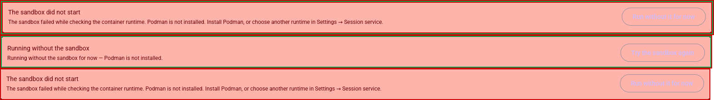

# US6 verification: the sandbox reports its own failures, and can be restarted

**Date**: 2026-08-25 · **Runtime**: Docker 29.5.1 (build 2518b52), x86_64 Linux 7.0.0-30-generic
**Image**: `micold-daemon:dev` (`sha256:2a7f0d3e…`, built from this working tree)
**Covers**: quickstart.md §B.3 (network posture) and the failure items of §B.5 (lifecycle)

Unlike the US1 pass, this one is not a hand-driven `docker` transcript. The checks live in
`crates/micold-core/tests/sandbox_real_lifecycle.rs`, behind the `sandbox-real-runtime` feature,
and they drive **`CliRuntime` against a real Docker daemon** — the same `create`/`start`/`stop`/
`remove`/`find` calls the application makes, building the argument vector the application builds.
Docker is not what can be wrong here; the argv and the state machine are. Writing the probe by hand
would have tested a `docker create` I typed, not the one the product runs.

That also makes this evidence re-runnable: the same tests are what the Linux `sandbox-runtime` CI
job executes.

## The run

```
$ cargo test -p micold-core --features sandbox-real-runtime sandbox_real_ -- --test-threads=1
```

— the CI job's own command, verbatim, so the evidence and the job select the same tests.

### One finding, from writing it this way

The first run of these tests used plain descriptive function names, and they passed. Under the CI
command they would have run **zero times**: `sandbox_real_` is a *test-name* filter, and an
integration target's file name is not part of a test's path, so `tests/sandbox_real_lifecycle.rs`
matches nothing unless its functions are named to match too. The result is not a failure — it is a
smaller number in a green summary, which is the kind of gap a green suite hides. Every test here now
carries the prefix in its own name, and the contract is written down beside the filter in
`.github/workflows/ci.yml`.

```
     Running tests/sandbox_real_handshake.rs
running 3 tests
test sandbox_real_handshake_refuses_a_wrong_token ... ok
test sandbox_real_handshake_succeeds_with_the_mounted_token ... ok
test sandbox_real_state_is_written_where_the_host_can_read_it ... ok
test result: ok. 3 passed; 0 failed; 0 ignored; 0 measured; 0 filtered out; finished in 2.18s

     Running tests/sandbox_real_lifecycle.rs
running 7 tests
test sandbox_real_a_container_stopped_from_outside_is_reported_lost ... ok
test sandbox_real_a_file_written_inside_belongs_to_the_host_user ... ok
test sandbox_real_an_explicit_stop_leaves_no_container_behind ... ok
test sandbox_real_no_outbound_blocks_egress_while_the_control_port_still_answers ... ok
test sandbox_real_no_outbound_still_resolves_names ... ok
test sandbox_real_outbound_permits_egress ... ok
test sandbox_real_the_daemons_state_survives_container_recreation ... ok
test result: ok. 7 passed; 0 failed; 0 ignored; 0 measured; 0 filtered out; finished in 40.44s
```

(The three handshake tests are US1's, re-run here because the CI command selects them too; the seven
below them are this pass. Every other target in the workspace reported `0 passed; N filtered out`,
which is the filter doing its job.)

## §B.3 — network posture

| Check | Test | Result |
|---|---|---|
| `NoOutbound`: egress fails **and** the control channel is unaffected | `sandbox_real_no_outbound_blocks_egress_while_the_control_port_still_answers` | pass |
| `NoOutbound`: name resolution still works (the documented caveat) | `sandbox_real_no_outbound_still_resolves_names` | pass |
| `Outbound`: egress succeeds | `sandbox_real_outbound_permits_egress` | pass — **not** skipped; the host had egress |

The egress probe is `timeout 5 bash -c 'exec 3<>/dev/tcp/1.1.1.1/443'`. The image carries neither
`curl` nor `wget` (`packaging/sandbox/Containerfile` installs only ca-certificates, git,
openssh-client, procps, less, bash), so the quickstart's `curl` is spelled with bash's `/dev/tcp`.
Resolution is checked with `getent hosts example.com`.

The first of those tests is the one that earns its keep. It asserts egress is blocked *and* that
`TcpStream::connect_timeout` to the published control port still succeeds within 20s. The rejected
alternative implementation — `--internal` — passes the first half and fails the second, which is
exactly the regression that would sever the client from the daemon while looking like a hardening
win. Research R4 chose `enable_ip_masquerade=false` for this reason; this test is what keeps that
choice from being quietly undone.

The DNS caveat is stated in `docs/user-guide/sandboxed-daemon.md` (§ "What the sandbox does not
block", line 156ff): "with outbound connections blocked, **DNS lookups still resolve**".

## §B.5 — lifecycle and failure

| Check | Covered by | Result |
|---|---|---|
| `docker stop` from outside → persistent failure with a reason and a remedy, no silent unsandboxed fallback | `sandbox_real_a_container_stopped_from_outside_is_reported_lost` | pass |
| Daemon state survives container recreation | `sandbox_real_the_daemons_state_survives_container_recreation` | pass |
| An explicit stop leaves nothing behind, and repeating it is harmless (C-7) | `sandbox_real_an_explicit_stop_leaves_no_container_behind` | pass |
| A file written inside belongs to the host user | `sandbox_real_a_file_written_inside_belongs_to_the_host_user` | pass |

The stop-from-outside test stops the container with `docker stop`, confirms `CliRuntime::find`
still reports the container with `running == false`, and then requires
`lifecycle::container_lost` to move the sandbox out of `Running` into `Failed` carrying
`RuntimeError::SandboxStopped`, a `reason()` that names the container, and a non-empty `remedy()`
(FR-034). It does **not** reach an unsandboxed state: only `Failed` admits `accept_fallback`, and
only with an explicit `ConsentedFallback` (`lifecycle.rs` tests
`a_failure_cannot_reach_a_working_daemon_without_consent`; client side in `features/sandbox.rs`).

The recreation test writes a file into `/var/lib/micold-ai-ide` inside the container, asserts it
appears at the bound host path, then stops **and removes** the container, brings a second container
up over the same state directory, and reads the file back from inside. That is FR-011/M-3's claim
end to end, on a container that no longer exists.

## What this pass did **not** run

Reported honestly rather than ticked:

- **New project registered while the sandbox runs → marked stale, sessions keep working, nothing
  restarts on its own.** Not exercised against real Docker; it is pure state-machine behaviour with
  no container involvement, and it is covered by
  `crates/micold-core/tests/sandbox_state.rs::{registering_a_project_marks_a_running_sandbox_stale,
  a_stale_sandbox_still_serves_the_sessions_already_in_it, a_stale_sandbox_can_also_be_lost}`.
- **Accepting the offered fallback explicitly, and the unsandboxed state staying visible.** Needs
  the GUI. Covered at the unit level by `micold-client/src/features/sandbox.rs` (consent required,
  only from `Failed`) and `micold-client/tests/banner_is_not_a_snackbar.rs` (the state stays on a
  persistent surface rather than a transient one).
- **Sessions survive a client restart while sandboxed** (FR-014). Needs a GUI session and a client
  restart; not automatable here.
- **With survive-logout enabled, the sandbox comes back after a reboot** (FR-014a/b, R6). Needs a
  reboot of this machine, which is not mine to do.

The three unrun items are the ones that require a display or a reboot. Everything in §B.3 and every
container-level item in §B.5 was exercised against a real Docker daemon.

---

## Addendum, 2026-08-26 — the two §B.5 boxes that were not about failure

Two boxes of §B.5 were left over because they are not failures: registering a project while the
sandbox runs, and a client restart. Both are now in
`crates/micold-daemon/tests/sandbox_real_staleness.rs`, driven through a **real session** rather
than through `CliRuntime`, because both claims are about what the user's session experiences.

```
$ cargo test -p micold-daemon --features sandbox-real-runtime --test sandbox_real_staleness
running 2 tests
test sandbox_real_sessions_survive_a_client_restart ... ok
test sandbox_real_a_project_registered_after_boot_is_outside_the_running_container ... ok
test result: ok. 2 passed; 0 failed; 0 ignored; 0 measured; 0 filtered out
```

### Registering a project while the sandbox runs (R9, M-4)

The state model's half — `Running` becomes `Stale`, `Stale` still accepts sessions, the only edge
back into bring-up takes a `RestartRequested` — was already held by
`micold-core/tests/sandbox_state.rs`. What no unit test can say is whether `Stale` is *necessary*.
The whole design (mark, do not act; make the user ask) rests on a container's bind mounts being
fixed at creation. If that premise were false, staleness would be an interruption offered to a user
whose sandbox could already see the project.

So the premise is measured: with a session open, the probe sends `ProjectAdd` for a directory that
exists on the host the whole time, waits for the daemon to report it in the catalogue, and then
tries to read it from inside the session. It cannot. The session that was running keeps working, and
the runtime's own record shows nothing restarted — same `State.StartedAt`, `RestartCount` 0, still
running. That last assertion is deliberately taken from Docker rather than from our state machine,
which is the half that could be lying.

### A client restart (FR-014)

Not a reconnect: the connection is dropped and the object holding the grid is gone. The probe writes
state into the *shell* — a variable, and the shell's own pid — and asks for it back over a new
connection. Asserting on the pid is what makes this more than a session-id lookup: a daemon that had
quietly restarted the shell would keep the id and lose the user's work, which is the failure FR-014
is about. Same pid, same variable.

### Two harness defects found in the writing, both of which had made probes lie

**The sentinel counter was per-`Terminal`.** Sessions outlive clients, so a reattached probe gets
the scrollback back — old sentinels included. The new `Terminal` numbered from 1 again, matched the
*previous* connection's `MICOLDPROBEE1` still on screen, and returned the empty range above it. The
command had run perfectly and the probe reported nothing. Sentinels are now numbered per process.

**The harness never seeded its input serial.** Input serials are per-session, monotonic, and the
daemon's position is authoritative — which is why the client seeds its stamper from the catalogue
(`SessionInputStamper::seed_from_catalog`, BUG-006/FR-028a). The harness started at zero, so on
reattach the daemon logged

```
WARN micold_daemon::state: dropping stale/duplicate input; these keystrokes are discarded
  session=9524edc7… serial=1 expected=3
```

and the probe timed out with a session that looked dead and was perfectly healthy. The daemon was
right both times. `wait_for_accept` now returns the welcome catalogue and `Terminal` takes the
serial from it, which also removes the `input loss detected across a reconnect` warning every
earlier probe was provoking on its *first* keystroke.

Worth recording because of what the second one implies for the feature rather than for the tests:
the reattach path's correctness depends on a field travelling in the catalogue, and a client that
forgets to read it types into a void with no error anywhere the user can see.

---

## §B.5 box 3 — accepting the offered fallback (FR-035a/b)

*Run 2026-08-26, on Xvfb `:78` + lavapipe rather than a real display (`.claude/skills/visual-pass`),
against a pinned client/daemon pair both built from this worktree at 0.8.0.*

This box was the last open one in §B.5, and running it found the defect it was written to find.

### The defect

`Message::SandboxFallbackAccepted` recorded the consent and returned `Task::none()`. Nothing else
changed. But the connection subscription dials from `app.placement`, and its `LocalSandbox` arm
deliberately never falls back to a host process — that is FR-035, and `daemon.rs` says so in a
comment that calls itself "the one place it would be easiest to lose". So pressing **Run without it
for now** flipped the banner to "Running without the sandbox" and the client went on dialling
`127.0.0.1:7727`, where nothing was listening, forever. The offer worked as a statement and not as a
service — and the state it left behind is the worst of the three, because the banner now says the
user made a choice that took effect.

Fixed in `8ee7741`: accepting the consent moves `placement.kind` to `HostProcess`, and asking for
the sandbox back moves it to `LocalSandbox`. The return leg matters as much as the outgoing one —
without it a restart would bring the container up while every session stayed on the host process,
which is a banner claiming containment over an unconfined shell.

In memory only. Nothing writes it to the settings store, which is what keeps the choice to this
occurrence alone (FR-035a); the next launch attempts the sandbox again.

### How it was driven

The sandbox was made to fail honestly rather than by fault injection: `settings.json` seeded with

```json
{"settings_version":4,"daemon":{"placement":"local_sandbox","sandbox":{"runtime":"podman"}}}
```

and podman is not installed on this machine, so the probe fails at its first step. A private
`XDG_DATA_HOME`, `XDG_CONFIG_HOME` and `XDG_RUNTIME_DIR=/tmp/vp78` kept the run away from the user's
own application and daemon.



Top to bottom, and in that order:

1. **Before.** "The sandbox did not start — The sandbox failed while checking the container runtime.
   Podman is not installed. Install Podman, or choose another runtime in Settings → Session service."
   with **Run without it for now**, over a second banner reading "Not connected to the session
   service" and a toast: `Could not connect to the session daemon: no sandboxed daemon is listening
   on 127.0.0.1:7727`. Nothing is serving anything.
2. **After pressing it.** The connection banner is gone — a host daemon was spawned and connected —
   and one persistent banner remains: "Running without the sandbox — Running without the sandbox for
   now — Podman is not installed", carrying **Try the sandbox again**. Verified against the process
   table, not only the pixels:

   ```text
   host daemon spawned: pid 556006 exe=/home/jaro/vp78/bin/micold-daemon
   ```

   A session started in the project then ran a real AI CLI to its first prompt, with the banner
   still standing above it — which is the FR-035b half: the unsandboxed state stays visible for as
   long as it lasts, not as a notification that scrolls away.
3. **After pressing "Try the sandbox again".** Straight back to the failure and the offer, and the
   client is dialling `127.0.0.1:7727` again. No silent host fallback survives the user asking for
   the sandbox back.

### What this run does not establish

The button labels on the error container are barely legible in both banners (see the image — light
purple on the error surface). That is a contrast question, it is not this box, and it is not
recorded as passing anything.

### A trap worth writing down

The first attempt at this pass ran a client at 0.8.0 against a daemon at **0.10.0** — another
worktree's binary, sitting in the shared `target-shared/debug/`, that a `cargo build -p micold-client
--bin micold-ai-ide -p micold-daemon` did not overwrite: `--bin` applies to the whole invocation, so
micold-daemon was never built and the stale file was copied out as if it were fresh. The run still
proved the fix (the client did move to a host process and did reach a daemon) but reported it as
"The session service is a different version". Build the two in separate `cargo build` invocations.
