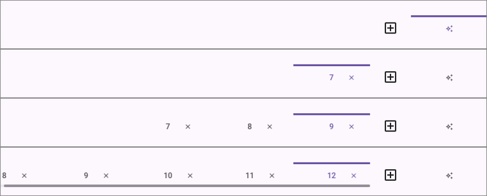
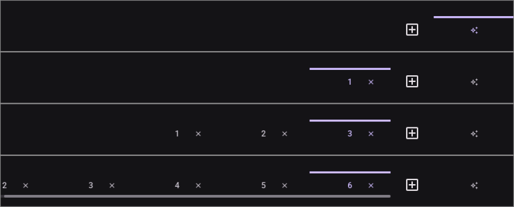
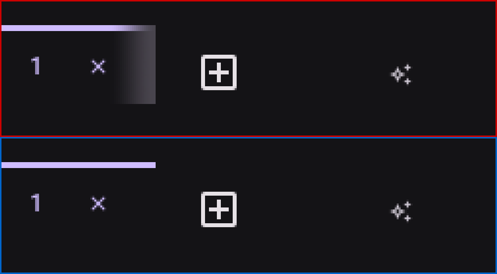
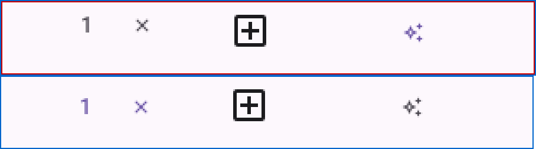
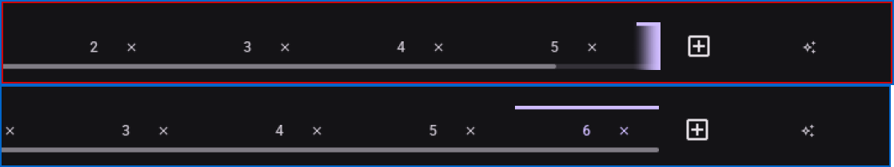

# Visual pass — Tabs-only switching

Record of T024's manual GUI check, run headlessly with the repo's `visual-pass` skill.

---

## 2026-08-21 — T024, the bar's trailing group at zero, one, three and six instances

**Ran on**: Xvfb `:91` (1600×1400) + lavapipe (Mesa's software Vulkan rasteriser), **not a physical
display**. `micold-ai-ide` and `micold-daemon`, `debug`, built from `feat/027-tabs-only-switching`
in one `cargo build -p micold-client --bin micold-ai-ide -p micold-daemon --bin micold-daemon` and
copied out of `target-shared/` to `~/vp/bin-027/` before launching — the shared target directory
holds whatever branch built last, and launching from it is how a pass reports on someone else's
code. The build log names **micold-core, micold-daemon and micold-client**, which is the check that
the daemon was actually rebuilt rather than silently skipped; the client carries a string the fix
adds (`shell_instance_open_requested`), and the run's own log shows the pair attached rather than
`refusing client: contract or build mismatch`. Isolated `XDG_DATA_HOME`, a private
`XDG_RUNTIME_DIR=/tmp/vp91`, and a throwaway project at `/tmp/vpproj027`; only processes whose
`XDG_RUNTIME_DIR` read `/tmp/vp91` were ever stopped.

**Why this task exists.** FR-002 and FR-003 are claims about an *arrangement*, and this feature's
gates do resolve arrangement — `gates/tabs_anchor_the_trailing_edge.rs` compares the very
coordinates the requirements name, and it was green. What it could not see is everything two boxes
can do to each other while each stays exactly where its own layout put it: a fade drawn over an
edge that does not overflow, a strip whose contents ride 4dp above the controls beside it, and a
tab that is created, marked, and left off screen. All three are below. The suite was green over
each of them.

### Passed — the arrangement, at four instance counts, in both schemes

Four crops per scheme at **identical geometry** (`760×80+830+1325`), zero instances first. Read in
order they answer FR-002 and FR-003 directly: the group is tabs, then "+", then the AI tab, with the
AI tab last against the bar's trailing edge; the tabs finish beside the "+" at every count rather
than stranded at the bar's leading edge; and there is no mode toggle anywhere in the bar, at any
count, in either pane (FR-001).

Exactly one tab carries the indicator in every frame. At zero instances it is the AI tab — the
session has no terminal to be on — and from one instance up it is the terminal tab the "+" just
created, which is FR-005 and FR-009 together.

**SC-003, measured rather than judged.** The horizontal ink centroid of the "+" and of the AI tab's
glyph, over all eight frames above:

| frames | "+" centroid | AI tab centroid |
|---|---|---|
| light, 0 / 1 / 3 / 6 instances | 1439.5 | 1531.9 |
| dark, 0 / 1 / 3 / 6 instances | 1439.5 | 1531.9 |

Identical to a tenth of a pixel across every count and both schemes: neither control moves when the
tab count changes, which is what FR-002 puts the "+" *between* the tabs and the AI tab to buy.

**The AI tab does not shrink when the bar is crowded** (feature 026 FR-002c). Its indicator spans
columns **1472..1591 — 120px**, which is `material::tab::WIDTH` exactly, in both schemes. iced
settles a width shortfall by silently shrinking trailing children, and the AI tab is the bar's last
child, so this is the number that would quietly move first.

**Six instances overflow**, which is what that count was chosen for: the strip scrolls, the leading
edge fades to say tab 1 is beyond it, and a scrollbar appears beneath the tabs. The trailing edge
does not fade, because after the fix below there is nothing beyond it.

### Passed — pressing tabs switches panes (FR-005, FR-006, SC-001)

Driven, not inferred. Pressing a terminal tab moves the indicator to it and puts that instance's
shell in the pane; pressing the AI tab puts Claude Code's trust prompt back. Both from either
starting pane, in one press, with no control other than the strip involved. The "+" opens an
instance from the AI pane as well as from a terminal (FR-004) — which is the case that had no
route at all once the toggle was deleted.

### Found and fixed — the edge fade drew at an edge that did not overflow

The first instance opened and a grey rule appeared between the tab and the "+". The strip held one
tab in a viewport many times its width; nothing was beyond either edge.

Two numbers from different frames. The fade asked whether content ran past the viewport by pairing
a **measured** content width, reported by the scrollable on some earlier frame, with a live viewport
width — and the measurement includes the leading slack that right-alignment spends, so the pair says
"overflowing" about a strip that fits. `strip_overflow` now derives the content width from the same
source the layout does, the tab count, and `Message::TabStripScrolled` carries two numbers instead
of three; `State::tab_strip_content_width` is deleted rather than left to be re-paired.

Measured, dark scheme, one instance: the 24dp band at the strip's trailing edge read **40** against
a bar ground of **19**; it reads **19** now — the same value as a band in the middle of the bar,
i.e. nothing drawn at all.

### Found and fixed — the tabs rode 4dp above the controls beside them

Both crops at `300×40+1300+1352`, which excludes the indicator so that only the glyph row differs.
In the first the "1" and its close glyph sit visibly higher than the "+" and the AI tab; in the
second all four are on one line.

`EdgeFade` boxes its content to `anatomy::button::MIN_TOUCH_TARGET` so the fade spans the whole
edge, and a container's default `align_y` is `Start` — so the 40dp strip sat at the top of a 48dp
box. Two correct decisions. It was invisible while the strip lived at the bar's *leading* edge with
nothing beside it; FR-002 put it against two controls the bar row centres, and a 4dp step then reads
as two rows of controls sharing a bar rather than as the one trailing group the feature claims.

Vertical ink centroids, light scheme, one instance — before: tab label **1363.6**, "+" **1367.5**,
AI tab **1368.5**. After: **1367.6**, 1367.5, 1368.5. (The AI tab's remaining 1dp is its glyph's own
ink distribution, not its box; the boxes agree to within the gate's 0.5dp.)

Gated before it was fixed, by a third test in `gates/tabs_anchor_the_trailing_edge.rs` comparing the
strip's midline with each trailing control's — the assertion nobody had written, because every node
was exactly where its own layout said it was. Regenerating the layout fixture moved 150 nodes by
exactly +4 in y and changed no x or width.

### Found and fixed — the sixth "+" hid the tab it had just created

Both crops at `740×66+860+1332`. In the first, the strip shows tabs 2–5, the trailing edge fades in
the indicator's own accent — the cue that says *the marked tab is beyond this edge* — and the
scrollbar thumb stops short of the end. The tab the user had just created, and which the pane was
already showing, was the one thing the bar would not show them. In the second it sits beside the
"+", marked, with the thumb at the end and the leading edge fading instead.

The reveal machinery was all present and correct. `session::arm_tab_reveal` claims in its own doc
comment that it is "called from every reducer arm that can change which tab is marked", and two of
the four never called it: `ShellInstanceOpenRequested` and `ShellInstanceCloseRequested`. Harmless
while the "+" opened instances into a strip with room for them; FR-002 and FR-003 are what make it
reachable in one press. The open arm is now routed to a named
`session::shell_instance_open_requested` rather than doing its work inline in `app.rs`, matching its
three siblings.

Gated by `tests/tab_reveal.rs`, which asserts the invariant over the **set** of arms rather than the
one case that failed — a single case would have passed for the two that already armed and said
nothing about the next control added to the strip.

### Not covered

- **Mid-flight animation.** A screenshot pipeline cannot reliably catch a chosen frame of a
  transition, so how the strip *moves* when a tab is opened or closed — and whether a reversal
  resumes or snaps — is unanswered here.
- **Perceived smoothness and frame pacing.** lavapipe is a software rasteriser; nothing measured
  here says anything about frame pacing on the user's GPU.
- **A physical display.** Colours were read out of the composited framebuffer, which is the same
  arithmetic a monitor is handed, but no panel, scaling factor or colour profile was involved.
