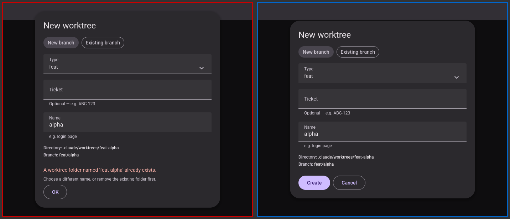
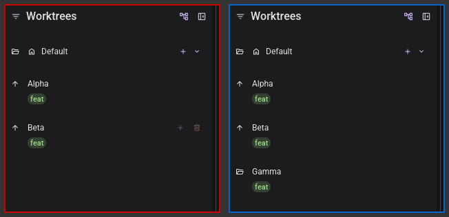
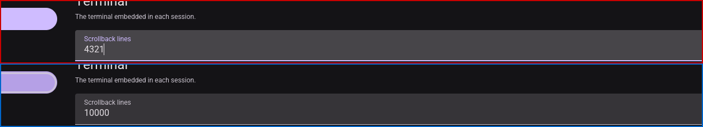
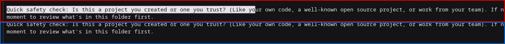
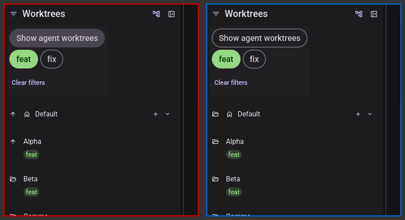
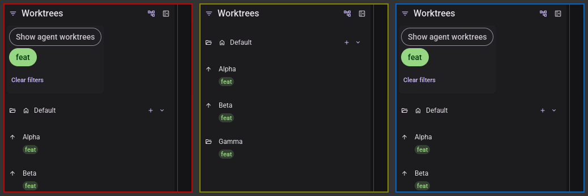

# Visual pass — Feature encapsulation

Record of T056's manual GUI check, run headlessly with the repo's `visual-pass` skill.

---

## 2026-08-27 — T056, the six behaviour-preservation scenarios of [quickstart.md](./quickstart.md) §C.4

**Ran on**: Xvfb `:81` (1600×1400×24) + lavapipe (Mesa's software Vulkan rasteriser), **not a
physical display**. `micold-ai-ide` and `micold-daemon`, `debug`, built from
`feat/feature-encapsulation` in one
`cargo build -p micold-client --bin micold-ai-ide -p micold-daemon --bin micold-daemon` and copied
out of `target-shared/` to `~/vp/bin-028/` before launching. The build log names **micold-core,
micold-client and micold-daemon**, each from
`.../worktrees/feat-feature-encapsulation/crates/…`, which is the check that the daemon was
rebuilt rather than silently skipped. Isolated `XDG_DATA_HOME`, a private
`XDG_RUNTIME_DIR=/tmp/vp81`, and two throwaway git projects (`demo`, with worktrees `feat-alpha`,
`feat-beta` and a `fix/delta` created out of band; `demo2`, with none) under the session
scratchpad. Only processes whose `XDG_RUNTIME_DIR` read `/tmp/vp81` were ever stopped.

**How the pinned pair was verified, given a refactor pins nothing visible.** The skill's usual
check — grep the binary for a string the change adds — has nothing to grab here: feature 028 moves
type names, and `Message::Session(Msg::StartMenuOpened)` leaves no more text in the binary than
`Message::SessionStartMenuOpened` did. What does distinguish them is the source path cargo embeds:
`strings` finds `/home/jaro/workspaces/micold-ai-ide/.claude/worktrees/feat-feature-encapsulation`
in **both** binaries, so both were built here and not lifted from whichever branch touched
`target-shared/` last. The run's own `micold-client.log` then opens with
`attach: connected projects=2 sessions=0` rather than a contract mismatch, and two AI sessions
started and streamed — which only happens through the daemon.

**Why this task exists.** §C.4 says it plainly: everything else about this feature proves the
*shape* changed correctly, and no gate can prove that a draft, a scroll position or a selection
still survives what it survived before. That is the class of change invariant **S3** exists to
prevent, and a struct move is exactly how it would slip through. The suite was green over every
frame below.

### 1. Passed — the add-worktree draft survives a refusal

Two crops at identical geometry (`700x600+450+400`), red first. `Type = feat`, `Name = alpha`
against an existing `feat-alpha`: the refusal arrives as *"A worktree folder named 'feat-alpha'
already exists. / Choose a different name, or remove the existing folder first."* with the form
still behind it and both fields still filled. Acknowledging with **OK** returns the same form, same
draft, `Create`/`Cancel` back — the draft is never the thing that gets cleared.

### 2. Passed — sidebar expansion survives a re-discovery

Identical geometry (`310x300+0+70`), red before. Alpha and Beta expanded (`↑`), then `feat-gamma`
created from the form — which replaces the whole worktree list. Both stay expanded; Gamma arrives
collapsed, which is right, because nobody opened it.

### 3. Passed — the settings draft is discarded by a cancel

Identical geometry (`1250x110+180+105`), red before. Scrollback changed from `10000` to `4321`,
**Cancel**, reopen Settings → Terminal: the saved `10000` is shown, not the abandoned draft.

### 4. Passed, with the scenario's premise corrected — the terminal selection does *not* survive a switch, and did not before either

Identical geometry (`1200x50+300+180`), red before. Two `claude` sessions (project root and
`feat-alpha`), a drag-selection across the trust prompt in the second, a switch to the first and
back: the highlight is gone.

§C.4 item 4 is worded as though it should have survived. It should not, and this is not something
028 changed. `shell::daemon_sync::view_and_start` opens with `app.selection = None;` — deliberately,
"resetting the local selection and scroll for the newly-displayed session" — and so does the shell
switch beside it. Both lines are identical on `origin/main`; diffing the whole switch path against
`origin/main` returns only the message-name rename that *is* this feature. So the requirement
FR-020 actually states — *unchanged from `main`* — holds, and there is nothing here to pin with a
test. What is wrong is the quickstart sentence's assumption, not the behaviour.

### 5. Passed — the project switch resets exactly what it resets today

Identical geometry (`330x360+0+70`), red before. Left: Default expanded, Alpha expanded, "Show
agent worktrees" on, the `feat` filter set. Then `demo` → `demo2` → `demo`. Right: Default
collapsed and the reveal chip off — `sidebar::project_entered` sets exactly those two fields and
nothing else — while the `feat` filter and the open filter panel are untouched, because it does not
reach them.

Alpha's expansion is gone too, and that is a second, older rule rather than a miss:
`sidebar::worktrees_replaced` prunes `expanded` to the names the incoming list actually has, and
`demo2` has none of them. It is documented as having moved out of `State::set_worktrees` — where
`main` still keeps its equivalent — as the first entry converted out of
`tests/feature_write_isolation.rs`'s allowlist.

### 6. Passed — a dismissed popover keeps the filter it set

Three crops at identical geometry (`330x330+0+70`), in order: red, yellow, blue. The `feat` chip
selected (filled, "Clear filters" appears); **Escape** dismisses the panel and the header's filter
glyph stays tinted; reopening shows the same chip still filled and "Clear filters" still there.
The panel's *openness* is popover state and goes; the filter it set is sidebar state and stays.

## What this pass did not cover

- **Mid-flight animation and perceived smoothness**, as always: a screenshot pipeline cannot catch
  a chosen frame of a 150 ms transition, and lavapipe's frame pacing says nothing about the user's
  GPU. Nothing in feature 028 touches `draw`, so this is a standing limitation rather than a gap
  specific to this pass.
- **A side-by-side against a `main` build.** Each scenario was read against what `main`'s source
  says it does — quoted above where it mattered — rather than against a second running binary.
  For items 4 and 5, where the observed behaviour was the surprising one, that reading is a diff of
  the relevant path against `origin/main` and it comes back empty apart from the rename.
