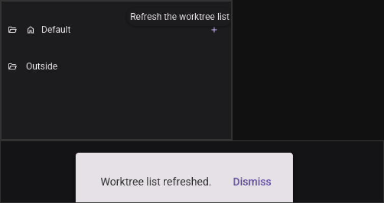
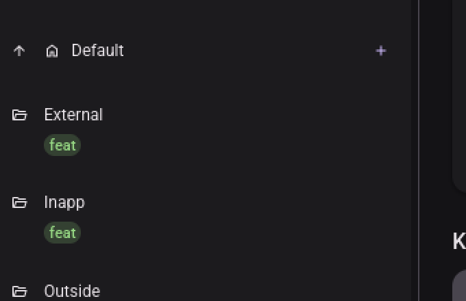
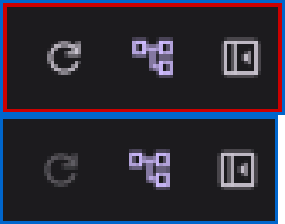
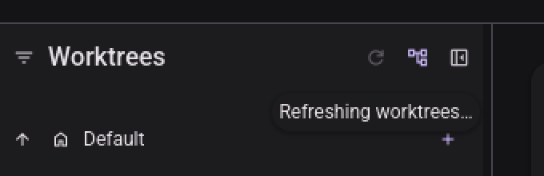
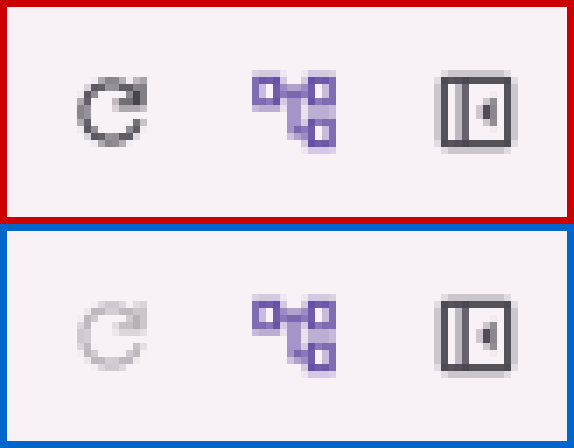
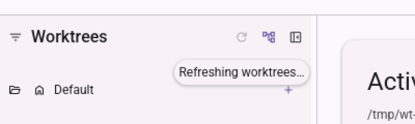
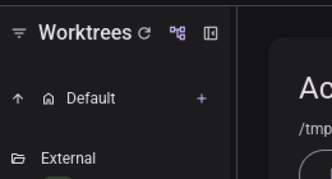
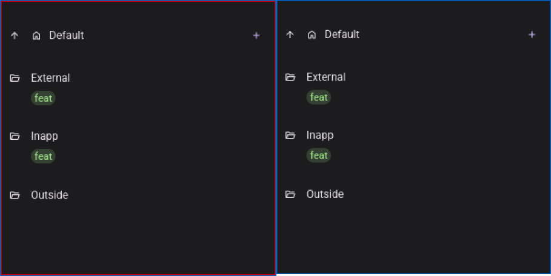
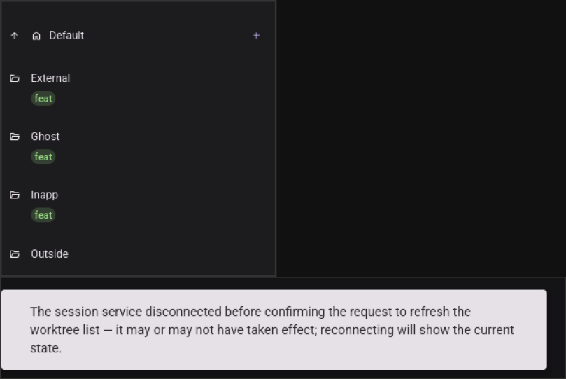

# Visual pass — Refresh the worktree list on demand

Record of T041's manual GUI check and T042's answer to research R6, run headlessly with the repo's
`visual-pass` skill.

---

## 2026-09-03 — T041 and T042, quickstart Part B §B.1–§B.7

**Ran on**: Xvfb `:91` (1600×1400) + lavapipe (Mesa's software Vulkan rasteriser), **not a physical
display**. `micold-ai-ide` and `micold-daemon`, `debug`, built from `feat/refresh-worktrees-list` in
one `cargo build -p micold-client --bin micold-ai-ide -p micold-daemon --bin micold-daemon` and
copied out of `target-shared/` to `~/vp/bin-029/` before launching — the shared target directory
holds whatever branch built last, and launching from it is how a pass reports on someone else's
code. The build log names **micold-core, micold-client and micold-daemon**, which is the check that
the daemon was actually rebuilt rather than silently skipped. The pin was confirmed three ways: that
build log; `strings` on both binaries (`WorktreeRefresh` — client 1, daemon 3; `Refreshing
worktrees` — client 1); and `client attached to daemon` in the run's own log with no `refusing
client: contract or build mismatch`. Isolated `XDG_DATA_HOME`, a private
`XDG_RUNTIME_DIR=/tmp/vp91`, and a throwaway repository at `/tmp/wt-029`; only processes whose
`XDG_RUNTIME_DIR` read `/tmp/vp91` were ever signalled.

**Why this task exists.** Every gate in `tests/` was green before this pass ran, and two of the
things below are invisible to all of them. §B.2's requirement is *indistinguishability* between two
rows — a claim about what they look like, which a layout gate that compares rectangles cannot hold.
And §B.3 turned out to describe a state the shell cannot reach at all, which no passing test would
ever report, because a test for a state that does not exist is a test nobody wrote.

### Passed — §B.1, a worktree that appeared outside the app (US1, FR-002, FR-009)

`git -C /tmp/wt-029 worktree add .claude/worktrees/outside -b feat/outside`, run in a terminal with
the app untouched. The stale list was confirmed first — the sidebar still read "No worktrees yet.
Add one to get started." — because a step that skips that proves nothing. One press of the header
control and `Outside` is there, with "Worktree list refreshed." in the snackbar.

The quickstart's own command could not have worked and was corrected as part of this pass: it
created the worktree at `/tmp/wt-029-outside`, and `reconcile` (`micold-core/src/worktree.rs`) lists
only worktrees whose parent directory *is* `<repo>/.claude/worktrees/`. The app is designed never to
show that path, so the step would have failed against correct code.

### Passed — §B.2, it is the same list however it arrived (US3, FR-004)

FR-004 claims a user cannot tell which trigger produced a row, so the check has to be a comparison.
`feat-external` was created in a terminal and brought in by pressing refresh; `feat-inapp` was
created through the app's own New worktree dialog. At 2× they are the same row: same folder icon,
same name treatment, same green `feat` chip in the same place.

Getting to that comparison took one wrong turn worth recording. The first pairing was `outside`
(refreshed in) against `feat-inapp` (created in app), and `outside` had no chip — which reads as the
refresh path losing metadata. It is not: `parse_tags` (`micold-core/src/naming.rs`) derives the chip
from the **directory name**, and `outside` has no leading type segment while `feat-inapp` does. Same
directory shape, same row; the arrival path never entered into it.

Selection and expansion survived the refresh. The open context menu closed — but it closed because
pressing the refresh control is a click outside the menu, which is what closes any menu here, and
the same press through the add-worktree control closes it identically. That is the dismissal rule,
not the refresh.

### Passed — §B.4, in progress (US2, FR-006, FR-007)

The daemon was paused with `kill -STOP` (pid confirmed as this run's by `/proc/<pid>/environ`) so
the in-flight state would hold still. Two crops at **identical geometry** (`80×30+218+71`), idle
first: the refresh glyph dims and its two neighbours do not, so the change is a state and not a
repaint. Hovering it reads **"Refreshing worktrees…"**.

Pressing it a second time while busy changed nothing — no second notice, no state change. `kill
-CONT` and it returned to full tone.

**Both schemes.** The same two crops in light, at the same `80×30+218+71`:

The dimming is if anything more legible here — the glyph loses most of its contrast against the
surface while its neighbours keep theirs. Reaching the light scheme meant Settings → Appearance →
Theme → Light, then a relaunch of the pinned pair with `projects.json` reseeded, since §B.3 had
forgotten the project; the daemon log shows `client attached to daemon` and no `refusing client`
line for that relaunch too.

### Passed — §B.6, the header still fits (FR-001, FR-010, research R10)

Dragged to `SIDEBAR_MIN_WIDTH` (180). The filter icon, the full word "Worktrees", and all three
controls coexist. The title is not clipped and not ellipsized — it is tight, roughly 6 px of gap at
1× between the title's right edge and the refresh glyph, but nothing is lost. This is the outcome
research R10 planned for: the `Length::Fill` title absorbs the third control's 26 px rather than the
neighbours giving it up.

### Passed — §B.7, nothing refreshes on its own (FR-012)

`feat-ghost` was created externally at 20:04:48 and the sidebar was captured again 79 seconds later,
with nothing touched in between. The two crops differ by **0 pixels** (`compare -metric AE`). The
list is not live and does not poll.

### Passed — §B.5, failure keeps the list (FR-008)

The daemon was killed with a project open, then refresh pressed. The notice reads "The session
service disconnected before confirming the request to refresh the worktree list — it may or may not
have taken effect; reconnecting will show the current state." All four worktrees stayed on screen.

Then the list changed anyway, and it is worth being precise about why: the client respawned the
daemon (a new pid appeared with this run's `XDG_RUNTIME_DIR`) and re-synced, which is exactly the
reconnect the notice names. `Ghost` arriving that way is the project's initial sync, not a
`WorktreeRefresh` — outside what FR-012 and `tests/refresh_is_only_on_demand.rs` constrain. It also
happens to confirm the notice's second clause is a description rather than boilerplate. §B.5 in the
quickstart now says so, because a runner who does not expect it will read it as FR-012 failing.

### Not passed as written — §B.3, nothing to refresh (FR-005)

§B.3 expected "the control is present but inert, with the two neighbours unchanged". That state does
not exist. `ui/mod.rs:282` puts the navigation drawer in the branch guarded by
`active_project().is_some()`, so with no project open there is no sidebar, no header, and no three
controls to compare — the screenshot above is the whole window.

**FR-005 is met**: it asks for the control to be "unavailable (visibly non-actionable)" when no
project is open, and absent is unavailable. What failed was the check, not the requirement, and it
failed by describing something to look at that was never there. The quickstart has been corrected.

`can_refresh_worktrees()`'s `workspace.active.is_some()` term is not dead — it guards the message
path in `on_worktree_refresh_requested`, and a press is not the only way to enter that — but no user
can observe its effect.

## T042 — R6's open question, answered

R6 chose "disabled + a changed tooltip + a completion notice" over a spinner, and left this open:
*if the visual pass reads the inert greyed state as broken rather than busy, the follow-up is the
spinner as its own change.* Its stated reason for doubt was that "a greyed button is ambiguous with
FR-005's 'no project' greying".

**It reads as busy. The ambiguity R6 feared does not exist, and no finding is filed.**

The reason is §B.3 above. `can_refresh_worktrees()` is `active.is_some() && !refreshing`, and the
`active` term can only be false in a branch that renders no sidebar at all. So with the control on
screen, the *only* thing that dims it is `refreshing`. Grey has one meaning in this control's life,
not two, and R6's premise — two states sharing an appearance — is not true of the shipped UI.

What the pass could see supports the same conclusion from the other direction: the dimming is
legible against two neighbours that do not change (`b4-idle-vs-busy.png`), the hover tooltip says
"Refreshing worktrees…" in the present progressive, the control returns to full tone when the reply
lands, and a snackbar confirms.

**The honest limit.** Without hovering, a static glance gives only "dimmer than it was a moment
ago", which is a weak cue rather than a wrong one — and on a small repository the state lasts well
under a second, so the practical exposure is small. Weak is not broken, and R6's follow-up is not
triggered. If a future feature adds a second reason for this control to be inert, that is the moment
to revisit option 1, because that is the moment R6's premise would become true.

## What this pass could not answer

- **Mid-flight animation.** The busy state was held still with `kill -STOP`; the real transition in
  and out of it is under a second and a screenshot pipeline cannot pick a frame of it reliably.
- **Perceived smoothness.** lavapipe is a software rasteriser, so nothing here says anything about
  frame pacing on the user's GPU.
Both schemes were covered for the header and the busy state (§B.4). §B.1, §B.2 and §B.5–§B.7 were
run in dark only; they turn on list contents and notice text rather than on tone, and the header
itself — the only surface this feature adds to — was checked in both.
