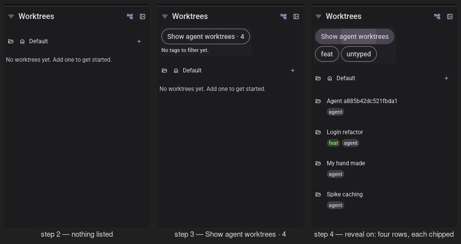
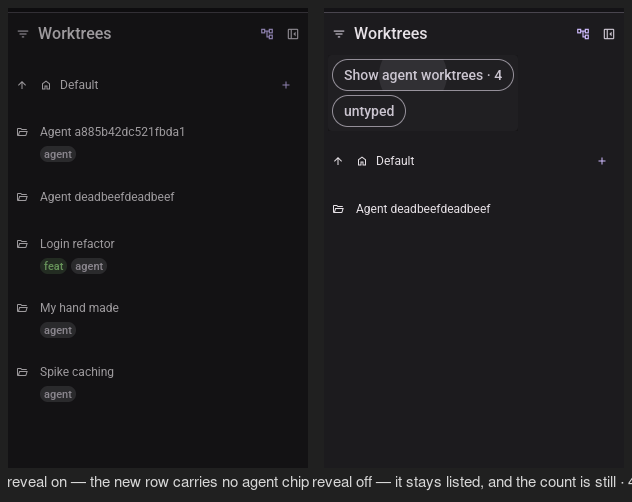
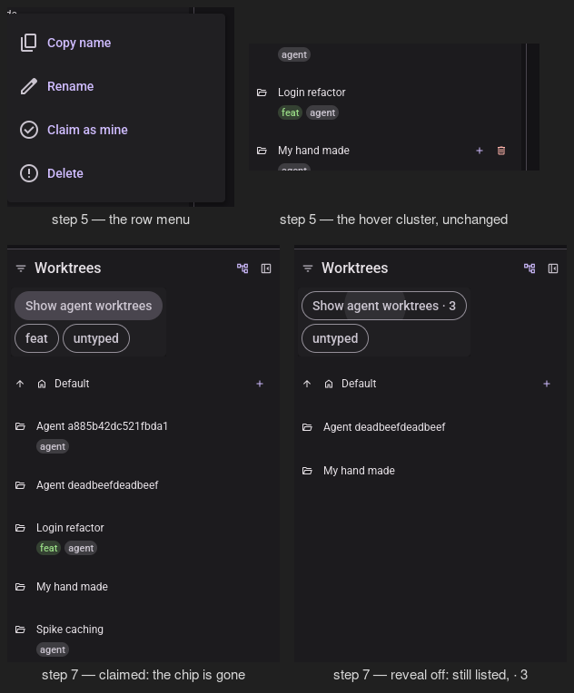
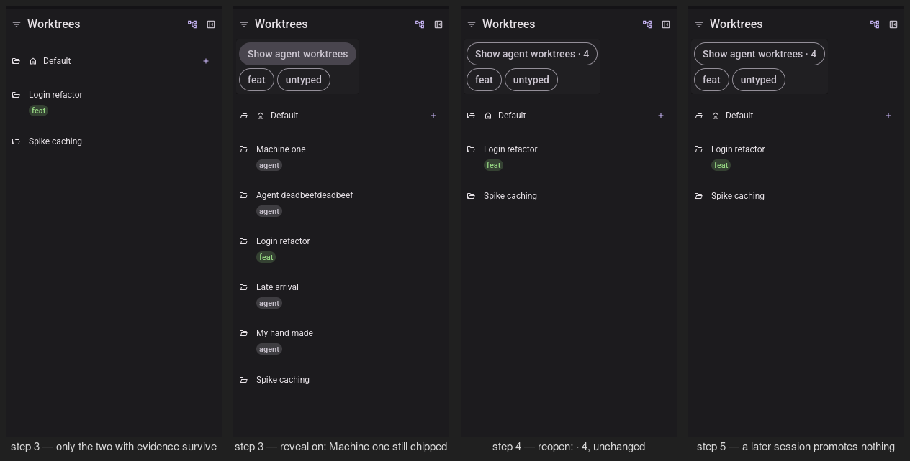
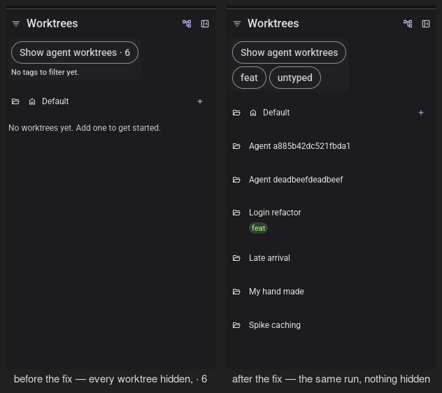
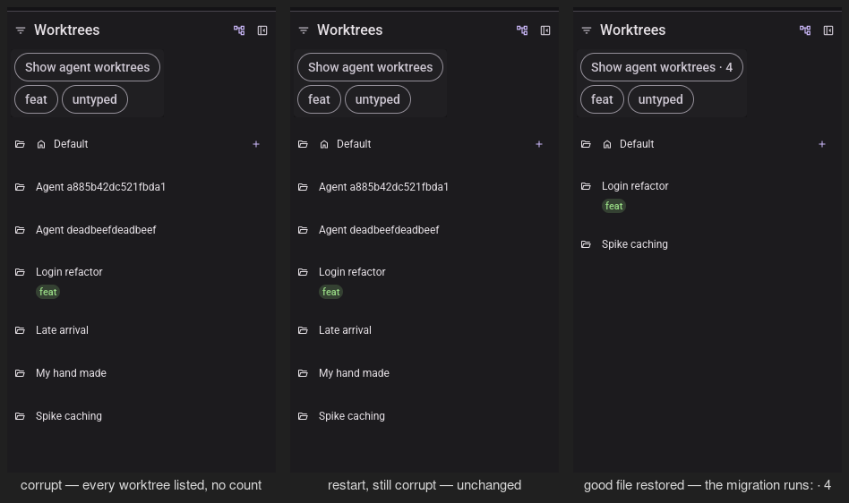

# Visual pass — Worktree provenance

Record of T042 and T079's manual GUI checks — [quickstart.md](./quickstart.md) Parts 2 and 3 — run
headlessly with the repo's `visual-pass` skill.

---

## 2026-09-12 — T042 / T079, the two inversions of 014's behaviour

**Ran on**: Xvfb `:77` (1600×1400) + lavapipe (Mesa's software Vulkan rasteriser), **not a physical
display**, with the client window sized to 1400×1000. `micold-ai-ide` and `micold-daemon`, `debug`,
built from `feat/worktree-provenance` in one
`cargo build -p micold-client --bin micold-ai-ide -p micold-daemon --bin micold-daemon` and copied
out of `target-shared/` to `~/vp/bin/` before launching — the shared target directory holds whatever
branch built last, and launching from it is how a pass reports on someone else's code. The pair was
confirmed by a string only this branch's client carries (`Claim as mine`) and by the run attaching
rather than printing `refusing client: contract or build mismatch`. Isolated `XDG_DATA_HOME` and a
private `XDG_RUNTIME_DIR=/tmp/vp77`; throwaway repos `qs-repo` and `qs-repo2` under the session
scratchpad; only processes whose `XDG_RUNTIME_DIR` read `/tmp/vp77` were ever stopped.

**Why this task exists.** Part 1 is where every decision in the feature is actually covered, and it
was green — `cargo fmt --all --check` clean, `cargo clippy --workspace --all-targets -- -D warnings`
clean, `cargo test --workspace --no-fail-fast` **2719 passed, 0 failed** across 273 test binaries.
What the render-free suite structurally cannot reach (Constitution Principle I, GUI-wiring
exception) is the count rendered on the reveal chip, the `Claim as mine` entry in the row menu, and
— the reason this pass earned its keep — what the *whole program* does when a store read fails,
which is a property of two processes reading the same file, not of any one function.

### Passed — Part 2, the fixture and the reveal control (steps 2–4)

Four worktrees made outside the app, under ordinary names and under a machine name. **None** is
listed (US1 / SC-001), and the empty state reads "No worktrees yet. Add one to get started." rather
than "No worktrees match the filter" — the distinction the user needs to not go looking for a filter
they did not set. The reveal control reads `Show agent worktrees · 4` (FR-025 / SC-010); switching it
on brings back exactly four rows, each chipped `agent`, and the count disappears from the control
while it is on (FR-025b).

### Passed — Part 2 step 6, a worktree created *through the app* (US2 scenario 2, FR-007b)

`agent-deadbeefdeadbeef` was created through the add-worktree form, under a name 014 would have
hidden on sight. It appears immediately (FR-010), with **no** `agent` chip, and the hidden count
stays at `· 4` with the reveal control off. This is the single clearest proof the rule inverted:
the name is the same shape as the row directly above it, and only the record separates them.

### Passed — Part 2 steps 5 and 7, the row menu and the claim (FR-015, US5 / SC-008)

Every ordinary action is present and enabled on a hidden row — copy name, rename, delete — plus
`Claim as mine`, and the hover cluster beside the row is unchanged. Claiming `my-hand-made` drops
its chip at once (FR-022); with the reveal control switched off it is still listed and the count
reads `· 3`.

### Passed — Part 2 steps 8–11

Switching the reveal control on, moving to `qs-repo2` and back left it **off** again, and coming
back did not restore it (FR-014). After a restart the created worktree and the claimed one were both
still listed with reveal off, and the other three still hidden (US2 scenario 1, US5 scenario 2). A
worktree created from a terminal under `.claude/worktrees/` never produced a row (US1 scenario 3);
the two captures taken immediately after creating it still read `· 3`, and the count reached `· 4`
at a later refresh — the row itself never appeared at any point.

Nothing on disk moved (SC-005 / FR-003 / FR-018): `git worktree list --porcelain` before and after
differed only by the worktree step 6 created, and
`find "$REPO/.claude/worktrees" -name '*provenance*' -o -name '*.micold*'` printed nothing.

### Passed — Part 3, the migration (FR-006, SC-009)

Part 3 step 1 asks for a store written by a **pre-feature** build, and no such build was available
to this pass. It was rehearsed instead by hand-editing the per-project state file into the
pre-feature shape — the two evidence forms FR-006 recognises (a display-name override, and an
archived session bound to a worktree directory) and neither `created_worktrees` nor
`provenance_migrated` — and keeping that file as `store-premigration` to restore from.

On the first run of the new build the renamed worktree and the one carrying a session are listed and
the rest are gone (SC-009), and the store shows exactly
`"created_worktrees": ["feat-login-refactor", "spike-caching"]`. **`agent-a885b42dc521fbda1` is not
backfilled even though it had been given the display label "Machine one"** — the FR-007a veto — and
it still carries the `agent` chip when revealed. Quitting and reopening left the state file
byte-identical and the count at `· 4` (FR-006c), and starting a session in a hidden worktree,
quitting and reopening left it hidden (FR-006d): claiming is the only way to keep it.

### Found and fixed — a failed read consumed the one-time migration (FR-011)

Part 3 step 6 corrupts the project's per-project state file and asks that **every** worktree be
listed with no count, because the app genuinely does not know which ones are the user's. That much
passed on the first walk. The regression was one launch further on: restarting with nothing restored
showed `Show agent worktrees · 6` over "No worktrees yet" — all six worktrees hidden, the exact
outcome FR-011 exists to prevent.

`load_project_state` renamed a corrupt per-project file aside to `<id>.json.bak`. That preserved the
bytes, but it hid the damage from the *next* reader of the same store — and there are two:
`crates/micold-client/src/shell/startup.rs:129` and the daemon the client has just spawned both call
`store.load()`. The second reader found a merely **missing** file, marked nothing unreadable, ran the
one-time FR-006 backfill against evidence that had just been discarded, and persisted
`provenance_migrated: true` with an empty record set. A transient read failure therefore spent the
migration and hid every worktree in the project, permanently.

Fixed test-first in `crates/micold-core/src/store.rs`: the corrupt file is now left exactly as found,
so every reader reaches the same verdict, and `save()` declines to write a project whose state this
run could not read — the in-memory shape for it is the empty one the failure degraded to, and writing
that back is the same erasure by another route. Two tests in
`crates/micold-core/tests/store_fault_isolation.rs` went red first
(`a_corrupt_project_state_file_stays_unreadable_for_every_reader`,
`saving_never_overwrites_an_unreadable_projects_state_file`) and green after.

### Passed — Part 3 step 6, re-walked against the fix

With the corrupt file in place every worktree is listed, none chipped, and the reveal control shows
no count at all. Restarting **without restoring anything** gives the identical sidebar, and the state
file is still the single byte `{` — untouched, with no `.bak` beside it and no `provenance_migrated`
written. Restoring the good file and reopening runs the migration exactly as it would have before the
failure: `· 4`, and `created_worktrees` back to the two worktrees with evidence.

### Not covered

- **Part 2 was walked against the build that preceded the FR-011 fix above**, and was not re-walked
  after it. The fix is confined to two branches that Part 2 cannot reach: the corrupt-file arm of
  `load_project_state`, and a `save()` guard that fires only for a project already in
  `unreadable_projects`. With neither condition present, the two builds do the same thing byte for
  byte. Part 3 step 6 — the only place either branch runs — was re-walked in full against the fixed
  binaries, and the whole-workspace suite is green on the fixed code.
- One platform only (Linux/Xvfb). Cross-platform parity rests on CI (T078).
- Light scheme only; this feature adds no new colour, and the `agent` chip it reuses was recorded in
  014's pass.
- `MICOLD_LOG=debug` produced no output in either the client or the daemon log during this pass, so
  every claim above is read from the store files on disk and from the pixels, not from logs.
