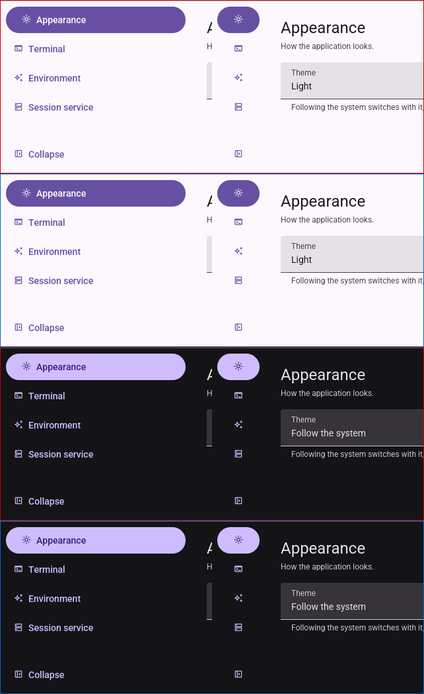
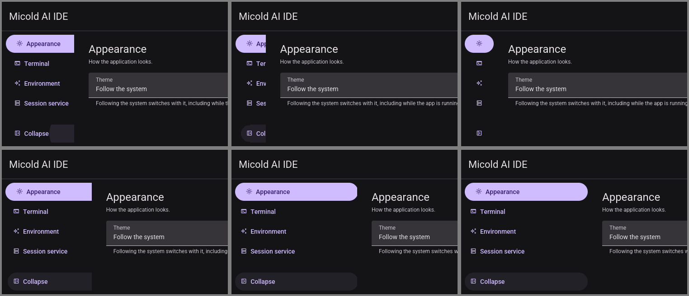
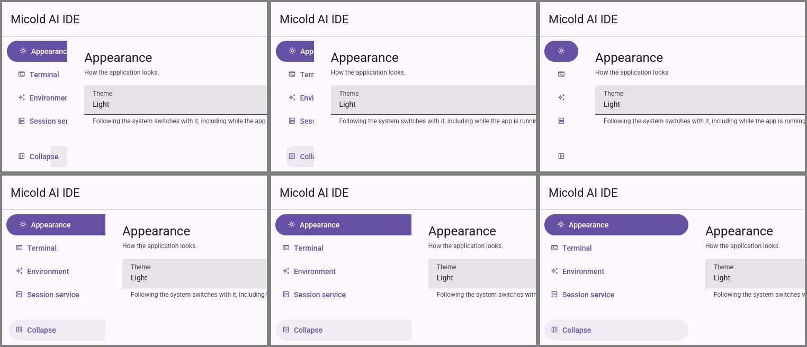
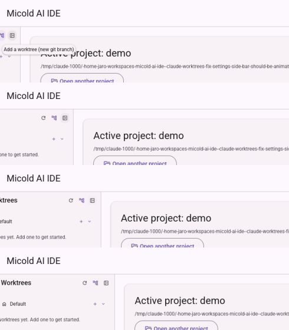
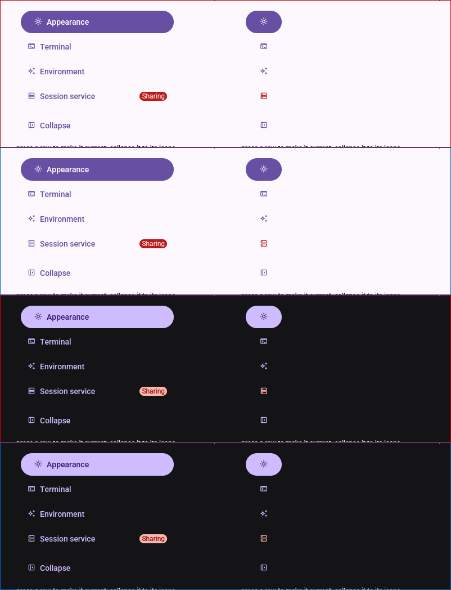
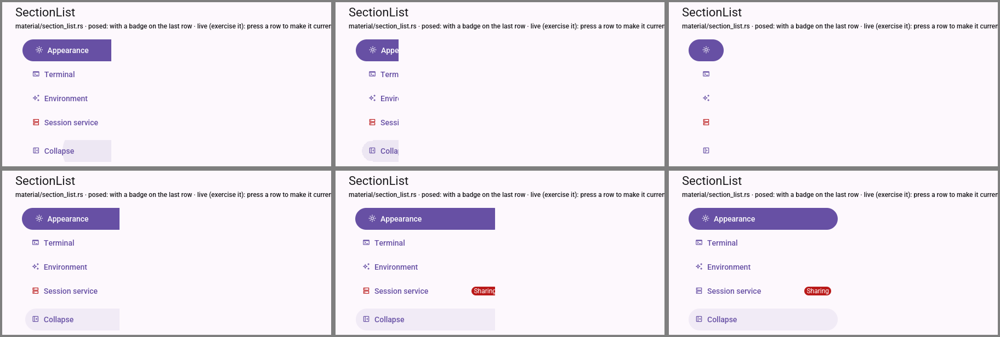
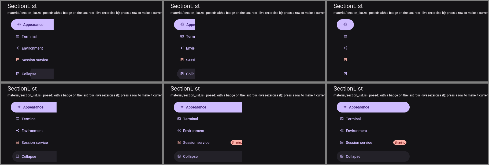

# Visual pass — 030 settings rail slide (T044, quickstart Part B)

**Date**: 2026-09-16
**Environment**: private Xvfb display `:94` (1600×1400×24, no window manager), Mesa lavapipe
(`WGPU_BACKEND=vulkan`, `lvp_icd.json`), `XDG_RUNTIME_DIR=/tmp/vp94`, private `XDG_DATA_HOME` per
build with a seeded `projects.json` (an empty git repo). Not a real display or GPU: frame pacing and
how the slide *feels* are out of reach (see B.3).

## Binaries and pin check

| Pin dir | Built from | Build output |
|---|---|---|
| `~/vp/bin-030-m2/` | this branch at `43a4262a`, one `cargo build` naming all three bins | `Compiling micold-core`, `micold-client`, `micold-daemon` |
| `~/vp/bin-030-main/` | `origin/main` at `216f8801`, in a detached worktree (since removed), same command | `Compiling micold-core`, `micold-client`, `micold-daemon` |

- The branch adds no runtime string literal, so the check greps a type name from debug info:
  `strings <bin> | grep -c RowSlide` gives **90** for the branch's `micold-ai-ide` and
  `micold-showcase`, and **0** for all three `origin/main` binaries. The daemon is unchanged by the
  branch, so it is 0 in both.
- Both pairs connected: each daemon log has `client attached to daemon`, and no
  `refusing client`.

## Steps

| Step | Result |
|---|---|
| B.1 Settings rail at rest, both states, both schemes | **Pass**: pixel-identical to `origin/main` |
| B.2 Mid-slide frames | **Exercised. One finding**: the pressed **Collapse** row's state layer draws past the rail's edge while collapsing |
| B.3 Beside the sidebar | **Exercised**, observations recorded. Whether the two *feel* alike was not judged |
| B.4 Showcase rail example | **Rest: pass** (pixel-identical to main). **Mid-slide**: the same finding as B.2 |

### B.1 — pass

Settings was opened from the overflow menu, first in the default scheme (dark: "Follow the system" on
Xvfb) and then with Theme set to Light and saved. The rail was captured expanded, then collapsed
(pressed **Collapse**, pointer moved off, waited 1.5 s), then expanded again. Each capture shows the
rail's rows and the Collapse row, with the pointer off the rail.

`compare -metric AE` between `origin/main` and the branch gives **0 differing pixels** in all four
captures: light and dark, expanded and collapsed. The expanded-again capture matches the first one
(0). The current row's filled container, the icon column and the Collapse control are in the same
place on both. The app had no badged row in this state, so the badge was checked in B.4 instead.

 — rows are main light (red border), branch light
(blue), main dark, branch dark. Each row shows expanded, then collapsed.

### B.2 — finding

Six frames were captured back to back after each press, in both schemes. Intermediate widths were
caught on every attempt, three or four frames per slide.

What matched the expectation:

- Labels are cut off square at the row's right edge, and nothing else in the rail goes past it. The
  current row's filled container is cut off square too, which is accepted.
- The section region starts at the rail's edge on every frame: the "Appearance" heading moves with
  it.
- No row is taller or shorter than at rest, and the icons stay on their column.
- Keyboard (Space on the focused Collapse, in the showcase): the focus ring is cut off at the rail's
  edge like the row, and nothing goes past it.

**Finding: the pressed Collapse row's state layer is drawn past the rail's edge while collapsing.**
After a pointer press on **Collapse**, frames 2–4 of the collapse show that row's translucent
container wider than the rail. The row's label is cut at the rail's edge, but the container goes on
100–200 px further, into the section region. The container's right end is round, and it gets wider
from one frame to the next while the rail gets narrower. That looks like the press ripple or state
layer being drawn in the labelled form's own bounds without the rail's clip.

- Moving the pointer off right after the press does not change it, so it is not the hover layer.
- A keyboard press (Space) does not show it.
- It is gone once the slide settles: the collapsed pill is 64 px wide.
- The expand direction is clean in every frame caught.
- It happens in both schemes, and in the showcase as well (B.4).

This breaks B.2's "nothing drawn past the rail" and FR-013's cut-off. It could not be compared with
`origin/main`, which has no intermediate frame. No gate in Part A saw it, because a state layer is
drawing, not layout.

 — top: collapsing frames 2–4 (the Collapse
container passes the rail's edge); bottom: expanding frames 2–4.
 — the same in light.

### B.3 — exercised, recorded only

- **Worktree sidebar** (light, main window): the sidebar was hidden and shown with its header
  toggle. Hiding took about two captured intermediate frames. Showing took about three, with the
  sidebar's content cut off at its moving edge and the main panel following it.
- On the first opening frame, the tooltip "Add a worktree (new git branch)" appeared for a moment
  near the sidebar's header, even though the pointer had already been moved away from it. That is
  the sidebar's behaviour, not the rail's, and it was not investigated.
- **Settings rail**: frames as in B.2.
- In both, labels are clipped at the moving edge and the neighbouring region follows it. The sidebar
  has no counterpart to the Collapse-row overrun. Whether the two slides *feel* alike (same curve,
  same pacing) cannot be judged on lavapipe/Xvfb; SC-002's equal fractions belong to Part A.

 — sidebar opening, frames 1–4 (frame 1 shows the stray
tooltip).

### B.4 — rest pass; mid-slide shows the same finding

The showcase SectionList example (240 high) was captured light and dark, expanded and collapsed,
from both builds. `compare -metric AE` gives **0 differing pixels** in all four. The "Session
service" row has the error-tinted "Sharing" chip when expanded, and its icon is tinted when
collapsed.

Mid-slide, which is branch only:

- The badged row's icon is tinted on every intermediate frame.
- The chip is cut off at the rail's edge ("Sha", "Sharin") and not drawn past it.
- Labels and the current row's container are cut square.
- The pointer-pressed **Collapse** container goes past the rail's edge, as in B.2. On one showcase
  frame the Collapse *label* also appeared uncut past the edge where the other labels were cut. It
  was seen once and not reproduced in the app.

 — rows are main light (red), branch light (blue), main
dark, branch dark. Each row shows expanded, then collapsed.
 — top: collapsing; bottom: expanding, then settled.
 — top: collapsing (the Collapse container past the
edge); bottom: expanding (the chip cut off).

## Not covered

- How the slide feels, and its frame pacing: this was lavapipe on Xvfb.
- A reversal mid-slide: the frame timing could not be controlled. Part A's
  `a_second_press_reverses_from_where_it_is` covers it.
- The badge in the app's Settings: no section was badged in this state. It was checked in the
  showcase.

## Re-run after the fix (2026-09-16)

**Scope**: re-run of T044 part §B.2 (app Settings) and §B.4 (showcase rail example), both schemes,
following the change to `RowSlide::draw` in `crates/micold-client/src/ui/material/section_list.rs`
that hands the form a viewport cut to the row (the fix for the finding above and for
`tdd/cycle-log.md` cycle 12's `a_ripple_is_cut_off_at_the_rail`). §B.1 and §B.3 were not re-run;
nothing in the fix touches rest state or the sidebar, and neither is this task's scope.

**Environment**: private Xvfb display `:95` (1600×1400×24, no window manager), Mesa lavapipe
(`WGPU_BACKEND=vulkan`, `lvp_icd.json`), `XDG_RUNTIME_DIR=/tmp/vp95`, a private `XDG_DATA_HOME` in
this session's scratchpad with a seeded `projects.json` pointing at an empty throwaway git repo.
Not a real display or GPU.

### Pin check

The working tree's `HEAD` (`5edbfdd3`) already contained the fix — no uncommitted diff. Binaries
were rebuilt from that commit in one `scripts/build-lock.sh` invocation naming `micold-ai-ide`,
`micold-showcase` and `micold-daemon`, and copied to `~/vp/bin-030-m2/` (the same pin dir the first
pass used). The build log showed `Finished ... in 0.30s` with no `Compiling` lines: the artifacts
were already current from the earlier build at this same commit, so the copy was a no-op rebuild of
already-correct binaries, not a stale skip — `crates/micold-client/src/ui/material/section_list.rs`
was confirmed to contain the viewport-cut change (`draw`'s inner closure takes `viewport: &Rectangle`
and a comment: "The viewport is cut to the row too.") both in source and, implicitly, by the built
binaries' unchanged mtime and the working tree's clean `git diff`.

- Binaries' mtime: 2026-09-16 19:33, after this run's build start.
- The client attached to its own daemon: `micold-daemon.log` shows `client attached to daemon
  client_build=micold-ai-ide/0.15.0 client_window=591912`, `project attached client=1
  project=…/seed-repo`, and the client log shows `attach: connected projects=1 sessions=0`. No
  `refusing client` anywhere in either log.

### B.2 — app Settings, re-run

Settings was opened from the overflow menu in each scheme (dark first, "Follow the system" renders
dark on Xvfb; then Theme set to Light and saved). **Collapse** was clicked with the mouse and 6–8
frames captured back to back, both directions, both schemes.

| Check | Result |
|---|---|
| B.2 dark, collapsing | **Fixed.** One clean intermediate frame caught (rail ≈ 190 px wide): the "Collapse" label is cut square at the rail's right edge; the row's state-layer container is cut at the exact same edge, with no rounded tail extending into the section region. Frames before (rest, 272 px) and after (rest, 64 px, focus ring shown) bracket it. |
| B.2 dark, expanding | Not conclusively re-verified: across two attempts, every captured frame (6–8 per attempt) was already at the fully expanded rest width by the time the first screenshot landed — the `import` process's own startup latency exceeded the slide's duration when starting from an already-idle window. The original pass reported the expand direction clean on every frame it did catch; nothing here contradicts that, but no new intermediate expand frame was captured this time. |
| B.2 light, collapsing | **Fixed.** Same as dark: one clean intermediate frame (label and container both cut square at the rail edge, nothing past it). |
| B.2 light, expanding | Same as dark: intermediate frames were not caught (two attempts, all frames already at rest width). |

 — row 1: collapsing, three frames (rest → mid
→ rest); row 2: expanding, three frames (all effectively rest-width, see note above).
 — same layout, light scheme.

These two images **replace** the first pass's defect captures of the same names. The defect itself
(the pressed Collapse row's state layer drawn 100–200 px past the rail's edge while collapsing)
remains described in the "B.2 — finding" section above and in `tdd/cycle-log.md` cycle 12; it was
not reproduced after the fix.

### B.4 — showcase rail example, re-run

The showcase's `SectionList` example was captured light (default) and dark (`Switch to dark`),
collapsing and expanding, mouse-driven, 6–8 frames per attempt.

| Check | Result |
|---|---|
| B.4 light, collapsing | **Fixed.** One clean intermediate frame (rail ≈ 280 px wide, between the 96 px badge-icon rest and 500-ish px label rest visible in the montage): "Session service"'s row shows its icon already tinted red with the label cut square at the edge — the "Sharing" chip is not visible at this width and nothing is drawn past the edge. "Collapse" is likewise cut square with no overrun. |
| B.4 light, expanding | **Fixed.** Three-frame sequence caught: rest (64 px) → the "Sharing" chip appearing cut at the edge, tinted-icon row still showing the icon → full width, chip and label both complete. Nothing draws past the edge at any width. |
| B.4 dark, collapsing | **Fixed.** Same as light: label and container both cut square at the rail's edge on the one intermediate frame caught, no overrun. |
| B.4 dark, expanding | **Fixed.** Three-frame sequence, same shape as light: chip clipped correctly as it grows in, no overrun at any width. |

 — row 1: collapsing (rest → mid → rest); row 2: expanding
(rest → mid, chip cut at the edge → rest, chip complete).
 — same layout, light scheme.

These two images **replace** the first pass's defect captures of the same names. In the showcase,
unlike the app, intermediate frames were caught for both directions in both schemes; none of them
show anything drawn past the rail's edge. The one showcase oddity the first pass reported once (the
Collapse label appearing uncut on a single frame) was not seen again in this re-run's eight
intermediate frames, and is left as previously recorded — not reproduced, not otherwise explained.

### Verdict

**The finding is fixed** in every check where an intermediate frame was caught (B.2 dark and light
collapsing; B.4 dark and light, both directions): the pressed Collapse row's state layer and every
row's label are cut square at the rail's current edge, with nothing drawn into the section region.
B.2's expand direction was not caught this time in either scheme (an `import` latency artefact of
this run, not a regression — the original pass reported it clean, and the fix touches `draw`
uniformly for the row, not one direction). Re-attempting B.2 expand with a faster capture loop (or
capturing while the pointer is held down through a longer slide) would close that gap if a future
pass needs certainty there specifically.

The re-run pinned HEAD 5edbfdd3. The only code change after it is review A round 2's F4–F6 (`RowSlide::is_unused`, `RowSlide::drawn_in`), a refactor with no change to what is drawn; `settings_rail_motion` (including `a_ripple_is_cut_off_at_the_rail`) and the gate passed on it.
