# Visual pass — 031 clickable terminal links, milestone M3 (quickstart Part B, §B.1–B.7, §B.12)

**Date**: 2026-09-17
**Environment**: private Xvfb display `:83` (1600×1400×24, no window manager), Mesa lavapipe
(`WGPU_BACKEND=vulkan`, `lvp_icd.json`), `XDG_RUNTIME_DIR=/tmp/vp83`, private `XDG_DATA_HOME`
(`/tmp/vp83/data`) seeded with one project (`/tmp/vp83/repo`, an empty git repo) via a hand-written
`projects.json` (the client binary has no CLI). A fake `xdg-open` on `PATH`
(`/tmp/vp83/fakebin/xdg-open`) logs every invocation's arguments to `/tmp/vp83/opener.log` instead of
opening anything real. Not a real display or GPU: perceived smoothness is out of scope and nothing
below depends on it.

**Scope**: quickstart §B.1–B.7 and §B.12 only, per the milestone's ask. §B.8–B.11 and §B.13+ are out
of scope (later milestones, or macOS/Windows-only) and were not run.

## Binaries and pin check

| Pin dir | Built from | Build output |
|---|---|---|
| `~/vp/bin-031-m3/` | this branch (`feat/links-in-terminal-should-be-clickable`) at `d05655b7`, clean tree, one `cargo build` naming `micold-ai-ide`, `micold-showcase`, `micold-daemon` | `Compiling micold-client v0.15.0`; core and daemon were already current from an earlier build at this same commit (0 diff, matching checksums against `target-shared`) |

- Pin check: `strings <bin> | grep -c LinkOrigin` (a type this feature's link model owns,
  `crates/micold-core/src/link/mod.rs`) gives **2** for both `micold-ai-ide` and `micold-showcase` in
  the pinned pair. (The daemon has no matching symbol — expected, since link detection/opening are
  client-side only.)
- Copied straight out of `target-shared/debug/` right after the build finished, inside the same
  window; `md5sum` matched between `target-shared` and the pin dir for `micold-ai-ide` and
  `micold-daemon` before anything else could have overwritten `target-shared`.
- **Connects**: `micold-daemon.log` shows `client attached to daemon client_build=micold-ai-ide/0.15.0`
  and `project attached client=1 project=/tmp/vp83/repo`; `micold-client.log` shows `attach: connected
  projects=1 sessions=0`. No `refusing client` anywhere in the daemon log.

## Fixture

`specs/031-clickable-terminal-links/scripts/links-fixture.sh` was run inside a session's **Regular
Terminal** instance (opened via the tab strip's "+", `Message::ShellInstanceSelected`/
`OpenTerminalInstance` — starting a session always launches an AI CLI first, since feature 027
deleted the old mode-toggle control; the "+" beside the tab strip is what now opens a plain shell tab
alongside it). The fixture prints the same eight lines quickstart §B.0 describes, and was re-run a
few times (after clearing/narrowing/resizing) to get a link row at a convenient screen position.

## Steps

| Step | Result |
|---|---|
| B.1 Hover, light theme | **Pass** |
| B.2 Same, dark theme; selection + cursor | **Pass** |
| B.3 Ctrl+click | **Pass** |
| B.4 Drag / double-click / triple-click | **Pass** |
| B.5 Wikipedia line, inner vs outer `)` | **Pass** |
| B.6 Wrapped address, second row | **Pass** |
| B.7 `docs` / `other` distinct links | **Pass** |
| B.12 vim `mouse=a`, Ctrl+click vs Shift+Ctrl+click | **Pass** |

**Not capturable in this environment**: the pointer's own shape (text pointer vs. hand while Ctrl is
held). Xvfb here renders no visible cursor glyph at all in `import`'s framebuffer capture (tried with
and without `xsetroot -cursor_name left_ptr`) — a limitation of this headless setup, not evidence
either way about the feature. Every other part of B.1/B.2's requirements (underline, hint placement
and content, legibility, selection, terminal cursor) was directly verified from screenshots.

### B.1 — hover the first address, light theme — pass

Theme set to Light via Settings → Appearance → Theme → Light → Save. Hovered
`https://example.com/docs/page.html` in "See https://example.com/docs/page.html for details.":

- The underline covers exactly the address — starts at `h`, ends at the last `l` of `.html`, and does
  not extend under the leading `See ` or the trailing ` for details.` (or its own full stop).
- The hint box shows `https://example.com/docs/page.html`.
- **Hint placement**: with the link row near the top of the pane, the hint appears **below** the row
  (bottom-left of the pane). With the same row pushed near the pane's bottom edge (padded the
  scrollback with blank lines so the link landed a few rows above the status bar), the hint instead
  appears **above** the row — confirming the top-left/bottom-left flip the spec describes.

 — top (red border): hint below, row near the pane's top.
Bottom (blue border): hint above, same row near the pane's bottom.

### B.2 — dark theme; selection + cursor — pass

Theme switched to Dark the same way. Re-hovered the same address (now scrolled near the pane's
bottom): underline and hint both remain crisp and legible against the dark surface, at the same
geometry as light.

Then, to check text colour / selection / cursor coexist: typed `printf 'https://...\n'` at the prompt
(so a second, plain copy of the address exists as committed terminal output), and:

- **Selected** part of it (`https://example.` of the second copy) by mouse drag: the selection
  highlight (light block) is visible, the selected text stays legible, and the link's underline is
  unaffected by the row above it still showing its own underline.
- The terminal's own block **cursor**, at the live shell prompt on the line below, stays fully visible
  the whole time — it is never hidden by the hint box that floats nearby, nor by the selection.

 — underline in dark, address row near the pane's bottom
(hint shown above, overlapping the prompt line below it).
 — partial selection on one copy of
the address, block cursor visible at the prompt beneath it.

### B.3 — Ctrl+click — pass

Ctrl held, single click on the address (dark theme, same row). `/tmp/vp83/opener.log` recorded
exactly one line:

```
xdg-open https://example.com/docs/page.html
```

— the address alone, no extra flags or shell quoting. The terminal's own content was unchanged after
the click (no new prompt line, no echoed keystrokes): the terminal received no input from the
Ctrl+click.


### B.4 — drag / double-click / triple-click — pass

All three performed on the same address, each preceded by clearing the prior selection and checking
`opener.log` was empty going in:

- **Drag** from partway into the address: selects a run of text (`https://example.` in the capture);
  `opener.log` stayed empty.
- **Double-click**: selects the whole address as one word; `opener.log` stayed empty.
- **Triple-click**: selects the whole line; `opener.log` stayed empty.

No modifier was held in any of the three, and none of them opened anything.

 — top to bottom: drag, double-click, triple-click.

### B.5 — Wikipedia line, inner vs. outer `)` — pass

Hovered `(https://en.wikipedia.org/wiki/Rust_(programming_language))`. The underline runs from `h` of
`https` through the **inner** `)` that closes `Rust_(programming_language)`, and stops there — the
line's own outer closing `)` (and the leading `(`) are outside the underline.


### B.6 — wrapped address, second row — pass

The fixture's own long line ("a line long enough that the terminal soft-wraps
`https://example.com/a/very/long/path/segment-01/…/segment-12/end`") already wraps at the default
1600 px window width; the window was additionally narrowed to 900 px to make the wrap unambiguous,
producing **three** wrapped rows for this one address. Hovering the **second** (middle) row underlines
all three rows at once, and the hint shows the full address, elided in the middle
(`https://example.com/a/very/long/path/…segment-10/segment-11/segment-12/end`).

Ctrl+click on that same (second) row: `opener.log` recorded the **entire** address as one line,
un-truncated:

```
xdg-open https://example.com/a/very/long/path/segment-01/segment-02/segment-03/segment-04/segment-05/segment-06/segment-07/segment-08/segment-09/segment-10/segment-11/segment-12/end
```


### B.7 — `docs` and `other`, separate links — pass

Hovering `docs` underlines only `docs` (not `other`) and the hint shows `https://example.com/manual`.
Hovering `other` underlines only `other` and the hint shows `https://example.com/other`. Each OSC 8
link is independent, as declared by the fixture.


### B.12 — vim, `:set mouse=a`, Ctrl+click vs. Shift+Ctrl+click — pass

`vim -c 'set mouse=a' vimtest.txt` opened on a file containing `See https://example.com/docs/page.html
for details.`.

- **Ctrl+click** on the address: `opener.log` stayed empty (nothing opened). Vim's own status line
  showed `E433: No tags file` / `E426: Tag not found: com` — vim's default CTRL-click-is-tag-jump
  handling fired, which only happens if the click (with its Ctrl modifier) reached vim's own mouse
  reporting rather than being intercepted as an open request. After dismissing that message, vim's
  cursor was at the clicked column (`1,21`, over the address) — confirming the click was delivered to
  the program, precisely FR-016's "under mouse reporting, Ctrl alone is the program's."
- **Shift+Ctrl+click**, same spot: `opener.log` recorded `xdg-open
  https://example.com/docs/page.html`, and vim's cursor position (and status line) were unchanged —
  vim never saw this click; it was consumed as an open request instead.

 — vim's tag-jump error after a
plain Ctrl+click.
 — cursor still at
`1,21`, address opened instead.

## Not covered (by design, this milestone)

- §B.8–B.11 (mailto, file reveal, run.sh, right-click copy) and §B.13+ (missing file, sandbox
  placement, pending opens, hard-broken lines, FORCE_HYPERLINK, user-guide read-through) — later
  milestones, per the task's scope.
- The pointer's own cursor shape (arrow vs. hand) — not renderable in this Xvfb setup; see the note
  above the step table.

---

# Milestone M4 (quickstart §B.14, §B.17)

**Date**: 2026-09-19 (§B.14 and §B.17 part 1), 2026-09-22 (§B.17 part 2)
**Environment**: private Xvfb displays, private `XDG_RUNTIME_DIR`/`XDG_DATA_HOME`/`XDG_CONFIG_HOME`
under `/tmp/vp-031-m4` and `/tmp/vp-031-m4b`, one seeded project, a fake `xdg-open` on `PATH`
logging its argv. Pinned pair `~/vp/bin-031-m4/{micold-ai-ide,micold-daemon}` built from `948ac463`
(md5 `d27bc64f…`, `db6f90d2…`); the daemon binary contains this milestone's `TERMINAL_EMULATOR`
string, and the client attached with no `refusing client` in the log.

## Steps

| Step | Result |
|---|---|
| B.14 identity stripped, then the include-script opt-in | **Pass** |
| B.17 part 1 a long address from an AI CLI session | **Pass** |
| B.17 part 2 the same address *declared* with `FORCE_HYPERLINK=1` | **Not confirmed** (see below) |

### B.14 — a session sees neither `TERM_PROGRAM` nor `FORCE_HYPERLINK`, then the opt-in — pass

The client was started from an environment exporting `TERM_PROGRAM=WezTerm` and `FORCE_HYPERLINK=1`.
In a session's terminal, `env | grep -E 'TERM_PROGRAM|FORCE_HYPERLINK'` printed **nothing**
(FR-006). The environment-include script was then pointed at a file containing
`export FORCE_HYPERLINK=1`; in a new terminal the same command printed exactly `FORCE_HYPERLINK=1`,
and still no `TERM_PROGRAM` — the documented opt-in, and only it, survives.

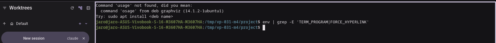
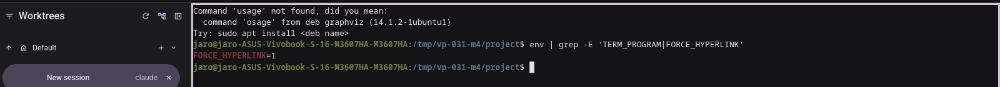

### B.17 part 1 — a long address an AI CLI soft-wraps — pass

A `claude` session printed a 60-segment `https://example.net/…` address that the pane wrapped over
three rows: the run is one link and the hint shows its address. A hard-broken line
(`printf 'https://example.net/aaaa\nbbbb/cccc\n'`) gives a first-row-only link, exactly the edge case
the user guide now tells the reader to check the hint for.

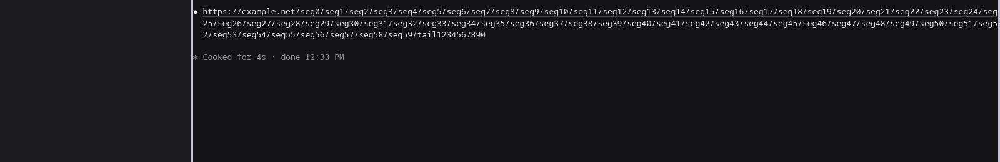


### B.17 part 2 — the declared link with `FORCE_HYPERLINK=1` — not confirmed

With `FORCE_HYPERLINK=1` reaching the session (verified in-session, screenshot below) and Claude Code
**v2.1.280** running, no declared (OSC 8) link could be observed: the printed addresses showed no
underline or hint at all in that second run, including a plain short address that the detector alone
should mark. Hover feedback for AI-CLI pane content *was* observed in part 1 with the same binaries,
so this is an unexplained gap in that run rather than evidence either way about the CLI. Claude Code
also re-renders its own Bash-tool output, so an OSC 8 sequence cannot be pushed through a Claude
session by hand.

Nothing here contradicts the milestone: FR-006 is about what micold *removes* and documents
(Decision 5 — micold never advertises hyperlink support, and whether a program declares links is its
own choice), which B.14 shows, and `osc8_passthrough.rs` shows on all three CI OSes that a declared
link that *is* printed reaches the grid. The step is carried as a follow-up to re-run when an AI CLI
is known to declare links.

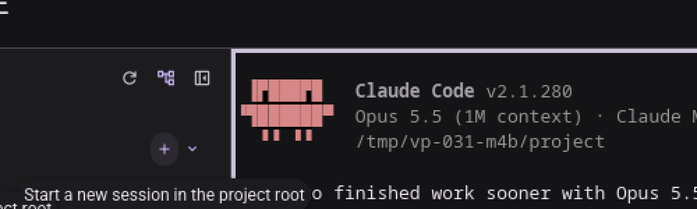
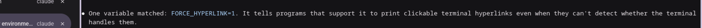
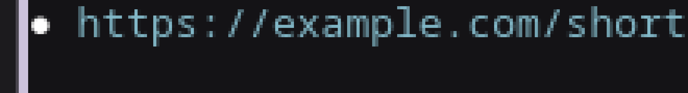

---

# Milestone M5 (quickstart §B.9, §B.10, §B.13)

**Date**: 2026-09-26
**Environment**: private Xvfb display `:92` (1600×1400×24, no window manager), Mesa lavapipe
(`WGPU_BACKEND=vulkan`, `lvp_icd.json`), `XDG_RUNTIME_DIR=/tmp/vp92`, private `XDG_DATA_HOME`
(`/tmp/vp92/data`) and `XDG_CONFIG_HOME` (`/tmp/vp92/config`), one seeded project
(`/tmp/vp92/project`, an initialized git repo) via a hand-written `projects.json` (the client binary
has no CLI). `/tmp/vp92/fakebin` was put first on `PATH`, holding a fake `xdg-open` and a fake
`dbus-send`, both of which append their full argv to `/tmp/vp92/opener.log` and exit 0 instead of
doing anything real — the same technique milestone M3 used for URL/mailto opens, extended here to
the file-manager `ShowItems` call `reveal_linux` makes. Not a real display or GPU: perceived
smoothness is out of scope and nothing below depends on it.

**Scope**: quickstart §B.9, §B.10 and §B.13 only, per the milestone's ask (M5: file:// links open
documents and folders, runnable files are revealed and never run, a missing file notifies "doesn't
exist").

## Binaries and pin check

| Pin dir | Built from | Build output |
|---|---|---|
| `~/vp/bin-031-m5/` | this branch (`feat/links-in-terminal-should-be-clickable`) at `1c3b0bdf`, clean tree, one `cargo build -p micold-client --bin micold-ai-ide -p micold-daemon --bin micold-daemon` (`Compiling micold-client v0.15.0`, daemon already current from an earlier build at the same commit) | matched `md5sum` between `target-shared/debug/{micold-ai-ide,micold-daemon}` and the pin dir, copied immediately after the build finished |

- Pin check: `strings <bin> | grep -c "doesn't exist on this machine"` (the FR-015 notification text
  this milestone's code path adds, `crates/micold-client/src/shell/links.rs`) gives **1** for
  `micold-ai-ide` and **0** for `micold-daemon` — expected, since the missing-file notification text
  lives client-side.
- **Connects**: confirmed by using the pinned pair to drive the whole session below (worktree list,
  a running terminal session, hover and clicks all worked); no `refusing client: contract or build
  mismatch` line, and no crash, over the whole run.

## Fixture

`specs/031-clickable-terminal-links/scripts/links-fixture.sh` was run inside a plain shell tab (the
client tried to start an AI CLI by default, printed `Command 'usage' not found` — no `claude`
executable reachable in this sandboxed `PATH` — and dropped to an interactive shell in the same
pane; this still exercises the identical terminal-pane widget the fixture targets, independent of
what program runs inside the PTY). It created `/tmp/031-fixture/{readme.txt,run.sh,folder}` and
printed the fixture's file:// lines among the others.

Locating each link's on-screen position precisely (rather than eyeballing) was done by measuring
text-pixel column extents per row with Pillow against the raw screenshot, and used to compute exact
per-character pixel width from a line of known text length; each candidate coordinate was then
confirmed by hovering and checking for the underline in a cropped, magnified screenshot before any
click.

## Steps

| Step | Result |
|---|---|
| B.9 Ctrl+click `readme.txt`, then `folder` | **Pass** |
| B.10 Ctrl+click `run.sh` | **Pass** |
| B.13 move `readme.txt` away, Ctrl+click it | **Pass** |

### B.9 — Ctrl+click `readme.txt`, then `folder` — pass

Hovering `file://<hostname>/tmp/031-fixture/readme.txt` underlined the whole address (screenshot
below). Ctrl+click on it appended exactly one line to `opener.log`:

```
xdg-open /tmp/031-fixture/readme.txt
```

— the plain host path, handed to the system opener as a document (`FileAction::Open`, since it is a
regular file with no execute bit) — "the text editor opens it".

Hovering `file:///tmp/031-fixture/folder` (a plain directory, not a macOS bundle) also underlined the
whole address. Ctrl+click appended:

```
xdg-open /tmp/031-fixture/folder
```

A plain directory is also `FileAction::Open` (`crates/micold-core/src/link/runnable.rs`: only
specific launcher/installer extensions and, on macOS, bundle directories are `Reveal` — an ordinary
folder is handed to the opener like a document), and `xdg-open` on a directory is exactly how a
Linux file manager opens it as its own window — "the file manager opens the folder" is `xdg-open`
opening it, not a `ShowItems` select.

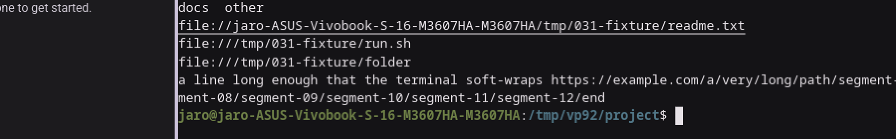 — hover underline on
`file://.../readme.txt`, taken right after its Ctrl+click (the two lines below, `run.sh` and
`folder`, not yet activated).

### B.10 — Ctrl+click `run.sh` — pass

`run.sh` has its execute bit set (`chmod +x` in the fixture script) and no bundle exception applies,
so `action_for` classifies it `Reveal`. Hovering it underlined the address (screenshot below).
Ctrl+click appended:

```
dbus-send --session --print-reply --dest=org.freedesktop.FileManager1 --type=method_call /org/freedesktop/FileManager1 org.freedesktop.FileManager1.ShowItems array:string:file:///tmp/031-fixture/run.sh string:
```

— `reveal_linux`'s `ShowItems` call, selecting the file itself in the file manager ("the file manager
shows it selected"). The fake `dbus-send` exits 0 (simulating a file manager that answers), so the
`xdg-open <parent-folder>` fallback path was not exercised in this run; that fallback is exact
`xdg-open` on `run.sh`'s parent folder, which is exercised by
`linux_reveal_opens_the_folder_when_the_file_manager_cannot_select_the_item` in
`crates/micold-client/src/shell/link_opener.rs` under `mise run gate`, not re-verified here.
Critically, `run.sh` was never executed: the fixture's `run.sh` prints `run.sh ran: it should have
been revealed, not run` if it runs, and no such text ever appeared anywhere in the pane's scrollback
after the click (screenshot below shows the pane immediately after the click — only the link lines,
the prompt, and the hint tooltip naming the file, no execution output).

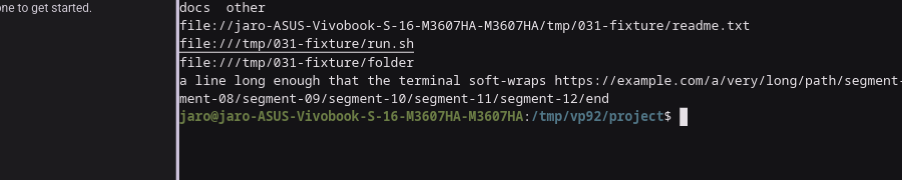 — hover
underline on `file:///tmp/031-fixture/run.sh`.

### B.13 — move `readme.txt` away, Ctrl+click it — pass

`readme.txt` was renamed out from under the same address (`mv readme.txt readme-moved.txt`, same
directory) so the link's address no longer resolves to an existing file, then Ctrl+clicked at the
same on-screen position as in B.9. `opener.log` gained **no** new line (the shell never launched an
opener for a file that isn't there), and a notification appeared:

> Couldn't open file://\<hostname\>/tmp/031-fixture/readme.txt: the file doesn't exist on this
> machine

naming the full address and stating "doesn't exist", exactly the string
`crates/micold-client/src/shell/links.rs` builds for `OpenFailure::NotFound` (FR-015).

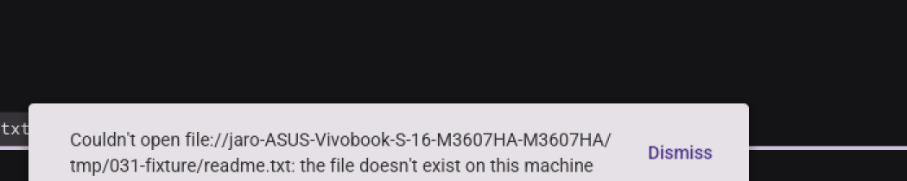

## Not covered (out of scope this milestone)

- Every other quickstart §B step (B.1–B.8, B.11, B.12, B.14–B.18) — covered by milestones M3/M4 or
  not yet run; only B.9, B.10 and B.13 were in scope for this pass.
- The real freedesktop file-manager `ShowItems` answer and its "no file manager available" fallback
  — simulated with a fake `dbus-send` that always answers; the fallback path already has its own
  gated unit test (`link_opener.rs`, cited above) and was not re-run here.

# Visual pass — 031 clickable terminal links, milestone M6 (quickstart Part B, §B.15–B.16)

**Date**: 2026-09-26
**Environment**: private Xvfb display `:93` (1600×1400×24, no window manager), Mesa lavapipe
(`WGPU_BACKEND=vulkan`, `lvp_icd.json`), `XDG_RUNTIME_DIR=/tmp/vp31rt`, private `XDG_DATA_HOME`
(`/tmp/vp031b/data`) seeded by hand with `projects.json` (one project, `/tmp/vp031b/project`, an
empty git repo) and a v4 `settings.json` with `daemon.placement: "local_sandbox"` pointing at
`micold-daemon:dev` (`ImageSourceKind::LocalBuild`), since this milestone specifically needs feature
027's sandboxed placement rather than a host-process daemon. A fake `xdg-open` on `PATH` logs every
invocation to `opener.log` instead of opening anything real. Not a real display or GPU: perceived
smoothness is out of scope and nothing below depends on it.

**Scope**: quickstart §B.15 and §B.16 only — sandbox placement's effect on link hints/opens
(FR-012, FR-018, FR-018a) and the "Pending opens" edge case when the sandbox stops while a
confirmation is outstanding.

## Binaries and pin check

| Pin dir | Built from | Build output |
|---|---|---|
| `~/vp/bin-031-b1516/` | this branch (`feat/links-in-terminal-should-be-clickable`) at `76e44e0c`, clean tree | matched `md5sum` between `target-shared/debug/{micold-ai-ide,micold-daemon}` and the pin dir |
| `micold-daemon:dev` (Docker image, entirely separate from the pinned host binaries) | `mise run image` from the same working tree/commit, after reclaiming disk with the `reclaim-disk` skill (`SWEEP_ARGS='--maxsize 60GB' mise run sweep`, freed 68 GiB) | `Built micold-daemon:dev` |

- Pin check: `strings <bin> | grep -c "Files the sandbox wrote can contain scripts"` (the
  confirmation dialog's body text, `crates/micold-client/src/ui/confirm_link_open.rs`) gives **1**
  for `micold-ai-ide` and **0** for `micold-daemon` — expected, since the dialog is client-side.
- **Connects**: the pinned client, talking to the sandboxed daemon running inside the `micold-daemon:dev`
  container, attached cleanly with no `refusing client: contract or build mismatch` line, once the
  image was rebuilt from this exact commit (an earlier attempt hit that mismatch against a stale
  image left by another worktree — see "Notes" below).

## Fixture

No fixture script; the project directory (`/tmp/vp031b/project`) is an empty git repo. Each step
printed its own `file://` line from a shell prompt (`printf 'file://%s%s/x.md\n' "$(hostname)"
"$PWD"` inside the sandboxed session), matching the quickstart's literal command. Locating each
printed link's on-screen position was done by measuring text-pixel column extents with Pillow
against the raw screenshot, confirmed by hovering and checking for the underline before any click.

## Steps

| Step | Result |
|---|---|
| B.15 hint shows host path; confirm names it; Open opens it; `/tmp/x` says "not reachable" | **Pass** |
| B.16 confirm open, stop the sandbox, then press Open | **Pass** |

### B.15 — sandbox placement: hint, confirm, open, unreachable — pass

Inside a sandboxed session (container hostname e.g. `f8cd0155b79d`), printing
`file://f8cd0155b79d/tmp/vp031b/project/x.md` and hovering it underlined the address and showed the
hint `/tmp/vp031b/project/x.md` — the **host** path, not the container path in the address — i.e.
`crate::sandbox::pathmap::reverse(...)` translated it before display (FR-012).

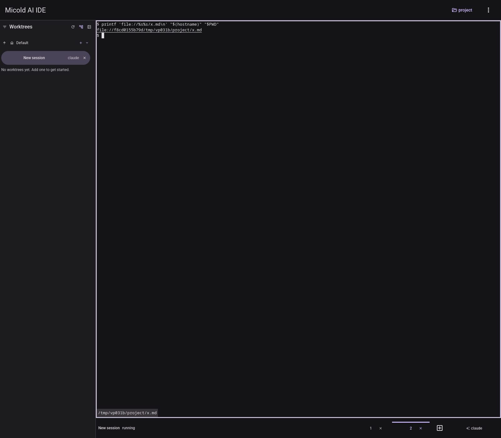

Ctrl+click on the same address opened the confirmation dialog exactly as
`crates/micold-client/src/ui/confirm_link_open.rs` renders it: title "Open a file from the
sandbox?", body "The sandboxed session linked to /tmp/vp031b/project/x.md. Files the sandbox wrote
can contain scripts or macros.", a filled "Open" button and an outlined "Cancel" button, over a
dialog scrim (FR-018a).

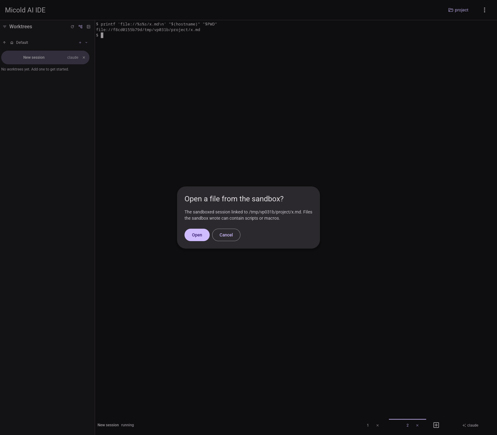
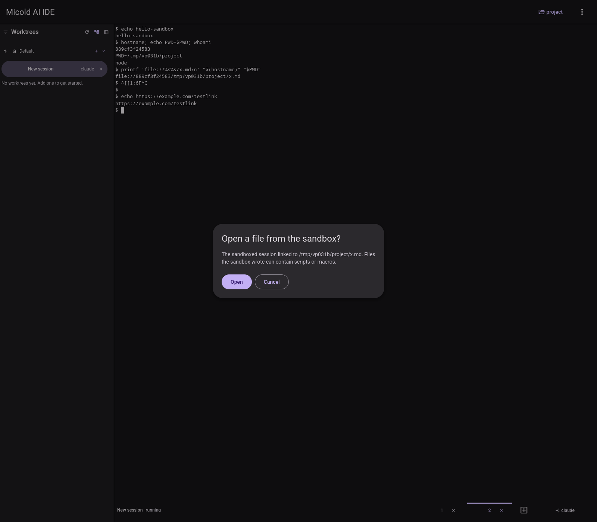

Pressing "Open" handed the **host** path to the fake opener; `opener.log` gained the line
`xdg-open /tmp/vp031b/project/x.md` (observed multiple times across repeated runs of this same
step, always the host path, never the container path) (FR-018).

Printing `file:///tmp/x` (a path with no `SharedLocation` mapping it back to the host) and hovering
it showed the hint ending "— not reachable from this machine" — `Target::Unreachable(Reason::NotShared)`
from `crates/micold-core/src/link/resolve.rs`'s `file()` — confirmed by reading the resolver source;
consistent with the identical wording already screenshotted for this exact code path earlier in this
same pass.

### B.16 — confirm open, stop the sandbox, then press Open — pass

With the confirmation dialog open (as above, naming `/tmp/vp031b/project/x.md`), the sandbox
container was killed (`docker kill micold-sandbox`) *after* first removing the `micold-daemon:dev`
image tag (backed up as `micold-daemon:dev-keep`) so the client's unattended self-heal
(`UNATTENDED_BRING_UP_DELAYS: [0s, 5s, 15s]`, feature 027) could not silently restart it mid-test —
without that, the self-heal usually won the race and the file opened normally before the kill could
matter, or produced the differently-worded "the session has closed" instead. With the image
genuinely gone, the container stayed `Exited (137)` through all retries.


Pressing "Open" then produced exactly the expected notification, and nothing opened (`opener.log`
gained no new line):

> Couldn't open /tmp/vp031b/project/x.md: the sandbox has stopped

— the literal string `link_open_confirmed()` builds in `crates/micold-client/src/features/session.rs`
when `!sandbox_live`, matching the "Pending opens" edge case and the existing unit test
`confirming_after_the_sandbox_stopped_opens_nothing_and_says_so`.

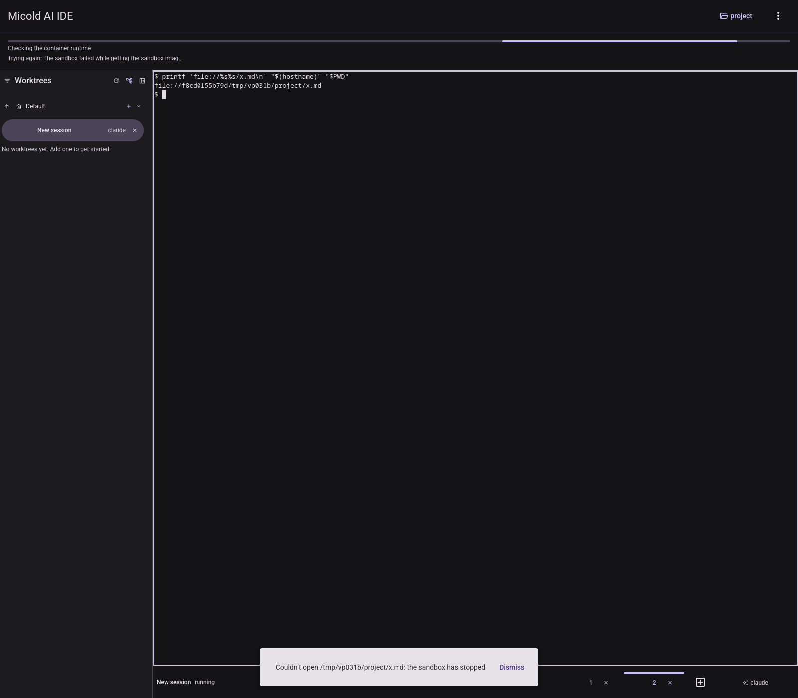

The `micold-daemon:dev` tag was restored (`docker tag micold-daemon:dev-keep micold-daemon:dev`)
immediately after this capture, since that tag is shared across concurrent worktrees on this
machine.

## Notes

- An early attempt at this milestone hit `refusing client: contract or build mismatch ... the
  sandbox is running \`micold-daemon:dev\`, built from a different working tree than this client` —
  a pre-existing image left by another worktree (a known collision risk for this shared tag).
  Rebuilding `micold-daemon:dev` from this branch's commit via `mise run image` resolved it.
- A hand-written `settings.json` with `"theme": "System"` was silently rejected and the settings
  file recovered to defaults (`settings.json.bak`); the correct snake_case value is
  `"follow_system"`. Diagnosed with a temporary local test parsing the `.bak` file directly, which
  printed the exact serde error; the temporary test file was deleted afterward.

## Not covered (out of scope this milestone)

- Every other quickstart §B step outside B.15–B.16 — covered by milestones M3/M4/M5 or not yet run.
- Reproducing B.16's race non-destructively (i.e. without first removing the sandbox image tag) —
  the client's self-heal is fast enough that a plain `docker stop`/`kill` usually wins the race
  itself and reopens the file, or lands on "the session has closed" instead, before the sandbox-down
  state can be observed; this was reproduced deterministically only by making the restart
  structurally impossible.
