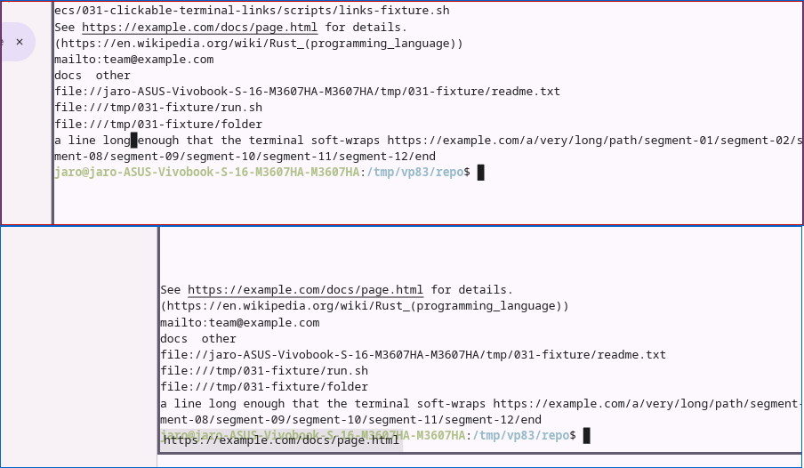
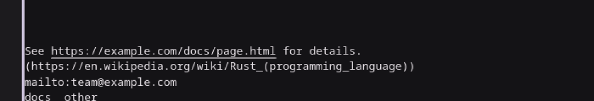
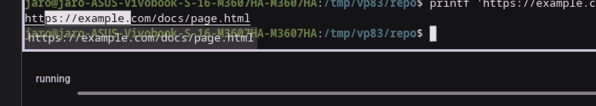
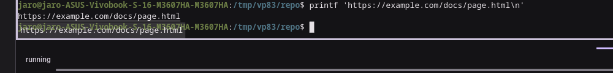
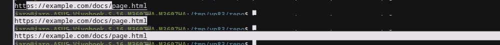
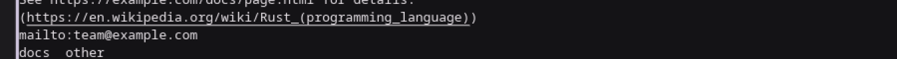
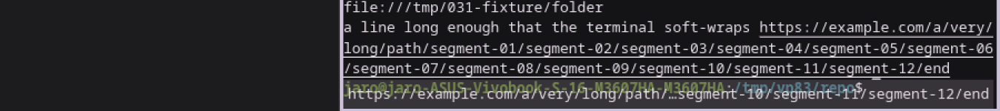
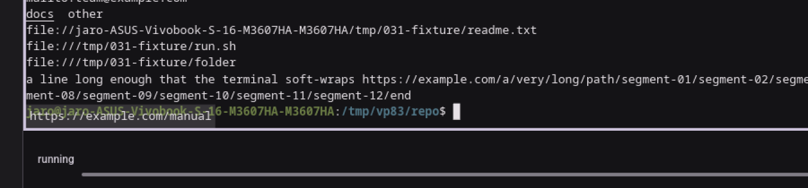
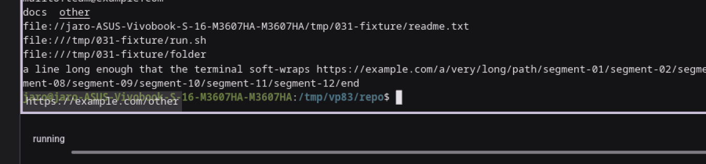

# Visual pass — 031 clickable terminal links, milestone M3 (quickstart Part B, §B.1–B.7, §B.12)

**Date**: 2026-09-17
**Environment**: private Xvfb display `:83` (1600×1400×24, no window manager), Mesa lavapipe
(`WGPU_BACKEND=vulkan`, `lvp_icd.json`), `XDG_RUNTIME_DIR=/tmp/vp83`, private `XDG_DATA_HOME`
(`/tmp/vp83/data`) seeded with one project (`/tmp/vp83/repo`, an empty git repo) via a hand-written
`projects.json` (the client binary has no CLI). A fake `xdg-open` on `PATH`
(`/tmp/vp83/fakebin/xdg-open`) logs every invocation's arguments to `/tmp/vp83/opener.log` instead of
opening anything real. Not a real display or GPU: perceived smoothness is out of scope and nothing
below depends on it.

**Scope**: quickstart §B.1–B.7 and §B.12 only, per the milestone's ask. §B.8–B.11 and §B.13+ are out
of scope (later milestones, or macOS/Windows-only) and were not run.

## Binaries and pin check

| Pin dir | Built from | Build output |
|---|---|---|
| `~/vp/bin-031-m3/` | this branch (`feat/links-in-terminal-should-be-clickable`) at `d05655b7`, clean tree, one `cargo build` naming `micold-ai-ide`, `micold-showcase`, `micold-daemon` | `Compiling micold-client v0.15.0`; core and daemon were already current from an earlier build at this same commit (0 diff, matching checksums against `target-shared`) |

- Pin check: `strings <bin> | grep -c LinkOrigin` (a type this feature's link model owns,
  `crates/micold-core/src/link/mod.rs`) gives **2** for both `micold-ai-ide` and `micold-showcase` in
  the pinned pair. (The daemon has no matching symbol — expected, since link detection/opening are
  client-side only.)
- Copied straight out of `target-shared/debug/` right after the build finished, inside the same
  window; `md5sum` matched between `target-shared` and the pin dir for `micold-ai-ide` and
  `micold-daemon` before anything else could have overwritten `target-shared`.
- **Connects**: `micold-daemon.log` shows `client attached to daemon client_build=micold-ai-ide/0.15.0`
  and `project attached client=1 project=/tmp/vp83/repo`; `micold-client.log` shows `attach: connected
  projects=1 sessions=0`. No `refusing client` anywhere in the daemon log.

## Fixture

`specs/031-clickable-terminal-links/scripts/links-fixture.sh` was run inside a session's **Regular
Terminal** instance (opened via the tab strip's "+", `Message::ShellInstanceSelected`/
`OpenTerminalInstance` — starting a session always launches an AI CLI first, since feature 027
deleted the old mode-toggle control; the "+" beside the tab strip is what now opens a plain shell tab
alongside it). The fixture prints the same eight lines quickstart §B.0 describes, and was re-run a
few times (after clearing/narrowing/resizing) to get a link row at a convenient screen position.

## Steps

| Step | Result |
|---|---|
| B.1 Hover, light theme | **Pass** |
| B.2 Same, dark theme; selection + cursor | **Pass** |
| B.3 Ctrl+click | **Pass** |
| B.4 Drag / double-click / triple-click | **Pass** |
| B.5 Wikipedia line, inner vs outer `)` | **Pass** |
| B.6 Wrapped address, second row | **Pass** |
| B.7 `docs` / `other` distinct links | **Pass** |
| B.12 vim `mouse=a`, Ctrl+click vs Shift+Ctrl+click | **Pass** |

**Not capturable in this environment**: the pointer's own shape (text pointer vs. hand while Ctrl is
held). Xvfb here renders no visible cursor glyph at all in `import`'s framebuffer capture (tried with
and without `xsetroot -cursor_name left_ptr`) — a limitation of this headless setup, not evidence
either way about the feature. Every other part of B.1/B.2's requirements (underline, hint placement
and content, legibility, selection, terminal cursor) was directly verified from screenshots.

### B.1 — hover the first address, light theme — pass

Theme set to Light via Settings → Appearance → Theme → Light → Save. Hovered
`https://example.com/docs/page.html` in "See https://example.com/docs/page.html for details.":

- The underline covers exactly the address — starts at `h`, ends at the last `l` of `.html`, and does
  not extend under the leading `See ` or the trailing ` for details.` (or its own full stop).
- The hint box shows `https://example.com/docs/page.html`.
- **Hint placement**: with the link row near the top of the pane, the hint appears **below** the row
  (bottom-left of the pane). With the same row pushed near the pane's bottom edge (padded the
  scrollback with blank lines so the link landed a few rows above the status bar), the hint instead
  appears **above** the row — confirming the top-left/bottom-left flip the spec describes.

 — top (red border): hint below, row near the pane's top.
Bottom (blue border): hint above, same row near the pane's bottom.

### B.2 — dark theme; selection + cursor — pass

Theme switched to Dark the same way. Re-hovered the same address (now scrolled near the pane's
bottom): underline and hint both remain crisp and legible against the dark surface, at the same
geometry as light.

Then, to check text colour / selection / cursor coexist: typed `printf 'https://...\n'` at the prompt
(so a second, plain copy of the address exists as committed terminal output), and:

- **Selected** part of it (`https://example.` of the second copy) by mouse drag: the selection
  highlight (light block) is visible, the selected text stays legible, and the link's underline is
  unaffected by the row above it still showing its own underline.
- The terminal's own block **cursor**, at the live shell prompt on the line below, stays fully visible
  the whole time — it is never hidden by the hint box that floats nearby, nor by the selection.

 — underline in dark, address row near the pane's bottom
(hint shown above, overlapping the prompt line below it).
 — partial selection on one copy of
the address, block cursor visible at the prompt beneath it.

### B.3 — Ctrl+click — pass

Ctrl held, single click on the address (dark theme, same row). `/tmp/vp83/opener.log` recorded
exactly one line:

```
xdg-open https://example.com/docs/page.html
```

— the address alone, no extra flags or shell quoting. The terminal's own content was unchanged after
the click (no new prompt line, no echoed keystrokes): the terminal received no input from the
Ctrl+click.



### B.4 — drag / double-click / triple-click — pass

All three performed on the same address, each preceded by clearing the prior selection and checking
`opener.log` was empty going in:

- **Drag** from partway into the address: selects a run of text (`https://example.` in the capture);
  `opener.log` stayed empty.
- **Double-click**: selects the whole address as one word; `opener.log` stayed empty.
- **Triple-click**: selects the whole line; `opener.log` stayed empty.

No modifier was held in any of the three, and none of them opened anything.

 — top to bottom: drag, double-click, triple-click.

### B.5 — Wikipedia line, inner vs. outer `)` — pass

Hovered `(https://en.wikipedia.org/wiki/Rust_(programming_language))`. The underline runs from `h` of
`https` through the **inner** `)` that closes `Rust_(programming_language)`, and stops there — the
line's own outer closing `)` (and the leading `(`) are outside the underline.



### B.6 — wrapped address, second row — pass

The fixture's own long line ("a line long enough that the terminal soft-wraps
`https://example.com/a/very/long/path/segment-01/…/segment-12/end`") already wraps at the default
1600 px window width; the window was additionally narrowed to 900 px to make the wrap unambiguous,
producing **three** wrapped rows for this one address. Hovering the **second** (middle) row underlines
all three rows at once, and the hint shows the full address, elided in the middle
(`https://example.com/a/very/long/path/…segment-10/segment-11/segment-12/end`).

Ctrl+click on that same (second) row: `opener.log` recorded the **entire** address as one line,
un-truncated:

```
xdg-open https://example.com/a/very/long/path/segment-01/segment-02/segment-03/segment-04/segment-05/segment-06/segment-07/segment-08/segment-09/segment-10/segment-11/segment-12/end
```



### B.7 — `docs` and `other`, separate links — pass

Hovering `docs` underlines only `docs` (not `other`) and the hint shows `https://example.com/manual`.
Hovering `other` underlines only `other` and the hint shows `https://example.com/other`. Each OSC 8
link is independent, as declared by the fixture.




### B.12 — vim, `:set mouse=a`, Ctrl+click vs. Shift+Ctrl+click — pass

`vim -c 'set mouse=a' vimtest.txt` opened on a file containing `See https://example.com/docs/page.html
for details.`.

- **Ctrl+click** on the address: `opener.log` stayed empty (nothing opened). Vim's own status line
  showed `E433: No tags file` / `E426: Tag not found: com` — vim's default CTRL-click-is-tag-jump
  handling fired, which only happens if the click (with its Ctrl modifier) reached vim's own mouse
  reporting rather than being intercepted as an open request. After dismissing that message, vim's
  cursor was at the clicked column (`1,21`, over the address) — confirming the click was delivered to
  the program, precisely FR-016's "under mouse reporting, Ctrl alone is the program's."
- **Shift+Ctrl+click**, same spot: `opener.log` recorded `xdg-open
  https://example.com/docs/page.html`, and vim's cursor position (and status line) were unchanged —
  vim never saw this click; it was consumed as an open request instead.

 — vim's tag-jump error after a
plain Ctrl+click.
 — cursor still at
`1,21`, address opened instead.

## Not covered (by design, this milestone)

- §B.8–B.11 (mailto, file reveal, run.sh, right-click copy) and §B.13+ (missing file, sandbox
  placement, pending opens, hard-broken lines, FORCE_HYPERLINK, user-guide read-through) — later
  milestones, per the task's scope.
- The pointer's own cursor shape (arrow vs. hand) — not renderable in this Xvfb setup; see the note
  above the step table.
